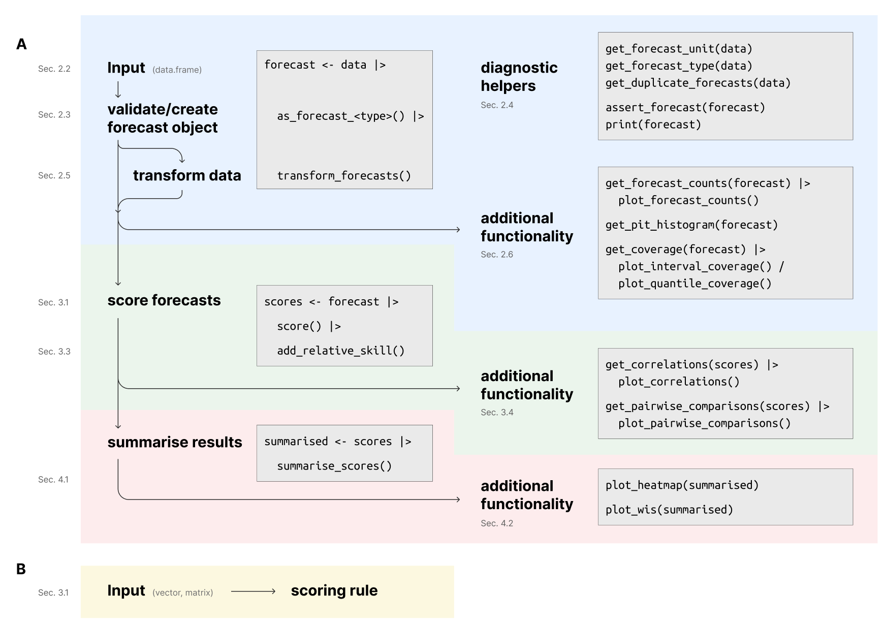

---
output:
  github_document:
    toc: false
---

# scoringutils <a href="https://epiforecasts.io/"></a>

<!-- badges: start -->
[](https://github.com/epiforecasts/scoringutils/actions/workflows/R-CMD-check.yaml)
[](https://app.codecov.io/gh/epiforecasts/scoringutils) 
[](https://CRAN.R-project.org/package=scoringutils)

[](https://cran.r-project.org/package=scoringutils)
<!-- badges: end -->


```{r setup, include=FALSE}
knitr::opts_chunk$set(echo = TRUE,
                      fig.width = 7,
                      collapse = TRUE,
                      comment = "#>",
                      fig.path = "man/figures/")
library(scoringutils)
library(magrittr)
library(data.table)
library(ggplot2)
library(knitr)
```

::: {.pkgdown-devel}
***Note***: [*This documentation*](https://epiforecasts.io/scoringutils/dev/) *refers to the development version of `scoringutils`.* *You can also view the* [*documentation of the stable version*](https://epiforecasts.io/scoringutils/).
:::

::: {.pkgdown-release}
***Note***: [*This documentation*](https://epiforecasts.io/scoringutils/) *refers to the stable version of `scoringutils`.* *You can also view the* [*documentation of the development version*](https://epiforecasts.io/scoringutils/dev/).
:::

## Utilities for Scoring and Assessing Predictions

The `scoringutils` package facilitates the process of evaluating forecasts in R, using a convenient and flexible `data.table`-based framework. It provides broad functionality to check the input data and diagnose issues, to visualise forecasts and missing data, to transform data before scoring, to handle missing forecasts, to aggregate scores, and to visualise the results of the evaluation. The package is easily extendable, meaning that users can supply their own scoring rules or extend existing classes to handle new types of forecasts. 

The package underwent a major re-write. The most comprehensive documentation for the updated package is the [revised version](https://drive.google.com/file/d/1URaMsXmHJ1twpLpMl1sl2HW4lPuUycoj/view?usp=drive_link) of our [original](https://doi.org/10.48550/arXiv.2205.07090) `scoringutils` paper. 

Another good starting point are the vignettes
<!-- vignettes on [Getting started](https://epiforecasts.io/scoringutils/articles/scoringutils.html),  -->
[Details on the metrics implemented](https://epiforecasts.io/scoringutils/articles/metric-details.html) and [Scoring forecasts directly](https://epiforecasts.io/scoringutils/articles/scoring-forecasts-directly.html).

<!-- > Nikos I. Bosse, Hugo Gruson, Anne Cori, Edwin van Leeuwen, Sebastian Funk and Sam Abbott (2022). _`Evaluating Forecasts with scoringutils in R`_. arXiv:2205.07090 <https://doi.org/10.48550/arXiv.2205.07090> -->

For further details on the specific issue of transforming forecasts for scoring see:

> Nikos I. Bosse, Sam Abbott, Anne Cori, Edwin van Leeuwen, Johannes Bracher\* and Sebastian Funk\* (\*: equal contribution) (2023). _`Scoring epidemiological forecasts on transformed scales`_, PLoS Comput Biol 19(8): e1011393 <https://doi.org/10.1371/journal.pcbi.1011393>

## Installation

Install the CRAN version of this package using

```{r, eval = FALSE}
install.packages("scoringutils")
```

Install the unstable development version from GitHub using

```{r, eval = FALSE}
remotes::install_github("epiforecasts/scoringutils", dependencies = TRUE)
```

## Quick start

### Forecast types

`scoringutils` currently supports scoring the following forecast types: 

- `binary`: a probability for a binary (yes/no) outcome variable.
- `point`: a forecast for a continuous or discrete outcome variable that is represented by a single number.
- `quantile`: a probabilistic forecast for a continuous or discrete outcome variable, with the forecast distribution represented by a set of predictive quantiles.
- `sample`: a probabilistic forecast for a continuous or discrete outcome variable, with the forecast represented by a finite set of samples drawn from the predictive distribution.
- `nominal` categorical forecast with unordered outcome possibilities (generalisation of binary forecasts to multiple outcomes)

### Input formats and input validation

The expected input format is generally a `data.frame` (or similar) with required columns `observed`, and `predicted` that holds the forecasts and observed values. Exact requirements depend on the forecast type. For more information, have a look at the [paper](https://drive.google.com/file/d/1URaMsXmHJ1twpLpMl1sl2HW4lPuUycoj/view?usp=drive_link), call `?as_forecast_binary`, `?as_forecast_quantile` etc., or have a look at the example data provided in the package (`example_binary`, `example_point`, `example_quantile`, `example_sample_continuous`, `example_sample_discrete`, `example_nominal`). 

Before scoring, input data needs to be validated and transformed into a forecast object using one of the `as_forecast_<type>()` functions. 

```{r}
forecast_quantile <- example_quantile |>
  as_forecast_quantile(
    forecast_unit = c(
      "location", "forecast_date", "target_end_date", "target_type", "model", "horizon"
    )
  )

print(forecast_quantile, 2)
```

### The forecast unit
For quantile-based and sample-based forecasts, a single prediction is represented by a set of several quantiles (or samples) from the predictive distribution, i.e. several rows in the input data. `scoringutils` therefore needs to group rows together that form a single forecast. `scoringutils` uses all other existing columns in the input data to achieve this - the values in all other columns should uniquely identify a single forecast. Additional columns unrelated to the forecast unit can mess this up. The `forecast_unit` argument in `as_forecast_<type>()` makes sure that only those columns are retained which are relevant for defining the unit of a single forecast. 


### Scoring forecasts
Forecasts can be scored by calling `score()` on a validated forecast object. 

```{r}
scores <- forecast_quantile |> 
  score()
```

`score()` takes an additional argument, `metrics`, with a list of scoring rules. Every forecast type has a default list of metrics. You can easily add your own scoring functions, as long as they conform with the format for that forecast type. See the [paper](https://drive.google.com/file/d/1URaMsXmHJ1twpLpMl1sl2HW4lPuUycoj/view?usp=drive_link) for more information. 

You can summarise scores using the function `summarise_scores()`. The `by` argument is used to specify the desired level of summary. `fun` let's you specify any summary function, although it is recommended to stick to the mean as a primary summary function, as other functions can lead to improper scores. 

```{r}
scores |> 
  summarise_scores(by = c("model", "target_type")) |>
  summarise_scores(by = c("model", "target_type"), fun = signif, digits = 3)
```

## Package workflow

The following depicts the suggested workflow for evaluating forecasts with `scoringutils` (sections refer to the paper). Please find more information in the [paper](https://drive.google.com/file/d/1URaMsXmHJ1twpLpMl1sl2HW4lPuUycoj/view?usp=drive_link), the function documentation and the vignettes. 



## Citation

If you are using `scoringutils` in your work please consider citing it using the output of `citation("scoringutils")` (or `print(citation("scoringutils"), bibtex = TRUE)`):

```{r, echo = FALSE}
citation("scoringutils") 
```

## How to make a bug report or feature request

Please briefly describe your problem and what output you expect in an [issue](https://github.com/epiforecasts/scoringutils/issues). If you have a question, please don't open an issue. Instead, ask on our [Q and A page](https://github.com/epiforecasts/scoringutils/discussions/categories/q-a).

## Contributing

We welcome contributions and new contributors! We particularly appreciate help on priority problems in the [issues](https://github.com/epiforecasts/scoringutils/issues). Please check and add to the issues, and/or add a [pull request](https://github.com/epiforecasts/scoringutils/pulls).

## Code of Conduct
  
Please note that the `scoringutils` project is released with a [Contributor Code of Conduct](https://epiforecasts.io/scoringutils/CODE_OF_CONDUCT.html). By contributing to this project, you agree to abide by its terms.

## Funding

The development of `scoringutils` was funded via the Health Protection Research Unit (grant code NIHR200908) and the Wellcome Trust (grant: 210758/Z/18/Z). This work has also been supported by the US National Institutes of General Medical Sciences (R35GM119582). The content is solely the responsibility of the authors and does not necessarily represent the official views of NIGMS, or the National Institutes of Health.

## Contributors


<!-- ALL-CONTRIBUTORS-LIST:START - Do not remove or modify this section -->
<!-- prettier-ignore-start -->
<!-- markdownlint-disable -->

All contributions to this project are gratefully acknowledged using the [`allcontributors` package](https://github.com/ropensci/allcontributors) following the [all-contributors](https://allcontributors.org) specification. Contributions of any kind are welcome!

### Code


<a href="https://github.com/epiforecasts/scoringutils/commits?author=nikosbosse">nikosbosse</a>, 
<a href="https://github.com/epiforecasts/scoringutils/commits?author=seabbs">seabbs</a>, 
<a href="https://github.com/epiforecasts/scoringutils/commits?author=sbfnk">sbfnk</a>, 
<a href="https://github.com/epiforecasts/scoringutils/commits?author=jamesmbaazam">jamesmbaazam</a>, 
<a href="https://github.com/epiforecasts/scoringutils/commits?author=Bisaloo">Bisaloo</a>, 
<a href="https://github.com/epiforecasts/scoringutils/commits?author=actions-user">actions-user</a>, 
<a href="https://github.com/epiforecasts/scoringutils/commits?author=toshiakiasakura">toshiakiasakura</a>, 
<a href="https://github.com/epiforecasts/scoringutils/commits?author=MichaelChirico">MichaelChirico</a>, 
<a href="https://github.com/epiforecasts/scoringutils/commits?author=jcken95">jcken95</a>, 
<a href="https://github.com/epiforecasts/scoringutils/commits?author=athowes">athowes</a>, 
<a href="https://github.com/epiforecasts/scoringutils/commits?author=nickreich">nickreich</a>, 
<a href="https://github.com/epiforecasts/scoringutils/commits?author=damonbayer">damonbayer</a>


### Issue Authors


<a href="https://github.com/epiforecasts/scoringutils/issues?q=is%3Aissue+author%3ADavideMagno">DavideMagno</a>, 
<a href="https://github.com/epiforecasts/scoringutils/issues?q=is%3Aissue+author%3Ambojan">mbojan</a>, 
<a href="https://github.com/epiforecasts/scoringutils/issues?q=is%3Aissue+author%3Ajhellewell14">jhellewell14</a>, 
<a href="https://github.com/epiforecasts/scoringutils/issues?q=is%3Aissue+author%3Adshemetov">dshemetov</a>, 
<a href="https://github.com/epiforecasts/scoringutils/issues?q=is%3Aissue+author%3Aelray1">elray1</a>, 
<a href="https://github.com/epiforecasts/scoringutils/issues?q=is%3Aissue+author%3Ajonathonmellor">jonathonmellor</a>, 
<a href="https://github.com/epiforecasts/scoringutils/issues?q=is%3Aissue+author%3Adylanhmorris">dylanhmorris</a>, 
<a href="https://github.com/epiforecasts/scoringutils/issues?q=is%3Aissue+author%3Aannakrystalli">annakrystalli</a>, 
<a href="https://github.com/epiforecasts/scoringutils/issues?q=is%3Aissue+author%3Arobchallen">robchallen</a>, 
<a href="https://github.com/epiforecasts/scoringutils/issues?q=is%3Aissue+author%3Ateunbrand">teunbrand</a>, 
<a href="https://github.com/epiforecasts/scoringutils/issues?q=is%3Aissue+author%3ARokGrah">RokGrah</a>, 
<a href="https://github.com/epiforecasts/scoringutils/issues?q=is%3Aissue+author%3Azsusswein">zsusswein</a>


### Issue Contributors


<a href="https://github.com/epiforecasts/scoringutils/issues?q=is%3Aissue+commenter%3Ajbracher">jbracher</a>, 
<a href="https://github.com/epiforecasts/scoringutils/issues?q=is%3Aissue+commenter%3Akathsherratt">kathsherratt</a>, 
<a href="https://github.com/epiforecasts/scoringutils/issues?q=is%3Aissue+commenter%3ATimTaylor">TimTaylor</a>


<!-- markdownlint-enable -->
<!-- prettier-ignore-end -->
<!-- ALL-CONTRIBUTORS-LIST:END -->


