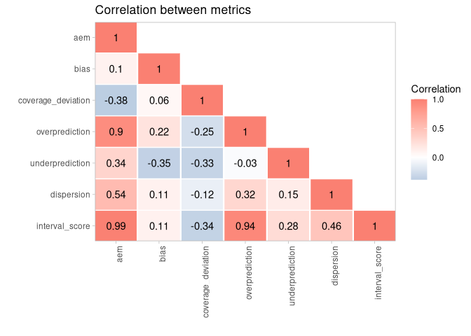

scoringutils: Utilities for Scoring and Assessing Predictions
================

-   [Input formats](#input-formats)
-   [Checking the input data](#checking-the-input-data)
-   [Showing available forecasts](#showing-available-forecasts)
-   [Scoring and summarising
    forecasts](#scoring-and-summarising-forecasts)
    -   [Adding empirical coverage](#adding-empirical-coverage)
    -   [Adding relative scores](#adding-relative-scores)
-   [Visualising scores](#visualising-scores)
    -   [Coloured table](#coloured-table)
    -   [Score heatmap](#score-heatmap)
    -   [Weighted interval score
        components](#weighted-interval-score-components)
-   [Calibration](#calibration)
-   [Pairwise comparisons](#pairwise-comparisons)
-   [Additional analyses and
    visualisations](#additional-analyses-and-visualisations)
    -   [Correlation between scores](#correlation-between-scores)
    -   [Scores by interval ranges](#scores-by-interval-ranges)
-   [Tips and tricks - converting to sample-based
    forecasts](#tips-and-tricks---converting-to-sample-based-forecasts)
-   [Available metrics](#available-metrics)
-   [Lower level functions](#lower-level-functions)

[](https://github.com/epiforecasts/scoringutils/actions)
[](https://codecov.io/gh/epiforecasts/scoringutils/)
[](https://CRAN.R-project.org/package=scoringutils)
[](https://github.com/epiforecasts/scoringutils)
[](https://cran.r-project.org/package=scoringutils)
<!-- badges: end -->

The `scoringutils` package provides a collection of metrics and proper
scoring rules that make it simple to score probabilistic forecasts
against the true observed values. The `scoringutils` package offers
convenient automated forecast evaluation in a data.table format (using
the function `score()`), but also provides experienced users with a set
of reliable lower-level scoring metrics operating on vectors/matriced
they can build upon in other applications. In addition it implements a
wide range of flexible plots that are able to cover many day-to-day use
cases.

Predictions can be handled in various formats: `scoringutils` can handle
probabilistic forecasts in either a sample based or a quantile based
format. For more detail on the expected input formats please see below.
True values can be integer, continuous or binary.

## Input formats

Most of the time, the `score` function will be able to do the entire
evaluation for you. All you need to do is to pass in a `data.frame` with
the appropriate columns. Which columns are required depends on the
format the forecasts come in. The forecast format can either be based on
quantiles (see `example_quantile`), based on predictive samples (see
`example_continuous` and `example_integer`) or in a binary format. The
following table gives an overview (pairwise comparisons will be
explained in more detail below):

    #>                  Format                       Required columns
    #> 1:       quantile-based 'true_value', 'prediction', 'quantile'
    #> 2:         sample-based   'true_value', 'prediction', 'sample'
    #> 3:               binary             'true_value', 'prediction'
    #> 4: pairwise-comparisons          additionally a column 'model'

Additional columns may be present to indicate a grouping of forecasts.
For example, we could have forecasts made by different models in various
locations at different time points, each for several weeks into the
future. It is important, that there are only columns present which are
relevant in order to group forecasts. A combination of different columns
should uniquely define the *unit of a single forecast*, meaning that a
single forecast is defined by the values in the other columns.

## Checking the input data

The function `check_forecasts()` can be used to check the input data. It
gives a summary of what `scoringutils` thinks you are trying to achieve.
It infers the type of the prediction target, the prediction format, and
the unit of a single forecasts, gives an overview of the number of
unique values per column (helpful for spotting missing data) and returns
warnings or errors.

``` r
example_quantile
#>        location target_end_date target_type true_value location_name
#>     1:       DE      2021-01-02       Cases     127300       Germany
#>     2:       DE      2021-01-02      Deaths       4534       Germany
#>     3:       DE      2021-01-09       Cases     154922       Germany
#>     4:       DE      2021-01-09      Deaths       6117       Germany
#>     5:       DE      2021-01-16       Cases     110183       Germany
#>    ---                                                              
#> 20541:       IT      2021-07-24      Deaths         78         Italy
#> 20542:       IT      2021-07-24      Deaths         78         Italy
#> 20543:       IT      2021-07-24      Deaths         78         Italy
#> 20544:       IT      2021-07-24      Deaths         78         Italy
#> 20545:       IT      2021-07-24      Deaths         78         Italy
#>        forecast_date quantile prediction                model horizon
#>     1:          <NA>       NA         NA                 <NA>      NA
#>     2:          <NA>       NA         NA                 <NA>      NA
#>     3:          <NA>       NA         NA                 <NA>      NA
#>     4:          <NA>       NA         NA                 <NA>      NA
#>     5:          <NA>       NA         NA                 <NA>      NA
#>    ---                                                               
#> 20541:    2021-07-12    0.850        352 epiforecasts-EpiNow2       2
#> 20542:    2021-07-12    0.900        397 epiforecasts-EpiNow2       2
#> 20543:    2021-07-12    0.950        499 epiforecasts-EpiNow2       2
#> 20544:    2021-07-12    0.975        611 epiforecasts-EpiNow2       2
#> 20545:    2021-07-12    0.990        719 epiforecasts-EpiNow2       2
```

``` r
check_forecasts(example_quantile)
#> $target_type
#> [1] "integer"
#> 
#> $prediction_type
#> [1] "quantile"
#> 
#> $forecast_unit
#> [1] "location"        "target_end_date" "target_type"     "location_name"  
#> [5] "forecast_date"   "model"           "horizon"        
#> 
#> $unique_values
#>                    model location target_end_date target_type true_value
#> 1: EuroCOVIDhub-ensemble        4              12           2         96
#> 2: EuroCOVIDhub-baseline        4              12           2         96
#> 3:  epiforecasts-EpiNow2        4              12           2         95
#> 4:       UMass-MechBayes        4              12           1         48
#>    location_name forecast_date quantile prediction horizon
#> 1:             4            11       23       3969       3
#> 2:             4            11       23       3733       3
#> 3:             4            11       23       3903       3
#> 4:             4            11       23       1058       3
#> 
#> $warnings
#> [1] "Some values for `prediction` are NA in the data provided"
#> 
#> 
#> Based on your input, scoringutils thinks:
#> Forecasts are for a `integer` target using a `quantile` prediction format.
#> The unit of a single forecast is defined by `location`, `target_end_date`, `target_type`, `location_name`, `forecast_date`, `model`, `horizon`. If this is not as intended, please DELETE UNNECESSARY columns or add new ones.
#> $unique_values shows how many unique values there are per column per model (across the entire data).
#> 
#> You should be aware of the following warnings:
#> Some values for `prediction` are NA in the data provided
```

If you are unsure what your input data should look like, have a look at
the `example_quantile`, `example_integer`, `example_continuous` and
`example_binary` data sets provided in the package.

## Showing available forecasts

The function `avail_forecasts()` may also be helpful to determine where
forecasts are available. Using the `by` argument you can specify the
level of summary. For example, to see how many forecasts there are per
model and target_type, we can run

``` r
avail_forecasts(example_quantile, 
                by = c("model", "target_type"))
#>                    model target_type Number forecasts
#> 1: EuroCOVIDhub-ensemble       Cases              128
#> 2: EuroCOVIDhub-baseline       Cases              128
#> 3:  epiforecasts-EpiNow2       Cases              128
#> 4: EuroCOVIDhub-ensemble      Deaths              128
#> 5: EuroCOVIDhub-baseline      Deaths              128
#> 6:       UMass-MechBayes      Deaths              128
#> 7:  epiforecasts-EpiNow2      Deaths              119
```

We see that ‘epiforecasts-EpiNow2’ has some missing forecasts and that
UMass-MechBayes has no case forecasts.

This information can also be visualised:

``` r
avail_forecasts(example_quantile, 
                by = c("model", "forecast_date", "target_type")) %>%
  plot_avail_forecasts() + 
  facet_wrap(~ target_type)
```

<!-- -->

You can visualise forecasts directly using the `plot_predictions`
function:

``` r
plot_predictions(data = example_quantile,
                 x = "target_end_date",
                 filter_truth = list('target_end_date <= "2021-07-15"',
                                     'target_end_date > "2021-05-22"'),
                 filter_forecasts = list("model == 'EuroCOVIDhub-ensemble'",
                                         'forecast_date == "2021-06-28"')) +
  facet_wrap(target_type ~ location, ncol = 4, scales = "free") +
  theme(legend.position = "bottom")
```

<!-- -->

## Scoring and summarising forecasts

Forecasts can easily be scored using the `score()` function. This
function returns unsumarised scores, which in most cases is not what the
user wants. A second function, `summarise_scores` takes care of the
summary.

``` r
score(example_quantile)
#>        location target_end_date target_type location_name forecast_date
#>     1:       DE      2021-05-08       Cases       Germany    2021-05-03
#>     2:       DE      2021-05-08       Cases       Germany    2021-05-03
#>     3:       DE      2021-05-08       Cases       Germany    2021-05-03
#>     4:       DE      2021-05-08       Cases       Germany    2021-05-03
#>     5:       DE      2021-05-08       Cases       Germany    2021-05-03
#>    ---                                                                 
#> 20397:       IT      2021-07-24      Deaths         Italy    2021-07-12
#> 20398:       IT      2021-07-24      Deaths         Italy    2021-07-12
#> 20399:       IT      2021-07-24      Deaths         Italy    2021-07-12
#> 20400:       IT      2021-07-24      Deaths         Italy    2021-07-12
#> 20401:       IT      2021-07-24      Deaths         Italy    2021-07-12
#>                        model horizon range true_value  lower  upper
#>     1: EuroCOVIDhub-baseline       1     0     106987 132607 132607
#>     2: EuroCOVIDhub-baseline       1    10     106987 132402 132812
#>     3: EuroCOVIDhub-baseline       1    10     106987 132402 132812
#>     4: EuroCOVIDhub-baseline       1    20     106987 131912 133302
#>     5: EuroCOVIDhub-baseline       1    20     106987 131912 133302
#>    ---                                                             
#> 20397:  epiforecasts-EpiNow2       2    90         78     69    499
#> 20398:  epiforecasts-EpiNow2       2    95         78     55    611
#> 20399:  epiforecasts-EpiNow2       2    95         78     55    611
#> 20400:  epiforecasts-EpiNow2       2    98         78     48    719
#> 20401:  epiforecasts-EpiNow2       2    98         78     48    719
#>        interval_score dispersion underprediction overprediction coverage
#>     1:       25620.00       0.00               0          25620        0
#>     2:       25599.50     184.50               0          25415        0
#>     3:       25599.50     184.50               0          25415        0
#>     4:       25481.00     556.00               0          24925        0
#>     5:       25481.00     556.00               0          24925        0
#>    ---                                                                  
#> 20397:          21.50      21.50               0              0        1
#> 20398:          13.90      13.90               0              0        1
#> 20399:          13.90      13.90               0              0        1
#> 20400:           6.71       6.71               0              0        1
#> 20401:           6.71       6.71               0              0        1
#>        coverage_deviation bias boundary quantile   aem quantile_coverage
#>     1:               0.00 0.95    lower    0.500 25620              TRUE
#>     2:              -0.10 0.95    lower    0.450 25620              TRUE
#>     3:              -0.10 0.95    upper    0.550 25620              TRUE
#>     4:              -0.20 0.95    lower    0.400 25620              TRUE
#>     5:              -0.20 0.95    upper    0.600 25620              TRUE
#>    ---                                                                  
#> 20397:               0.10 0.90    upper    0.950   108              TRUE
#> 20398:               0.05 0.90    lower    0.025   108             FALSE
#> 20399:               0.05 0.90    upper    0.975   108              TRUE
#> 20400:               0.02 0.90    lower    0.010   108             FALSE
#> 20401:               0.02 0.90    upper    0.990   108              TRUE
```

``` r
score(example_quantile) %>%
  summarise_scores(by = c("model", "target_type"))
#>                    model target_type interval_score dispersion underprediction
#> 1: EuroCOVIDhub-baseline       Cases    28483.57465 4102.50094    10284.972826
#> 2: EuroCOVIDhub-ensemble       Cases    17943.82383 3663.52458     4237.177310
#> 3:  epiforecasts-EpiNow2       Cases    20831.55662 5664.37795     3260.355639
#> 4: EuroCOVIDhub-baseline      Deaths      159.40387   91.40625        2.098505
#> 5: EuroCOVIDhub-ensemble      Deaths       41.42249   30.18099        4.103261
#> 6:       UMass-MechBayes      Deaths       52.65195   26.87239       16.800951
#> 7:  epiforecasts-EpiNow2      Deaths       66.64282   31.85692       15.893314
#>    overprediction coverage_deviation        bias         aem
#> 1:   14096.100883        -0.11211957  0.09796875 38473.60156
#> 2:   10043.121943        -0.09785326 -0.05640625 24101.07031
#> 3:   11906.823030        -0.06660326 -0.07890625 27923.81250
#> 4:      65.899117         0.11614130  0.33906250   233.25781
#> 5:       7.138247         0.19528533  0.07265625    53.13281
#> 6:       8.978601        -0.02312500 -0.02234375    78.47656
#> 7:      18.892583        -0.04287176 -0.00512605   104.74790
```

The `by` argument can be used to define the level of summary. By
default, `by = NULL` is set to the unit of a single forecast. For
quantile-based forecasts, unsummarised scores are returned for every
quantile individually. It can therefore make sense to run
`summarise_scores`even without any arguments provided.

``` r
score(example_quantile) %>%
  summarise_scores()
#>      location target_end_date target_type location_name forecast_date
#>   1:       DE      2021-05-08       Cases       Germany    2021-05-03
#>   2:       DE      2021-05-08       Cases       Germany    2021-05-03
#>   3:       DE      2021-05-08       Cases       Germany    2021-05-03
#>   4:       DE      2021-05-08      Deaths       Germany    2021-05-03
#>   5:       DE      2021-05-08      Deaths       Germany    2021-05-03
#>  ---                                                                 
#> 883:       IT      2021-07-24      Deaths         Italy    2021-07-05
#> 884:       IT      2021-07-24      Deaths         Italy    2021-07-12
#> 885:       IT      2021-07-24      Deaths         Italy    2021-07-12
#> 886:       IT      2021-07-24      Deaths         Italy    2021-07-12
#> 887:       IT      2021-07-24      Deaths         Italy    2021-07-12
#>                      model horizon interval_score  dispersion underprediction
#>   1: EuroCOVIDhub-baseline       1    16925.04696 1649.220870       0.0000000
#>   2: EuroCOVIDhub-ensemble       1     7990.85478 5440.985217       0.0000000
#>   3:  epiforecasts-EpiNow2       1    25395.96087 8173.700000       0.0000000
#>   4: EuroCOVIDhub-baseline       1       46.79304   44.662609       0.0000000
#>   5: EuroCOVIDhub-ensemble       1       53.88000   53.271304       0.6086957
#>  ---                                                                         
#> 883:  epiforecasts-EpiNow2       3       19.76261   14.284348       0.0000000
#> 884: EuroCOVIDhub-baseline       2       80.33696   76.728261       0.0000000
#> 885: EuroCOVIDhub-ensemble       2       18.65870   13.354348       0.0000000
#> 886:       UMass-MechBayes       2       25.58174    7.755652       0.0000000
#> 887:  epiforecasts-EpiNow2       2       66.16174   25.553043       0.0000000
#>      overprediction coverage_deviation  bias   aem
#>   1:   15275.826087        -0.38521739  0.95 25620
#>   2:    2549.869565         0.04956522  0.50 12271
#>   3:   17222.260870        -0.29826087  0.90 44192
#>   4:       2.130435         0.22347826  0.30    15
#>   5:       0.000000         0.39739130 -0.10    14
#>  ---                                              
#> 883:       5.478261         0.04956522  0.50    26
#> 884:       3.608696         0.31043478  0.20    53
#> 885:       5.304348         0.13652174  0.40    30
#> 886:      17.826087        -0.21130435  0.80    46
#> 887:      40.608696        -0.29826087  0.90   108
```

### Adding empirical coverage

For quantile-based forecasts we are often interested in specific
coverage-levels, for example, what percentage of true values fell
between all 50% or the 90% prediction intervals. We can add this
information using the function `add_coverage()`. This function also
requires a `by` argument which defines the level of grouping for which
the percentage of true values covered by certain prediction intervals is
computed.

``` r
score(example_quantile) %>%
  add_coverage(ranges = c(50, 90), by = c("model", "target_type")) %>%
  summarise_scores(by = c("model", "target_type"))
#>                    model target_type coverage_50 coverage_90 interval_score
#> 1: EuroCOVIDhub-baseline       Cases   0.3281250   0.8203125    28483.57465
#> 2: EuroCOVIDhub-baseline      Deaths   0.6640625   1.0000000      159.40387
#> 3: EuroCOVIDhub-ensemble       Cases   0.3906250   0.8046875    17943.82383
#> 4: EuroCOVIDhub-ensemble      Deaths   0.8750000   1.0000000       41.42249
#> 5:       UMass-MechBayes      Deaths   0.4609375   0.8750000       52.65195
#> 6:  epiforecasts-EpiNow2       Cases   0.4687500   0.7890625    20831.55662
#> 7:  epiforecasts-EpiNow2      Deaths   0.4201681   0.9075630       66.64282
#>    dispersion underprediction overprediction coverage_deviation        bias
#> 1: 4102.50094    10284.972826   14096.100883        -0.11211957  0.09796875
#> 2:   91.40625        2.098505      65.899117         0.11614130  0.33906250
#> 3: 3663.52458     4237.177310   10043.121943        -0.09785326 -0.05640625
#> 4:   30.18099        4.103261       7.138247         0.19528533  0.07265625
#> 5:   26.87239       16.800951       8.978601        -0.02312500 -0.02234375
#> 6: 5664.37795     3260.355639   11906.823030        -0.06660326 -0.07890625
#> 7:   31.85692       15.893314      18.892583        -0.04287176 -0.00512605
#>            aem coverage_50 coverage_90
#> 1: 38473.60156   0.3281250   0.8203125
#> 2:   233.25781   0.6640625   1.0000000
#> 3: 24101.07031   0.3906250   0.8046875
#> 4:    53.13281   0.8750000   1.0000000
#> 5:    78.47656   0.4609375   0.8750000
#> 6: 27923.81250   0.4687500   0.7890625
#> 7:   104.74790   0.4201681   0.9075630
```

### Adding relative scores

In order to better compare models against each other we can use relative
scores which are computed based on pairwise comparisons (see details
below). Relative scores can be added to the evaluation using the
function `summarise_scores()`. This requires a column called ‘model’ to
be present. Pairwise comparisons are computed according to the grouping
specified in `by`: essentially, the data.frame with all scores gets
split into different data.frames according to the values specified in
`by` and relative scores are computed for every individual group
separately. The `baseline` argumen allows us to specify a baseline that
can be used to scale relative scores (all scores are divided by the
baseline relative score). For example, to obtain relative scores
separately for different forecast targets, we can run

``` r
score(example_quantile) %>%
  summarise_scores(by = c("model", "target_type"), 
                   relative_skill = TRUE, 
                   baseline = "EuroCOVIDhub-ensemble")
#>                    model target_type interval_score dispersion underprediction
#> 1: EuroCOVIDhub-baseline       Cases    28483.57465 4102.50094    10284.972826
#> 2: EuroCOVIDhub-baseline      Deaths      159.40387   91.40625        2.098505
#> 3: EuroCOVIDhub-ensemble       Cases    17943.82383 3663.52458     4237.177310
#> 4: EuroCOVIDhub-ensemble      Deaths       41.42249   30.18099        4.103261
#> 5:       UMass-MechBayes      Deaths       52.65195   26.87239       16.800951
#> 6:  epiforecasts-EpiNow2       Cases    20831.55662 5664.37795     3260.355639
#> 7:  epiforecasts-EpiNow2      Deaths       66.64282   31.85692       15.893314
#>    overprediction coverage_deviation        bias         aem relative_skill
#> 1:   14096.100883        -0.11211957  0.09796875 38473.60156      1.1693281
#> 2:      65.899117         0.11614130  0.33906250   233.25781      1.9327518
#> 3:   10043.121943        -0.09785326 -0.05640625 24101.07031      0.7366427
#> 4:       7.138247         0.19528533  0.07265625    53.13281      0.5022745
#> 5:       8.978601        -0.02312500 -0.02234375    78.47656      0.6263587
#> 6:   11906.823030        -0.06660326 -0.07890625 27923.81250      0.8551920
#> 7:      18.892583        -0.04287176 -0.00512605   104.74790      0.8260394
#>    scaled_rel_skill
#> 1:         1.587375
#> 2:         3.847999
#> 3:         1.000000
#> 4:         1.000000
#> 5:         1.247045
#> 6:         1.160932
#> 7:         1.644598
```

## Visualising scores

### Coloured table

A simple coloured table can be produced based on the scores:

``` r
score(example_integer) %>%
  summarise_scores(by = c("model")) %>%
  plot_score_table() 
```

<!-- -->

### Score heatmap

We can also summarise one particular metric across different categories
using a simple heatmap:

``` r
score(example_continuous) %>%
  summarise_scores(by = c("model", "location", "target_type")) %>%
  plot_heatmap(x = "location", metric = "bias") + 
    facet_wrap(~ target_type)
```

<!-- -->

### Weighted interval score components

The weighted interval score can be split up into three components:
Over-prediction, under-prediction and dispersion. These can be
visualised separately in the following way:

``` r
score(example_quantile) %>%
  summarise_scores(by = c("target_type", "model")) %>%
  plot_wis() + 
  facet_wrap(~ target_type, scales = "free")
```

<!-- -->

## Calibration

Calibration is a measure statistical consistency between the forecasts
and the observed values. The most common way of assessing calibration
(more precisely: probabilistic calibration) are PIT histograms. The
probability integral transform (PIT) is equal to the cumulative
distribution function of a forecast evaluated at the true observed
value. Ideally, pit values should be uniformly distributed after the
transformation.

We can compute pit values as such:

``` r
example_continuous %>%
  pit(by = "model") 
#>                      model pit_value
#>   1: EuroCOVIDhub-baseline     0.025
#>   2: EuroCOVIDhub-baseline     0.525
#>   3: EuroCOVIDhub-baseline     0.000
#>   4: EuroCOVIDhub-baseline     0.000
#>   5: EuroCOVIDhub-baseline     0.200
#>  ---                                
#> 883:       UMass-MechBayes     0.950
#> 884:       UMass-MechBayes     0.500
#> 885:       UMass-MechBayes     0.100
#> 886:       UMass-MechBayes     0.450
#> 887:       UMass-MechBayes     0.100
```

And visualise the results as such:

``` r
example_continuous %>%
  pit(by = c("model", "target_type")) %>%
  plot_pit() + 
  facet_grid(model ~ target_type)
```

<!-- -->

Similarly for quantile-based forecasts:

``` r
example_quantile[quantile %in% seq(0.1, 0.9, 0.1), ] %>%
  pit(by = c("model", "target_type")) %>%
  plot_pit() + 
  facet_grid(model ~ target_type)
```

<!-- -->

Another way to look at calibration are interval coverage and quantile
coverage. Interval coverage is the percentage of true values that fall
inside a given central prediction interval. Quantile coverage is the
percentage of observed values that fall below a given quantile level.

In order to plot interval coverage, you need to include “range” in the
`by` argument to `summarise_scores()`. The green area on the plot marks
conservative behaviour, i.e. your empirical coverage is greater than it
nominally need be (e.g. 55% of true values covered by all 50% central
prediction intervals.)

``` r
example_quantile %>%
  score() %>%
  summarise_scores(by = c("model", "range")) %>%
  plot_interval_coverage()
```

<!-- -->

To visualise quantile coverage, you need to include “quantile” in `by`.
Again, the green area corresponds to conservative forecasts, where
central prediction intervals would cover more than needed.

``` r
example_quantile %>%
  score() %>%
  summarise_scores(by = c("model", "quantile")) %>%
  plot_quantile_coverage()
```

<!-- -->

## Pairwise comparisons

Relative scores for different models can be computed using pairwise
comparisons, a sort of pairwise tournament where all cominations of two
models are compared against each other based on the overlapping set of
available forecasts common to both models. Internally, a ratio of the
mean scores of both models is computed. The relative score of a model is
then the geometric mean of all mean score ratios which involve that
model. When a baseline is provided, then that baseline is excluded from
the relative scores for individual models (which therefore differ
slightly from relative scores without a baseline) and all relative
scores are scaled by (i.e. divided by) the relative score of the
baseline model.

In `scoringutils`, pairwise comparisons can be made in two ways: Through
the standalone function `pairwise_comparison()` or from within
`summarise_scores` which simply adds relative scores to an existing set
of scores.

``` r
example_quantile %>%
  score() %>%
  pairwise_comparison(by = "model", baseline = "EuroCOVIDhub-baseline")
#>                     model       compare_against mean_scores_ratio         pval
#>  1: EuroCOVIDhub-baseline EuroCOVIDhub-baseline         1.0000000 1.000000e+00
#>  2: EuroCOVIDhub-baseline EuroCOVIDhub-ensemble         1.5925819 2.608666e-32
#>  3: EuroCOVIDhub-baseline       UMass-MechBayes         3.0275019 2.627464e-20
#>  4: EuroCOVIDhub-baseline  epiforecasts-EpiNow2         1.3703452 9.164893e-18
#>  5: EuroCOVIDhub-ensemble EuroCOVIDhub-baseline         0.6279112 2.608666e-32
#>  6: EuroCOVIDhub-ensemble EuroCOVIDhub-ensemble         1.0000000 1.000000e+00
#>  7: EuroCOVIDhub-ensemble       UMass-MechBayes         0.7867229 1.244731e-04
#>  8: EuroCOVIDhub-ensemble  epiforecasts-EpiNow2         0.8606607 1.881520e-02
#>  9:       UMass-MechBayes EuroCOVIDhub-baseline         0.3303053 2.627464e-20
#> 10:       UMass-MechBayes EuroCOVIDhub-ensemble         1.2710955 1.244731e-04
#> 11:       UMass-MechBayes       UMass-MechBayes         1.0000000 1.000000e+00
#> 12:       UMass-MechBayes  epiforecasts-EpiNow2         0.7439673 7.253878e-03
#> 13:  epiforecasts-EpiNow2 EuroCOVIDhub-baseline         0.7297431 9.164893e-18
#> 14:  epiforecasts-EpiNow2 EuroCOVIDhub-ensemble         1.1618981 1.881520e-02
#> 15:  epiforecasts-EpiNow2       UMass-MechBayes         1.3441452 7.253878e-03
#> 16:  epiforecasts-EpiNow2  epiforecasts-EpiNow2         1.0000000 1.000000e+00
#>         adj_pval relative_skill scaled_rel_skill
#>  1: 1.000000e+00      1.8764575        1.0000000
#>  2: 1.565200e-31      1.8764575        1.0000000
#>  3: 1.313732e-19      1.8764575        1.0000000
#>  4: 3.665957e-17      1.8764575        1.0000000
#>  5: 1.565200e-31      0.8781147        0.4679641
#>  6: 1.000000e+00      0.8781147        0.4679641
#>  7: 3.734192e-04      0.8781147        0.4679641
#>  8: 1.881520e-02      0.8781147        0.4679641
#>  9: 1.313732e-19      0.9815460        0.5230846
#> 10: 3.734192e-04      0.9815460        0.5230846
#> 11: 1.000000e+00      0.9815460        0.5230846
#> 12: 1.450776e-02      0.9815460        0.5230846
#> 13: 3.665957e-17      1.1602139        0.6183001
#> 14: 1.881520e-02      1.1602139        0.6183001
#> 15: 1.450776e-02      1.1602139        0.6183001
#> 16: 1.000000e+00      1.1602139        0.6183001
```

``` r
example_quantile %>%
  score() %>%
  summarise_scores(by = "model", relative_skill = TRUE, baseline = "EuroCOVIDhub-baseline")
#>                    model interval_score dispersion underprediction
#> 1: EuroCOVIDhub-baseline    14321.48926 2096.95360      5143.53567
#> 2: EuroCOVIDhub-ensemble     8992.62316 1846.85278      2120.64029
#> 3:       UMass-MechBayes       52.65195   26.87239        16.80095
#> 4:  epiforecasts-EpiNow2    10827.40786 2950.73422      1697.23411
#>    overprediction coverage_deviation        bias         aem relative_skill
#> 1:    7081.000000         0.00201087  0.21851562 19353.42969      1.8764575
#> 2:    5025.130095         0.04871603  0.00812500 12077.10156      0.8781147
#> 3:       8.978601        -0.02312500 -0.02234375    78.47656      0.9815460
#> 4:    6179.439535        -0.05516986 -0.04336032 14521.10526      1.1602139
#>    scaled_rel_skill
#> 1:        1.0000000
#> 2:        0.4679641
#> 3:        0.5230846
#> 4:        0.6183001
```

If using the `pairwise_comparison()` function, we can also visualise
pairwise comparisons by showing the mean score ratios between models. By
default, smaller values are better and the model we care about is
showing on the y axis on the left, while the model against it is
compared is shown on the x-axis on the bottom. In the example above, the
EuroCOVIDhub-ensemble performs best (it only has values smaller 1),
while the EuroCOVIDhub-baseline performs worst (and only has values
larger than 1). For cases, the UMass-MechBayes model is of course
excluded as there are no case forecasts available and therefore the set
of overlapping forecasts is empty.

``` r
example_quantile %>%
  score() %>%
  pairwise_comparison(by = c("model", "target_type")) %>%
  plot_pairwise_comparison() + 
  facet_wrap(~ target_type)
```

<!-- -->

## Additional analyses and visualisations

### Correlation between scores

It may sometimes be interesting to see how different scores correlate
with each other. We can examine this using the function `correlation()`.
When dealing with quantile-based forecasts, it is important to call
`summarise_scorees()` before `correlation()` to summarise over quantiles
before computing correlations.

``` r
example_quantile %>%
  score() %>%
  summarise_scores() %>%
  correlation()
#>    interval_score dispersion underprediction overprediction coverage_deviation
#> 1:           1.00       0.46            0.28           0.94              -0.34
#> 2:           0.46       1.00            0.15           0.32              -0.12
#> 3:           0.28       0.15            1.00          -0.03              -0.33
#> 4:           0.94       0.32           -0.03           1.00              -0.25
#> 5:          -0.34      -0.12           -0.33          -0.25               1.00
#> 6:           0.11       0.11           -0.35           0.22               0.06
#> 7:           0.99       0.54            0.34           0.90              -0.38
#>     bias   aem             metric
#> 1:  0.11  0.99     interval_score
#> 2:  0.11  0.54         dispersion
#> 3: -0.35  0.34    underprediction
#> 4:  0.22  0.90     overprediction
#> 5:  0.06 -0.38 coverage_deviation
#> 6:  1.00  0.10               bias
#> 7:  0.10  1.00                aem
```

Visualisng correlations:

``` r
example_quantile %>%
  score() %>%
  summarise_scores() %>%
  correlation() %>%
  plot_correlation()
```

<!-- -->

### Scores by interval ranges

If you would like to see how different forecast interval ranges
contribute to average scores, you can viusalise scores by interval
range:

``` r
example_quantile %>%
  score() %>%
  summarise_scores(by = c("model", "range", "target_type")) %>%
  plot_ranges() + 
  facet_wrap(~ target_type, scales = "free")
```

<!-- -->

## Tips and tricks - converting to sample-based forecasts

Different metrics are available for different forecasting formats. In
some cases, you may for example have forecasts in a sample-based format,
but wish to make use of some of the functionality only available to
quantile-based forecasts. For example, you may want to use the
decomposition of the weighted interval score, or may like to compute
interval coverage values.

You can convert your forecasts into a sample-based format using the
function `sample_to_quantile()`. There is, however, one caveat:
Quantiles will be calculated based on the predictive samples, which may
introduce a bias if the number of available samples is small.

``` r
example_integer %>%
  sample_to_quantile(quantiles = c(0.01, 0.025, seq(0.05, 0.95, 0.05), 0.975, 0.99)) %>%
  score() %>%
  add_coverage(by = c("model", "target_type"))
#>                        model target_type location location_name target_end_date
#>     1: EuroCOVIDhub-baseline       Cases       DE       Germany      2021-05-08
#>     2: EuroCOVIDhub-baseline       Cases       DE       Germany      2021-05-08
#>     3: EuroCOVIDhub-baseline       Cases       DE       Germany      2021-05-08
#>     4: EuroCOVIDhub-baseline       Cases       DE       Germany      2021-05-08
#>     5: EuroCOVIDhub-baseline       Cases       DE       Germany      2021-05-08
#>    ---                                                                         
#> 20397:  epiforecasts-EpiNow2      Deaths       IT         Italy      2021-07-24
#> 20398:  epiforecasts-EpiNow2      Deaths       IT         Italy      2021-07-24
#> 20399:  epiforecasts-EpiNow2      Deaths       IT         Italy      2021-07-24
#> 20400:  epiforecasts-EpiNow2      Deaths       IT         Italy      2021-07-24
#> 20401:  epiforecasts-EpiNow2      Deaths       IT         Italy      2021-07-24
#>        forecast_date horizon range true_value      lower     upper
#>     1:    2021-05-03       1     0     106987 136366.000 136366.00
#>     2:    2021-05-03       1    10     106987 131832.400 138525.90
#>     3:    2021-05-03       1    10     106987 131832.400 138525.90
#>     4:    2021-05-03       1    20     106987 129321.200 139595.60
#>     5:    2021-05-03       1    20     106987 129321.200 139595.60
#>    ---                                                            
#> 20397:    2021-07-12       2    90         78     44.900    469.10
#> 20398:    2021-07-12       2    95         78     42.525    642.75
#> 20399:    2021-07-12       2    95         78     42.525    642.75
#> 20400:    2021-07-12       2    98         78     31.410    660.30
#> 20401:    2021-07-12       2    98         78     31.410    660.30
#>        interval_score dispersion underprediction overprediction coverage
#>     1:    29379.00000    0.00000               0        29379.0        0
#>     2:    27857.47500 3012.07500               0        24845.4        0
#>     3:    27857.47500 3012.07500               0        24845.4        0
#>     4:    26443.96000 4109.76000               0        22334.2        0
#>     5:    26443.96000 4109.76000               0        22334.2        0
#>    ---                                                                  
#> 20397:       21.21000   21.21000               0            0.0        1
#> 20398:       15.00563   15.00563               0            0.0        1
#> 20399:       15.00563   15.00563               0            0.0        1
#> 20400:        6.28890    6.28890               0            0.0        1
#> 20401:        6.28890    6.28890               0            0.0        1
#>        coverage_deviation bias boundary quantile     aem quantile_coverage
#>     1:               0.00 0.98    lower    0.500 29379.0              TRUE
#>     2:              -0.10 0.98    lower    0.450 29379.0              TRUE
#>     3:              -0.10 0.98    upper    0.550 29379.0              TRUE
#>     4:              -0.20 0.98    lower    0.400 29379.0              TRUE
#>     5:              -0.20 0.98    upper    0.600 29379.0              TRUE
#>    ---                                                                    
#> 20397:               0.10 0.70    upper    0.950    73.5              TRUE
#> 20398:               0.05 0.70    lower    0.025    73.5             FALSE
#> 20399:               0.05 0.70    upper    0.975    73.5              TRUE
#> 20400:               0.02 0.70    lower    0.010    73.5             FALSE
#> 20401:               0.02 0.70    upper    0.990    73.5              TRUE
#>        coverage_50 coverage_90
#>     1:   0.3828125   0.7265625
#>     2:   0.3828125   0.7265625
#>     3:   0.3828125   0.7265625
#>     4:   0.3828125   0.7265625
#>     5:   0.3828125   0.7265625
#>    ---                        
#> 20397:   0.5462185   0.9243697
#> 20398:   0.5462185   0.9243697
#> 20399:   0.5462185   0.9243697
#> 20400:   0.5462185   0.9243697
#> 20401:   0.5462185   0.9243697
```

## Available metrics

An overview of available metrics can be found in the `metrics_summary`
data set that is included in the package.

``` r
metrics_summary
#>                                           Metric Discrete Continuous Binary
#>  1: (Continuous) ranked probability score (CRPS)        +          +      -
#>  2:                             Log score (logS)        -          +      -
#>  3:              (Weighted) interval score (WIS)        +          +      -
#>  4:                 Dawid-Sebastiani score (DSS)        +          +      -
#>  5:                             Brier score (BS)        -          -      +
#>  6:                            Interval coverage        +          +      -
#>  7:                            Quantile coverage        +          +      -
#>  8:         Probability integral transform (PIT)        +          +      -
#>  9:                                    Sharpness        +          +      -
#> 10:                                         Bias        +          +      -
#> 11:                             Mean score ratio        ~          ~      ~
#> 12:                               Relative skill        ~          ~      ~
#>     Quantiles
#>  1:         -
#>  2:         -
#>  3:         +
#>  4:         -
#>  5:         -
#>  6:         -
#>  7:         -
#>  8:         +
#>  9:         +
#> 10:         +
#> 11:         ~
#> 12:         ~
#>                                                                                                                           Properties
#>  1:                                                                         proper scoring rule, global, stable handling of outliers
#>  2:                         proper scoring rule, log of predictive density evaluated at observed value, local, unstable for outliers
#>  3: proper scoring rule, global, stable handling of outliers, converges to crps for an increasing numbre of equally spaced intervals
#>  4:                                                       proper scoring rule, somewhat global, somewhat stable handling of outliers
#>  5:                                                                                                              proper scoring rule
#>  6:                                                                                                          measure for calibration
#>  7:                                                                                                          measure for calibration
#>  8:                                                                                                             assesses calibration
#>  9:                                                                                                    measures forecast dispersions
#> 10:                                                                captures tendency to over-or underpredict (aspect of calibration)
#> 11:                                   compares performance of two models. Properties depend on the metric chosen for the comparison.
#> 12:                           Ranks models based on pairwise comparisons. Properties depend on the metric chosen for the comparison.
#>     References
#>  1:           
#>  2:           
#>  3:           
#>  4:           
#>  5:           
#>  6:           
#>  7:           
#>  8:           
#>  9:           
#> 10:           
#> 11:           
#> 12:
```

## Lower level functions

Most of these metrics are available as lower level functions and
extensively documented. Have a look at the help files to understand
these better.
