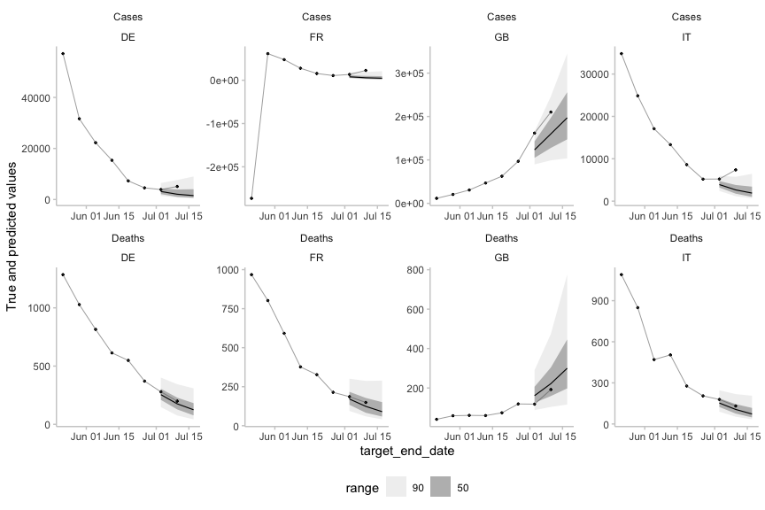

scoringutils: Utilities for Scoring and Assessing Predictions
================

<!-- badges: start -->

[](https://github.com/epiforecasts/scoringutils/actions/workflows/R-CMD-check.yaml)
[](https://app.codecov.io/gh/epiforecasts/scoringutils)
[](https://CRAN.R-project.org/package=scoringutils)
[](https://github.com/epiforecasts/scoringutils)
[](https://cran.r-project.org/package=scoringutils)
<!-- badges: end -->

The `scoringutils` package provides a collection of metrics and proper
scoring rules and aims to make it simple to score probabilistic
forecasts against the true observed values. The `scoringutils` package
offers convenient automated forecast evaluation in a `data.table` format
(using the function `score()`), but also provides experienced users with
a set of reliable lower-level scoring metrics operating on
vectors/matriced they can build upon in other applications. In addition
it implements a wide range of flexible plots designed to cover many use
cases.

Where available `scoringutils` depends on functionality from
`scoringRules` which provides a comprehensive collection of proper
scoring rules for predictive probability distributions represented as
sample or parametric distributions. For some forecast types, such as
quantile forecasts, `scoringutils` also implements additional metrics
for evaluating forecasts. On top of providing an interface to the proper
scoring rules implemented in `scoringRules` and natively, `scoringutils`
also offers utilities for summarising and visualising forecasts and
scores, and to obtain relative scores between models which may be useful
for non-overlapping forecasts and forecasts across scales.

Predictions can be handled in various formats: `scoringutils` can handle
probabilistic forecasts in either a sample based or a quantile based
format. For more detail on the expected input formats please see below.
True values can be integer, continuous or binary, and appropriate scores
for each of these value types are selected automatically.

## Installation

Install the CRAN version of this package using:

``` r
install.packages("scoringutils")
```

Install the stable development version of the package with:

``` r
install.packages("scoringutils", repos = "https://epiforecasts.r-universe.dev")
```

Install the unstable development from GitHub using the following,

``` r
remotes::install_github("epiforecasts/scoringutils", dependencies = TRUE)
```

## Quick start

In this quick start guide we explore some of the functionality of the
`scoringutils` package using quantile forecasts from the [ECDC
forecasting hub](https://covid19forecasthub.eu/) as an example. For more
detailed documentation please see the package vignettes, and individual
function documentation.

### Plotting forecasts

As a first step to evaluating the forecasts we visualise them. For the
purposes of this example here we make use of `plot_predictions()` to
filter the available forecasts for a single model, and forecast date.

``` r
example_quantile %>%
  make_NA(what = "truth", 
          target_end_date >= "2021-07-15", 
          target_end_date < "2021-05-22"
  ) %>%
  make_NA(what = "forecast",
          model != 'EuroCOVIDhub-ensemble', 
          forecast_date != "2021-06-28"
  ) %>%
  plot_predictions(
    x = "target_end_date",
    by = c("target_type", "location")
  ) +
  facet_wrap(target_type ~ location, ncol = 4, scales = "free") 
```

<!-- -->

### Scoring forecasts

Forecasts can be easily and quickly scored using the `score()` function.
This function returns unsumarised scores, which in most cases is not
what the user wants. Here we make use of additional functions from
`scoringutils` to add empirical coverage-levels (`add_coverage()`), and
scores relative to a baseline model (here chosen to be the
EuroCOVIDhub-ensemble model). See the getting started vignette for more
details. Finally we summarise these scores by model and target type.

``` r
example_quantile %>%
  score() %>%
  add_coverage(ranges = c(50, 90), by = c("model", "target_type")) %>%
  summarise_scores(
    by = c("model", "target_type"),
    relative_skill = TRUE,
    baseline = "EuroCOVIDhub-ensemble"
  ) %>%
  summarise_scores(
    fun = signif, 
    digits = 2
  ) %>%
  kable()
#> The following messages were produced when checking inputs:
#> 1.  144 values for `prediction` are NA in the data provided and the corresponding rows were removed. This may indicate a problem if unexpected.
```

| model                 | target_type | interval_score | dispersion | underprediction | overprediction | coverage_deviation |    bias | ae_median | coverage_50 | coverage_90 | relative_skill | scaled_rel_skill |
|:----------------------|:------------|---------------:|-----------:|----------------:|---------------:|-------------------:|--------:|----------:|------------:|------------:|---------------:|-----------------:|
| EuroCOVIDhub-baseline | Cases       |          28000 |       4100 |         10000.0 |        14000.0 |             -0.110 |  0.0980 |     38000 |        0.33 |        0.82 |           1.30 |              1.6 |
| EuroCOVIDhub-baseline | Deaths      |            160 |         91 |             2.1 |           66.0 |              0.120 |  0.3400 |       230 |        0.66 |        1.00 |           2.30 |              3.8 |
| EuroCOVIDhub-ensemble | Cases       |          18000 |       3700 |          4200.0 |        10000.0 |             -0.098 | -0.0560 |     24000 |        0.39 |        0.80 |           0.82 |              1.0 |
| EuroCOVIDhub-ensemble | Deaths      |             41 |         30 |             4.1 |            7.1 |              0.200 |  0.0730 |        53 |        0.88 |        1.00 |           0.60 |              1.0 |
| UMass-MechBayes       | Deaths      |             53 |         27 |            17.0 |            9.0 |             -0.023 | -0.0220 |        78 |        0.46 |        0.88 |           0.75 |              1.3 |
| epiforecasts-EpiNow2  | Cases       |          21000 |       5700 |          3300.0 |        12000.0 |             -0.067 | -0.0790 |     28000 |        0.47 |        0.79 |           0.95 |              1.2 |
| epiforecasts-EpiNow2  | Deaths      |             67 |         32 |            16.0 |           19.0 |             -0.043 | -0.0051 |       100 |        0.42 |        0.91 |           0.98 |              1.6 |

`scoringutils` contains additional functionality to summarise these
scores at different levels, to visualise them, and to explore the
forecasts themselves. See the package vignettes and function
documentation for more information.

## Citation

If using `scoringutils` in your work please consider citing it using the
output of `citation("scoringutils")`:

    #> 
    #> To cite scoringutils in publications use the following. If you use the
    #> CRPS, DSS, or Log Score, please also cite scoringRules.
    #> 
    #>   Nikos I. Bosse, Hugo Gruson, Sebastian Funk, EpiForecasts, and Sam
    #>   Abbott (2020). scoringutils: Utilities for Scoring and Assessing
    #>   Predictions, DOI: 10.5281/zenodo.4618017
    #> 
    #> To cite scoringRules in publications use:
    #> 
    #>   Alexander Jordan, Fabian Krueger, Sebastian Lerch (2019). Evaluating
    #>   Probabilistic Forecasts with scoringRules. Journal of Statistical
    #>   Software, 90(12), 1-37. DOI 10.18637/jss.v090.i12
    #> 
    #> To see these entries in BibTeX format, use 'print(<citation>,
    #> bibtex=TRUE)', 'toBibtex(.)', or set
    #> 'options(citation.bibtex.max=999)'.

## How to make a bug report or feature request

Please briefly describe your problem and what output you expect in an
[issue](https://github.com/epiforecasts/scoringutils/issues). If you
have a question, please don’t open an issue. Instead, ask on our [Q and
A
page](https://github.com/epiforecasts/scoringutils/discussions/categories/q-a).

## Contributing

We welcome contributions and new contributors! We particularly
appreciate help on priority problems in the
[issues](https://github.com/epiforecasts/scoringutils/issues). Please
check and add to the issues, and/or add a [pull
request](https://github.com/epiforecasts/scoringutils/pulls).

## Code of Conduct

Please note that the `scoringutils` project is released with a
[Contributor Code of
Conduct](https://epiforecasts.io/scoringutils/CODE_OF_CONDUCT.html). By
contributing to this project, you agree to abide by its terms.
