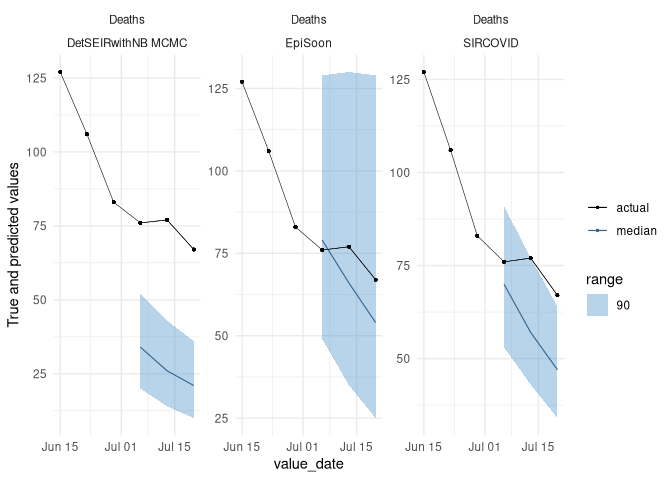
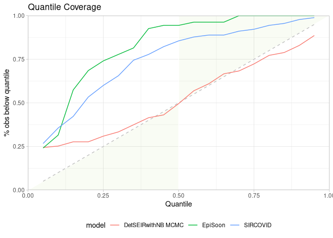
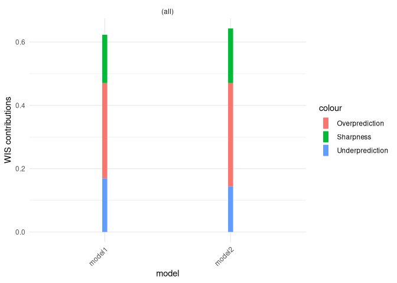
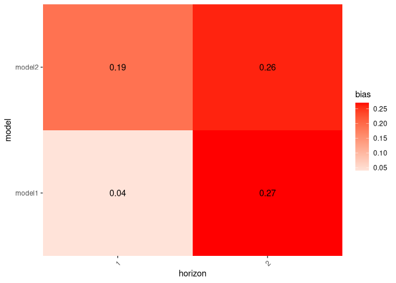

scoringutils: Utilities for Scoring and Assessing Predictions
================

[](https://github.com/epiforecasts/scoringutils/actions)
[](https://codecov.io/gh/epiforecasts/scoringutils/)
[](https://CRAN.R-project.org/package=scoringutils)
[](https://github.com/epiforecasts/scoringutils)
[](https://cran.r-project.org/package=scoringutils)
<!-- badges: end -->

The scoringutils package provides a collection of metrics and proper
scoring rules that make it simple to score forecasts against the true
observed values.

# Installation

The stable version of `scoringutils` is on CRAN, but is outdated now. We
do not recommend using it. Please install the current development
version from github using

``` r
remotes::install_github("epiforecasts/scoringutils")
```

# Introduction and Overview of Functionality

The `scoringutils` package provides a collection of metrics and proper
scoring rules that make it simple to score forecasts against the true
observed values. Predictions can either be automatically scored from a
`data.frame` using the function `eval_forecasts`. Alternatively,
evaluation metrics can be accessed directly using lower level functions
within a vector/matrix framework.

Predictions can be handled in various formats: `scoringutils` can handle
probabilistic forecasts in either a sample based or a quantile based
format. For more detail on the expected input formats please see below.
True values can be integer, continuous or binary.

In addition to automatic scoring, `scoringutils` offers a variety of
plots and visualisations.

# Scoring Forecasts Automatically

Most of the time, the `eval_forecasts` function will be able to do the
entire evaluation for you. The idea is simple, yet flexible.

All you need to do is to pass in a `data.frame` that has a column called
`prediction` and one called `true_value`. Depending on the exact input
format, additional columns like `sample`, `quantile` or `range` and
`boundary` are needed. Additional columns may be present to indicate a
grouping of forecasts. For example, we could have forecasts made by
different models in various locations at different time points, each for
several weeks into the future. In this case, we would have additional
columns called for example `model`, `date`, `forecast_date`,
`forecast_horizon` and `location`.

Using the `by` argument you need to specify the *unit of a single
forecast*. In this example here we would set
`by = c("model", "date", "forecast_date", "forecast_horizon", "location")`
(note: if we want to be pedantic, there is a small duplication as the
information of “date” is already included in the combination of
“forecast\_date” and “forecast\_horizon”. But as long as there isn’t
some weird shift, this doesn’t matter for the purpose of grouping our
observations). If you don’t specify `by` (i.e. `by = NULL`),
`scoringutils` will automatically use all appropriate present columns.
Note that you don’t need to include columns such as `quantile` or
`sample` in the `by` argument, as several quantiles / samples make up
one forecast.

Using the `summarise_by` argument you can now choose categories to
aggregate over. If you were only interested in scores for the different
models, you would specify `summarise_by = c("model")`. If you wanted to
have scores for every model in every location, you would need to specify
`summarise_by = c("model", "location")`. If you wanted to have one score
per quantile or one per prediction interval range, you could specify
something like `summarise_by = c("model", "quantile")` or
`summarise_by = c("model", "quantile", "range")` (note again that some
information is duplicated in quantile and range, but this doesn’t really
matter for grouping purposes). When aggregating, `eval_forecasts` takes
the mean according to the group defined in `summarise_by` (i.e. in this
example, if `summarise_by = c("model", "location")`, scores will be
averaged over all forecast dates, forecast horizons and quantiles to
yield one score per model and location). In addition to the mean, you
can also obtain the standard deviation of the scores over which you
average or any desired quantile (e.g. the median in addition to the
mean) by specifying `sd = TRUE` and `quantiles = c(0.5)`.

## Example Evaluation

Here is an example of an evaluation using the example data included in
the package. The data comes from a set of [Covid-19 short-term forecasts
in the UK](https://github.com/epiforecasts/covid19.forecasts.uk).

``` r
library(scoringutils)
#> Note: The definitions of the weighted interval score has slightly changed in version 0.1.5. If you want to use the old definition, use the argument `count_median_twice = TRUE` in the function `interval_score()`
library(data.table)
```

``` r
data <- scoringutils::quantile_example_data
print(data, 3, 3)
#>       value_date     value_type geography          value_desc true_value
#>    1: 2020-05-04   hospital_inc   England Hospital admissions       1043
#>    2: 2020-05-04  hospital_prev   England Total beds occupied      10648
#>    3: 2020-05-11   hospital_inc   England Hospital admissions        743
#>   ---                                                                   
#> 5150: 2020-08-03 death_inc_line     Wales              Deaths          1
#> 5151: 2020-08-03 death_inc_line     Wales              Deaths          1
#> 5152: 2020-08-03 death_inc_line     Wales              Deaths          1
#>                    model creation_date quantile prediction horizon
#>    1:               <NA>          <NA>       NA         NA      NA
#>    2:               <NA>          <NA>       NA         NA      NA
#>    3:               <NA>          <NA>       NA         NA      NA
#>   ---                                                             
#> 5150:           SIRCOVID    2020-07-13     0.85          4      21
#> 5151: DetSEIRwithNB MCMC    2020-07-13     0.90          2      21
#> 5152:           SIRCOVID    2020-07-13     0.90          6      21
scores <- scoringutils::eval_forecasts(data, 
                                       summarise_by = c("model", "quantile", "range"))
print(scores, 3, 3)
#>                  model quantile range interval_score sharpness underprediction
#>  1: DetSEIRwithNB MCMC     0.50     0       54.45528  0.000000     54.16260163
#>  2: DetSEIRwithNB MCMC     0.45    10       53.96138  6.310976     47.42276423
#>  3: DetSEIRwithNB MCMC     0.55    10       53.96138  6.310976     47.42276423
#> ---                                                                           
#> 55:           SIRCOVID     0.90    80       18.18000 17.368889      0.15555556
#> 56:           SIRCOVID     0.05    90       11.69444 11.661111      0.03333333
#> 57:           SIRCOVID     0.95    90       11.69444 11.661111      0.03333333
#>     overprediction  coverage coverage_deviation       bias      aem
#>  1:      0.2926829 0.3170732         0.31707317 -0.2333333 54.45528
#>  2:      0.2276423 0.4308943         0.33089431 -0.2333333 54.45528
#>  3:      0.2276423 0.4308943         0.33089431 -0.2333333 54.45528
#> ---                                                                
#> 55:      0.6555556 0.9333333         0.13333333  0.2255556 42.90000
#> 56:      0.0000000 0.9888889         0.08888889  0.2255556 42.90000
#> 57:      0.0000000 0.9888889         0.08888889  0.2255556 42.90000
#>     quantile_coverage
#>  1:         0.4959350
#>  2:         0.4308943
#>  3:         0.5691057
#> ---                  
#> 55:         0.9777778
#> 56:         0.2666667
#> 57:         0.9888889
```

Using an appropriate level of summary, we can easily use the output for
visualisation. The `scoringutils` package offers some built-in functions
to help get a sense of the data

``` r
filtered_data <- data[geography == "England" & 
                        creation_date <= "2020-06-29" & 
                        value_desc == "Deaths"]

scoringutils::plot_predictions(filtered_data[creation_date == "2020-06-29"], 
                               add_truth_data = filtered_data,
                               x = "value_date", range = c(0, 90), 
                               facet_formula = value_desc ~ model)
```

<!-- -->

(The data is just randomly generated values. We plan to add real example
data to make these illustrations more useful in the future)

``` r
scores <- scoringutils::eval_forecasts(data, 
                             summarise_by = c("model"))
scoringutils::score_table(scores)
```

<!-- -->

Given this level of aggregation, not all metrics may make sense. In this
case, for example, averaging over different quantiles to compute
quantile coverage does not make much sense. If you like, you can select
specific metrics for the visualisation.

Let us look at calibration:

``` r
scores <- scoringutils::eval_forecasts(data, 
                             summarise_by = c("model", "range", "quantile"))
scoringutils::interval_coverage(scores) + 
  ggplot2::ggtitle("Interval Coverage")

scoringutils::quantile_coverage(scores) + 
  ggplot2::ggtitle("Quantile Coverage")
```



Let us look at the individual components of the weighted interval score:

``` r
scores <- scoringutils::eval_forecasts(data, 
                             summarise_by = c("model", "value_desc"))
scoringutils::wis_components(scores, facet_formula = ~ value_desc)
```

<!-- -->

We can also look at contributions to different metrics by range:

``` r
scores <- scoringutils::eval_forecasts(data, 
                             summarise_by = c("model", "range", "value_desc"))
scoringutils::range_plot(scores, y = "interval_score", 
                         facet_formula = ~ value_desc)
```

<!-- -->

We can also visualise metrics using a heatmap:

``` r
scores <- scoringutils::eval_forecasts(data, 
                             summarise_by = c("model", "horizon"))
scores[, horizon := as.factor(horizon)]
scoringutils::score_heatmap(scores, 
                            x = "horizon", metric = "bias")
```

### Expected Input Formats

The `eval_forecasts` function is designed to work with various different
input formats. The following formats are currently supported:

quantile forecasts in either a plain quantile format or in a format that
specifies interval ranges and the boundary of a given interval range.

``` r
print(scoringutils::quantile_example_data, 3, 3)
#>       value_date     value_type geography          value_desc true_value
#>    1: 2020-05-04   hospital_inc   England Hospital admissions       1043
#>    2: 2020-05-04  hospital_prev   England Total beds occupied      10648
#>    3: 2020-05-11   hospital_inc   England Hospital admissions        743
#>   ---                                                                   
#> 5150: 2020-08-03 death_inc_line     Wales              Deaths          1
#> 5151: 2020-08-03 death_inc_line     Wales              Deaths          1
#> 5152: 2020-08-03 death_inc_line     Wales              Deaths          1
#>                    model creation_date quantile prediction horizon
#>    1:               <NA>          <NA>       NA         NA      NA
#>    2:               <NA>          <NA>       NA         NA      NA
#>    3:               <NA>          <NA>       NA         NA      NA
#>   ---                                                             
#> 5150:           SIRCOVID    2020-07-13     0.85          4      21
#> 5151: DetSEIRwithNB MCMC    2020-07-13     0.90          2      21
#> 5152:           SIRCOVID    2020-07-13     0.90          6      21
print(scoringutils::range_example_data_long, 3, 3)
#>       value_date     value_type geography          value_desc true_value
#>    1: 2020-05-04   hospital_inc   England Hospital admissions       1043
#>    2: 2020-05-04  hospital_prev   England Total beds occupied      10648
#>    3: 2020-05-11   hospital_inc   England Hospital admissions        743
#>   ---                                                                   
#> 5417: 2020-07-27 death_inc_line     Wales              Deaths          1
#> 5418: 2020-08-03 death_inc_line     Wales              Deaths          1
#> 5419: 2020-08-03 death_inc_line     Wales              Deaths          1
#>                    model creation_date prediction horizon boundary range
#>    1:               <NA>          <NA>         NA      NA     <NA>    NA
#>    2:               <NA>          <NA>         NA      NA     <NA>    NA
#>    3:               <NA>          <NA>         NA      NA     <NA>    NA
#>   ---                                                                   
#> 5417:           SIRCOVID    2020-07-13          1      14    upper     0
#> 5418: DetSEIRwithNB MCMC    2020-07-13          0      21    upper     0
#> 5419:           SIRCOVID    2020-07-13          1      21    upper     0
```

sample based format with either continuous or integer values

``` r
print(scoringutils::integer_example_data, 3, 3)
#>        value_date     value_type geography          value_desc    model
#>     1: 2020-05-04   hospital_inc   England Hospital admissions     <NA>
#>     2: 2020-05-04  hospital_prev   England Total beds occupied     <NA>
#>     3: 2020-05-11   hospital_inc   England Hospital admissions     <NA>
#>    ---                                                                 
#> 13427: 2020-08-03 death_inc_line     Wales              Deaths SIRCOVID
#> 13428: 2020-08-03 death_inc_line     Wales              Deaths SIRCOVID
#> 13429: 2020-08-03 death_inc_line     Wales              Deaths SIRCOVID
#>        creation_date horizon prediction sample true_value
#>     1:          <NA>      NA         NA     NA       1043
#>     2:          <NA>      NA         NA     NA      10648
#>     3:          <NA>      NA         NA     NA        743
#>    ---                                                   
#> 13427:    2020-07-13      21          0     48          1
#> 13428:    2020-07-13      21          0     49          1
#> 13429:    2020-07-13      21          0     50          1
print(scoringutils::continuous_example_data, 3, 3)
#>        value_date     value_type geography          value_desc    model
#>     1: 2020-05-04   hospital_inc   England Hospital admissions     <NA>
#>     2: 2020-05-04  hospital_prev   England Total beds occupied     <NA>
#>     3: 2020-05-11   hospital_inc   England Hospital admissions     <NA>
#>    ---                                                                 
#> 13427: 2020-08-03 death_inc_line     Wales              Deaths SIRCOVID
#> 13428: 2020-08-03 death_inc_line     Wales              Deaths SIRCOVID
#> 13429: 2020-08-03 death_inc_line     Wales              Deaths SIRCOVID
#>        creation_date horizon   prediction sample true_value
#>     1:          <NA>      NA           NA     NA       1043
#>     2:          <NA>      NA           NA     NA      10648
#>     3:          <NA>      NA           NA     NA        743
#>    ---                                                     
#> 13427:    2020-07-13      21 0.3340917507     48          1
#> 13428:    2020-07-13      21 0.3540187438     49          1
#> 13429:    2020-07-13      21 0.0001998965     50          1
print(scoringutils::range_example_data_wide, 3, 3)
#>      value_date     value_type        geography          value_desc true_value
#>   1: 2020-05-04 death_inc_line          England              Deaths        448
#>   2: 2020-05-04 death_inc_line Northern Ireland              Deaths          9
#>   3: 2020-05-04 death_inc_line         Scotland              Deaths         40
#>  ---                                                                          
#> 344: 2020-08-03  hospital_prev          England Total beds occupied        784
#> 345: 2020-08-03  hospital_prev         Scotland Total beds occupied        265
#> 346: 2020-08-03       icu_prev         Scotland   ICU beds occupied          3
#>                   model creation_date horizon lower_0 lower_10 lower_20
#>   1:               <NA>          <NA>      NA      NA       NA       NA
#>   2:               <NA>          <NA>      NA      NA       NA       NA
#>   3:               <NA>          <NA>      NA      NA       NA       NA
#>  ---                                                                   
#> 344:               <NA>          <NA>      NA      NA       NA       NA
#> 345:               <NA>          <NA>      NA      NA       NA       NA
#> 346: DetSEIRwithNB MCMC    2020-07-13      21       2        2        2
#>      lower_30 lower_40 lower_50 lower_60 lower_70 lower_80 lower_90 upper_0
#>   1:       NA       NA       NA       NA       NA       NA       NA      NA
#>   2:       NA       NA       NA       NA       NA       NA       NA      NA
#>   3:       NA       NA       NA       NA       NA       NA       NA      NA
#>  ---                                                                       
#> 344:       NA       NA       NA       NA       NA       NA       NA      NA
#> 345:       NA       NA       NA       NA       NA       NA       NA      NA
#> 346:        2        2        1        1        1        1        0       2
#>      upper_10 upper_20 upper_30 upper_40 upper_50 upper_60 upper_70 upper_80
#>   1:       NA       NA       NA       NA       NA       NA       NA       NA
#>   2:       NA       NA       NA       NA       NA       NA       NA       NA
#>   3:       NA       NA       NA       NA       NA       NA       NA       NA
#>  ---                                                                        
#> 344:       NA       NA       NA       NA       NA       NA       NA       NA
#> 345:       NA       NA       NA       NA       NA       NA       NA       NA
#> 346:        3        3        3        3        4        4        4        5
#>      upper_90
#>   1:       NA
#>   2:       NA
#>   3:       NA
#>  ---         
#> 344:       NA
#> 345:       NA
#> 346:        6
```

forecasts in a binary format:

``` r
print(scoringutils::binary_example_data, 3, 3)
#>      value_date     value_type geography          value_desc              model
#>   1: 2020-05-04   hospital_inc   England Hospital admissions               <NA>
#>   2: 2020-05-04  hospital_prev   England Total beds occupied               <NA>
#>   3: 2020-05-11   hospital_inc   England Hospital admissions               <NA>
#>  ---                                                                           
#> 344: 2020-07-27 death_inc_line     Wales              Deaths           SIRCOVID
#> 345: 2020-08-03 death_inc_line     Wales              Deaths DetSEIRwithNB MCMC
#> 346: 2020-08-03 death_inc_line     Wales              Deaths           SIRCOVID
#>      creation_date horizon prediction true_value
#>   1:          <NA>      NA         NA         NA
#>   2:          <NA>      NA         NA         NA
#>   3:          <NA>      NA         NA         NA
#>  ---                                            
#> 344:    2020-07-13      14       0.34          0
#> 345:    2020-07-13      21       0.22          1
#> 346:    2020-07-13      21       0.26          0
```

It also offers functionality to convert between these formats. For more
information have a look at the documentation of the following functions:

``` r
scoringutils::sample_to_quantile() # convert from sample based to quantile format
scoringutils::range_long_to_quantile() # convert from range format to plain quantile
scoringutils::quantile_to_range_long() # convert the other way round
scoringutils::range_wide_to_long() # convert range based format from wide to long
scoringutils::range_long_to_wide() # convert the other way round
```

# Scoring Forecasts Directly

A variety of metrics and scoring rules can also be accessed directly
through the `scoringutils` package.

The following gives an overview of (most of) the implemented metrics.

## Bias

The function `bias` determines bias from predictive Monte-Carlo samples,
automatically recognising whether forecasts are continuous or integer
valued.

For continuous forecasts, Bias is measured as
*B*<sub>*t*</sub>(*P*<sub>*t*</sub>, *x*<sub>*t*</sub>) = 1 − 2 ⋅ (*P*<sub>*t*</sub>(*x*<sub>*t*</sub>))

where *P*<sub>*t*</sub> is the empirical cumulative distribution
function of the prediction for the true value *x*<sub>*t*</sub>.
Computationally, *P*<sub>*t*</sub>(*x*<sub>*t*</sub>) is just calculated
as the fraction of predictive samples for *x*<sub>*t*</sub> that are
smaller than *x*<sub>*t*</sub>.

For integer valued forecasts, Bias is measured as

*B*<sub>*t*</sub>(*P*<sub>*t*</sub>, *x*<sub>*t*</sub>) = 1 − (*P*<sub>*t*</sub>(*x*<sub>*t*</sub>) + *P*<sub>*t*</sub>(*x*<sub>*t*</sub> + 1))

to adjust for the integer nature of the forecasts. In both cases, Bias
can assume values between -1 and 1 and is 0 ideally.

``` r
## integer valued forecasts
true_values <- rpois(30, lambda = 1:30)
predictions <- replicate(200, rpois(n = 30, lambda = 1:30))
bias(true_values, predictions)
#>  [1]  0.020  0.830 -0.070  0.850  0.600  0.985 -0.395 -0.540  0.920 -0.705
#> [11]  0.730 -0.340  0.310  0.955  0.235 -0.235 -0.580 -0.835  0.955 -0.460
#> [21] -0.225  0.025 -0.980 -0.860 -0.875 -0.235 -0.035  0.580  0.000  0.985

## continuous forecasts
true_values <- rnorm(30, mean = 1:30)
predictions <- replicate(200, rnorm(30, mean = 1:30))
bias(true_values, predictions)
#>  [1]  0.35 -0.37 -0.10 -0.37 -0.32 -0.14 -0.76  0.21 -1.00  0.73  0.31  0.30
#> [13]  0.40  0.21  0.87  0.83 -0.84 -0.19  0.47 -0.69 -0.18  0.96  0.70  0.27
#> [25]  0.31 -0.14 -0.05 -0.69 -0.72  0.83
```

## Sharpness

Sharpness is the ability of the model to generate predictions within a
narrow range. It is a data-independent measure, and is purely a feature
of the forecasts themselves.

Shaprness of predictive samples corresponding to one single true value
is measured as the normalised median of the absolute deviation from the
median of the predictive samples. For details, see `?stats::mad`

``` r
predictions <- replicate(200, rpois(n = 30, lambda = 1:30))
sharpness(predictions)
#>  [1] 1.4826 1.4826 1.4826 2.2239 2.9652 2.9652 2.9652 2.9652 2.9652 2.9652
#> [11] 2.9652 3.7065 4.4478 4.4478 4.4478 2.9652 4.4478 4.4478 2.9652 4.4478
#> [21] 4.4478 4.4478 4.4478 4.4478 5.9304 4.4478 4.4478 4.4478 5.9304 5.9304
```

## Calibration

Calibration or reliability of forecasts is the ability of a model to
correctly identify its own uncertainty in making predictions. In a model
with perfect calibration, the observed data at each time point look as
if they came from the predictive probability distribution at that time.

Equivalently, one can inspect the probability integral transform of the
predictive distribution at time t,

*u*<sub>*t*</sub> = *F*<sub>*t*</sub>(*x*<sub>*t*</sub>)

where *x*<sub>*t*</sub> is the observed data point at time *t* in
*t*<sub>1</sub>, …, *t*<sub>*n*</sub>, n being the number of forecasts,
and *F*<sub>*t*</sub> is the (continuous) predictive cumulative
probability distribution at time t. If the true probability distribution
of outcomes at time t is *G*<sub>*t*</sub> then the forecasts
*F*<sub>*t*</sub> are said to be ideal if
*F*<sub>*t*</sub> = *G*<sub>*t*</sub> at all times *t*. In that case,
the probabilities ut are distributed uniformly.

In the case of discrete outcomes such as incidence counts, the PIT is no
longer uniform even when forecasts are ideal. In that case a randomised
PIT can be used instead:

*u*<sub>*t*</sub> = *P*<sub>*t*</sub>(*k*<sub>*t*</sub>) + *v* ⋅ (*P*<sub>*t*</sub>(*k*<sub>*t*</sub>) − *P*<sub>*t*</sub>(*k*<sub>*t*</sub> − 1))

where *k*<sub>*t*</sub> is the observed count, *P*<sub>*t*</sub>(*x*) is
the predictive cumulative probability of observing incidence *k* at time
*t*, *P*<sub>*t*</sub>( − 1) = 0 by definition and *v* is standard
uniform and independent of *k*. If *P*<sub>*t*</sub> is the true
cumulative probability distribution, then *u*<sub>*t*</sub> is standard
uniform.

The function checks whether integer or continuous forecasts were
provided. It then applies the (randomised) probability integral and
tests the values *u*<sub>*t*</sub> for uniformity using the
Anderson-Darling test.

As a rule of thumb, there is no evidence to suggest a forecasting model
is miscalibrated if the p-value found was greater than a threshold of
*p* &gt;  = 0.1, some evidence that it was miscalibrated if
0.01 &lt; *p* &lt; 0.1, and good evidence that it was miscalibrated if
*p* &lt;  = 0.01. In this context it should be noted, though, that
uniformity of the PIT is a necessary but not sufficient condition of
calibration. It should als be noted that the test only works given
sufficient samples, otherwise the Null hypothesis will often be rejected
outright.

## Continuous Ranked Probability Score (CRPS)

Wrapper around the `crps_sample` function from the `scoringRules`
package. For more information look at the manuals from the
`scoringRules` package. The function can be used for continuous as well
as integer valued forecasts. Smaller values are better.

``` r
true_values <- rpois(30, lambda = 1:30)
predictions <- replicate(200, rpois(n = 30, lambda = 1:30))
crps(true_values, predictions)
#>  [1]  0.484725  0.522300  0.754775  1.940750  0.946000  1.540875  0.560800
#>  [8]  1.287250  0.773250  6.333950  0.977575  1.600275  1.062800  8.922450
#> [15]  2.441150  0.834700  2.728625  1.004725  1.996200  3.062175  1.136075
#> [22]  2.975050  3.402475  3.283250  3.156225  3.942225  4.146375 10.740000
#> [29]  1.646800  1.751275
```

## Dawid-Sebastiani Score (DSS)

Wrapper around the `dss_sample` function from the `scoringRules`
package. For more information look at the manuals from the
`scoringRules` package. The function can be used for continuous as well
as integer valued forecasts. Smaller values are better.

``` r
true_values <- rpois(30, lambda = 1:30)
predictions <- replicate(200, rpois(n = 30, lambda = 1:30))
dss(true_values, predictions)
#>  [1] 3.271605 1.109590 2.296375 1.638642 1.720113 1.891801 1.814442 2.633736
#>  [9] 2.315999 3.609963 3.199639 3.208637 2.718436 4.955331 5.141449 4.165855
#> [17] 3.417330 3.390977 3.526383 3.127248 3.334262 3.220303 5.131775 4.164216
#> [25] 4.444760 6.651042 4.790084 3.784817 3.604751 3.972252
```

## Log Score

Wrapper around the `log_sample` function from the `scoringRules`
package. For more information look at the manuals from the
`scoringRules` package. The function should not be used for integer
valued forecasts. While Log Scores are in principle possible for integer
valued foreasts they require a kernel density estimate which is not well
defined for discrete values. Smaller values are better.

``` r
true_values <- rnorm(30, mean = 1:30)
predictions <- replicate(200, rnorm(n = 30, mean = 1:30))
logs(true_values, predictions)
#>  [1] 4.2449388 1.2183110 0.9350496 1.3702498 1.2994017 1.9734176 1.9486463
#>  [8] 1.0301476 1.0777401 1.1858366 0.8741934 1.2182398 1.0398304 1.1220978
#> [15] 1.6338811 1.8492573 2.6494550 1.5769399 1.0705151 1.0049739 0.9289143
#> [22] 1.2958066 1.0433506 1.0013816 1.1328087 1.0145965 4.4580586 1.0059555
#> [29] 1.0175473 1.3584801
```

## Brier Score

The Brier score is a proper score rule that assesses the accuracy of
probabilistic binary predictions. The outcomes can be either 0 or 1, the
predictions must be a probability that the true outcome will be 1.

The Brier Score is then computed as the mean squared error between the
probabilistic prediction and the true outcome.

<!-- $$\text{BrierScore} = \frac{1}{N}\sum_{t=1}^{n} (\text{prediction}_t-\text{outcome}_t)^2$$ -->

``` r
true_values <- sample(c(0,1), size = 30, replace = TRUE)
predictions <- runif(n = 30, min = 0, max = 1)

brier_score(true_values, predictions)
#> [1] 0.3132916
```

## Interval Score

The Interval Score is a Proper Scoring Rule to score quantile
predictions, following Gneiting and Raftery (2007). Smaller values are
better.

The score is computed as


<!-- $$\begin{align*} -->
<!-- \text{score} = & (\text{upper} - \text{lower}) + \\ -->
<!-- & \frac{2}{\alpha} \cdot ( \text{lower} - \text{true_value}) \cdot 1( \text{true_values} < \text{lower}) + \\ -->
<!-- & \frac{2}{\alpha} \cdot ( \text{true_value} - \text{upper}) \cdot 1( \text{true_value} > \text{upper}) -->
<!-- \end{align*}$$ -->

where 1() is the indicator function and *α* is the decimal value that
indicates how much is outside the prediction interval. To improve
usability, the user is asked to provide an interval range in percentage
terms, i.e. interval\_range = 90 (percent) for a 90 percent prediction
interval. Correspondingly, the user would have to provide the 5% and 95%
quantiles (the corresponding alpha would then be 0.1). No specific
distribution is assumed, but the range has to be symmetric (i.e you
can’t use the 0.1 quantile as the lower bound and the 0.7 quantile as
the upper). Setting `weigh = TRUE` will weigh the score by *α*/2 such
that the Interval Score converges to the CRPS for increasing number of
quantiles.

``` r
true_values <- rnorm(30, mean = 1:30)
interval_range <- 90
alpha <- (100 - interval_range) / 100
lower <- qnorm(alpha/2, rnorm(30, mean = 1:30))
upper <- qnorm((1- alpha/2), rnorm(30, mean = 1:30))

interval_score(true_values = true_values,
               lower = lower,
               upper = upper,
               interval_range = interval_range)
#>  [1] 0.1221291 0.1313182 0.1663424 0.2354949 0.2466355 0.2170362 1.5143775
#>  [8] 0.1810042 0.2064054 1.2614409 0.4002147 1.4409476 0.1685613 0.6510942
#> [15] 0.1086299 0.2612796 0.2429625 0.1377730 0.1912384 0.7589243 0.1609433
#> [22] 1.4352004 0.1790574 0.1040817 0.1621819 0.1988057 0.1803143 0.1420993
#> [29] 0.1225354 0.2043855
```
