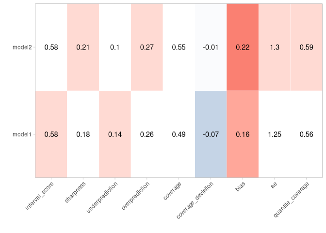

scoringutils: Utilities for Scoring and Assessing Predictions
================

<!-- badges: end -->

The scoringutils package provides a collection of metrics and proper
scoring rules that make it simple to score forecasts against the true
observed values.

Installation
------------

The stable version of `scoringutils` is on CRAN, but is outdated now. We
do not recommend using it. Please install the current development
version from github using

    remotes::install_github("epiforecasts/scoringutils")

Functionality
-------------

Predictions can either be automatically scored from a `data.frame` using
the function `eval_forecasts`. Alternatively, evaluation metrics can be
accessed directly using lower level functions within a vector/matrix
framework.

Predictions can be handled in various formats: `scoringutils` can handle
probabilistic forecasts in either a sample based or a quantile based
format. For more detail on the expected input formats please see below.
True values can be integer, continuous or binary.

In addition to automatic scoring, `scoringutils` offers a variety of
plots and visualisations.

Scoring Forecasts Automatically
-------------------------------

Most of the time, the `eval_forecasts` function will be able to do the
entire evaluation for you. The idea is simple, yet flexible.

All you need to do is to pass in a `data.frame` that has a column called
`prediction` and one called `true_value`. Depending on the exact input
format, additional columns like `sample`, `quantile` or `range` and
`boundary` are needed. Additional columns may be present to indicate a
grouping of forecasts. For example, we could have forecasts made by
different models in various locations at different time points, each for
several weeks into the future. In this case, we would have additional
columns called for example `model`, `date`, `forecast_date`,
`forecast_horizon` and `location`.

Using the `by` argument you need to specify the *unit of a single
forecast*. In this example here we would set
`by = c("model", "date", "forecast_date", "forecast_horizon", "location")`
(note: if we want to be pedantic, there is a small duplication as the
information of “date” is already included in the combination of
“forecast\_date” and “forecast\_horizon”. But as long as there isn’t
some weird shift, this doesn’t matter for the purpose of grouping our
observations). If you don’t specify `by` (i.e. `by = NULL`),
`scoringutils` will automatically use all appropriate present columns.
Note that you don’t need to include columns such as `quantile` or
`sample` in the `by` argument, as several quantiles / samples make up
one forecast.

Using the `summarise_by` argument you can now choose categories to
aggregate over. If you were only interested in scores for the different
models, you would specify `summarise_by = c("model")`. If you wanted to
have scores for every model in every location, you would need to specify
`summarise_by = c("model", "location")`. If you wanted to have one score
per quantile or one per prediction interval range, you could specify
something like `summarise_by = c("model", "quantile")` or
`summarise_by = c("model", "quantile", "range")` (note again that some
information is duplicated in quantile and range, but this doesn’t really
matter for grouping purposes). When aggregating, `eval_forecasts` takes
the mean according to the group defined in `summarise_by` (i.e. in this
example, if `summarise_by = c("model", "location")`, scores will be
averaged over all forecast dates, forecast horizons and quantiles to
yield one score per model and location). In addition to the mean, you
can also obtain the standard deviation of the scores over which you
average or any desired quantile (e.g. the median in addition to the
mean) by specifying `sd = TRUE` and `quantiles = c(0.5)`.

Example Evaluation
------------------

Here is an example of an evaluation using toy data:

    data <- scoringutils::quantile_example_data_plain
    print(data, 3, 3)

    ##      true_value id  model prediction horizon quantile
    ##   1:   2.659261  1 model1 -0.6448536       1     0.05
    ##   2:   2.659261  1 model1  0.3255102       1     0.25
    ##   3:   2.659261  1 model1  1.0000000       1     0.50
    ##  ---                                                 
    ## 598:  30.189608 30 model2 31.2242353       2     0.50
    ## 599:  30.189608 30 model2 31.3873685       2     0.95
    ## 600:  30.189608 30 model2 30.6399809       2     0.75

    scoringutils::eval_forecasts(data, 
                                 summarise_by = c("model", "quantile", "range"))

    ##      model quantile range interval_score sharpness underprediction
    ##  1: model1     0.50     0      0.8269027 0.0000000     0.304369095
    ##  2: model1     0.25    50      0.7760589 0.3044214     0.179681560
    ##  3: model1     0.75    50      0.7760589 0.3044214     0.179681560
    ##  4: model1     0.05    90      0.2658170 0.1523911     0.024935181
    ##  5: model1     0.95    90      0.2658170 0.1523911     0.024935181
    ##  6: model2     0.50     0      0.9779030 0.0000000     0.350926228
    ##  7: model2     0.25    50      0.6787509 0.3566315     0.072721303
    ##  8: model2     0.75    50      0.6787509 0.3566315     0.072721303
    ##  9: model2     0.05    90      0.2721723 0.1606143     0.008071852
    ## 10: model2     0.95    90      0.2721723 0.1606143     0.008071852
    ##     overprediction  coverage coverage_deviation      bias        ae
    ##  1:     0.52253362 0.0000000         0.00000000 0.1566667 0.8269027
    ##  2:     0.29195591 0.4000000        -0.10000000 0.1566667 1.0557020
    ##  3:     0.29195591 0.4000000        -0.10000000 0.1566667 1.1052588
    ##  4:     0.08849074 0.8166667        -0.08333333 0.1566667 1.4575565
    ##  5:     0.08849074 0.8166667        -0.08333333 0.1566667 1.8171179
    ##  6:     0.62697674 0.0000000         0.00000000 0.2233333 0.9779030
    ##  7:     0.24939811 0.5333333         0.03333333 0.2233333 0.8272041
    ##  8:     0.24939811 0.5333333         0.03333333 0.2233333 1.2435606
    ##  9:     0.10348616 0.8500000        -0.05000000 0.2233333 1.4528032
    ## 10:     0.10348616 0.8500000        -0.05000000 0.2233333 1.9825992
    ##     quantile_coverage
    ##  1:         0.5500000
    ##  2:         0.4000000
    ##  3:         0.7833333
    ##  4:         0.1333333
    ##  5:         0.9500000
    ##  6:         0.6166667
    ##  7:         0.3333333
    ##  8:         0.8666667
    ##  9:         0.1500000
    ## 10:         0.9833333

Using an appropriate level of summary, we can easily use the output for
visualisation. The `scoringutils` package offers some built-in functions
to help get a sense of the data

    scoringutils::plot_predictions(data, x = "id", range = c(0, 90), 
                                   facet_formula = ~ model)

<!-- -->

(The data is just randomly generated values. We plan to add real example
data to make these illustrations more useful in the future)

    scores <- scoringutils::eval_forecasts(data, 
                                 summarise_by = c("model"))

    scoringutils::score_table(scores)

<!-- -->

Given this level of aggregation, not all metrics may make sense. In this
case, for example, averaging over different quantiles to compute
quantile coverage does not make much sense. If you like, you can select
specific metrics for the visualisation.

Let us look at calibration:

    scores <- scoringutils::eval_forecasts(data, 
                                 summarise_by = c("model", "range"))

    scoringutils::interval_coverage(scores) + 
      ggplot2::ggtitle("Interval Coverage")

    scoringutils::quantile_coverage(data) + 
      ggplot2::ggtitle("Quantile Coverage")

Let us look at the individual components of the weighted interval score:

    scores <- scoringutils::eval_forecasts(data, 
                                 summarise_by = c("model"))

    scoringutils::wis_components(scores)

<!-- -->

We can also look at contributions to different metrics by range:

    scores <- scoringutils::eval_forecasts(data, 
                                 summarise_by = c("model", "range"))

    scoringutils::range_plot(scores, y = "interval_score")

<!-- -->

We can also visualise metrics using a heatmap:

    scores <- scoringutils::eval_forecasts(data, 
                                 summarise_by = c("model", "horizon"))

    scoringutils::score_heatmap(scores %>%
                                  dplyr::mutate(horizon = as.factor(horizon)), 
                                x = "horizon", metric = "bias")

<!-- -->

For an applied example using real data, have look at a [preliminary
evaluation of models from the German Forecast
Hub](https://github.com/nikosbosse/forecast-report).

### Expected Input Formats

The `eval_forecasts` function is designed to work with various different
input formats. The following formats are currently supported:

quantile forecasts in eiher a plain quantile format or in a format that
specifies interval ranges and the boundary of a given interval range.

    print(scoringutils::quantile_example_data_plain, 3, 3)

    ##      true_value id  model prediction horizon quantile
    ##   1:   2.659261  1 model1 -0.6448536       1     0.05
    ##   2:   2.659261  1 model1  0.3255102       1     0.25
    ##   3:   2.659261  1 model1  1.0000000       1     0.50
    ##  ---                                                 
    ## 598:  30.189608 30 model2 31.2242353       2     0.50
    ## 599:  30.189608 30 model2 31.3873685       2     0.95
    ## 600:  30.189608 30 model2 30.6399809       2     0.75

    print(scoringutils::quantile_example_data_long, 3, 3)

    ##      true_value id  model prediction boundary range horizon
    ##   1:   2.659261  1 model1 -0.6448536    lower    90       1
    ##   2:   2.659261  1 model1  0.3255102    lower    50       1
    ##   3:   2.659261  1 model1  1.0000000    lower     0       1
    ##  ---                                                       
    ## 718:  30.189608 30 model2 31.3873685    upper    90       2
    ## 719:  30.189608 30 model2 30.6399809    upper    50       2
    ## 720:  30.189608 30 model2 31.2576984    upper     0       2

sample based format with either continuous or integer values

    print(scoringutils::integer_example_data, 3, 3)

    ## # A tibble: 6,000 x 6
    ## # Groups:   id [30]
    ##       id model  true_value sample prediction horizon
    ##    <int> <chr>       <dbl>  <int>      <dbl>   <dbl>
    ##  1     1 model1          6      1          5       1
    ##  2     1 model1          6      2          4       1
    ##  3     1 model1          6      3          3       1
    ##  4     1 model1          6      4          3       1
    ##  5     1 model1          6      5          4       1
    ##  6     1 model1          6      6          4       1
    ##  7     1 model1          6      7          5       1
    ##  8     1 model1          6      8          4       1
    ##  9     1 model1          6      9          4       1
    ## 10     1 model1          6     10          6       1
    ## # … with 5,990 more rows

    print(scoringutils::continuous_example_data, 3, 3)

    ##       id  model  true_value sample   prediction horizon
    ##    1:  1 model1  0.03007379      1 -0.203426069       1
    ##    2:  1 model1  0.03007379      2  0.007621269       1
    ##    3:  1 model1  0.03007379      3 -2.086657003       1
    ##   ---                                                  
    ## 5998: 30 model2 -2.93749990     48 -0.079900522       2
    ## 5999: 30 model2 -2.93749990     49 -1.178524017       2
    ## 6000: 30 model2 -2.93749990     50  0.638750918       2

forecasts in a binary format:

    print(scoringutils::binary_example_data, 3, 3)

    ## # A tibble: 120 x 5
    ## # Groups:   id, model [60]
    ##       id model  horizon prediction true_value
    ##    <int> <fct>    <dbl>      <dbl>      <dbl>
    ##  1     1 model1       1    0.746            0
    ##  2     1 model1       2    0.522            0
    ##  3     1 model2       1    0.00958          0
    ##  4     1 model2       2    0.00671          0
    ##  5     2 model1       1    0.730            0
    ##  6     2 model1       2    0.511            0
    ##  7     2 model2       1    0.0274           0
    ##  8     2 model2       2    0.0192           0
    ##  9     3 model1       1    0.543            0
    ## 10     3 model1       2    0.380            0
    ## # … with 110 more rows

It also offers functionality to convert between these formats. For more
information have a look at the documentation of the following functions:

    scoringutils::sample_to_quantile() # convert from sample based to quantile format
    scoringutils::range_to_quantile() # convert from range format to plain quantile
    scoringutils::quantile_to_range() # convert the other way round
    scoringutils::quantile_to_long() # convert range based format from wide to long
    scoringutils::quantile_to_wide() # convert the other way round

Scoring Forecasts Directly Using Lower Level Functions
------------------------------------------------------

Documentation will be added soon.
