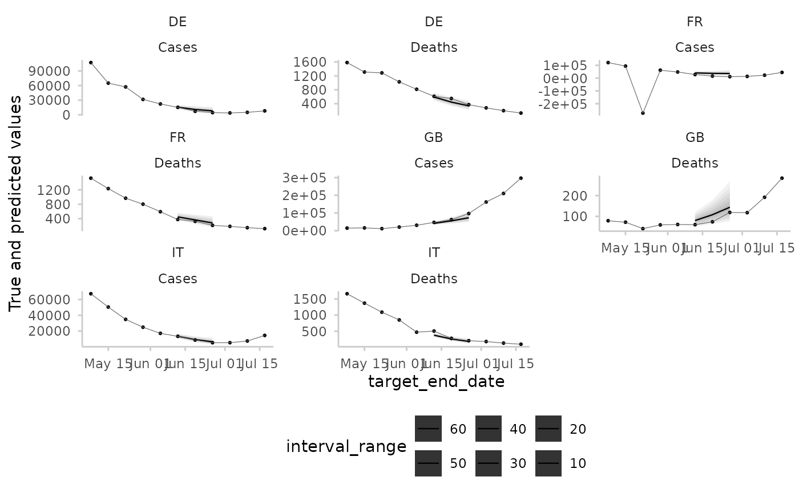
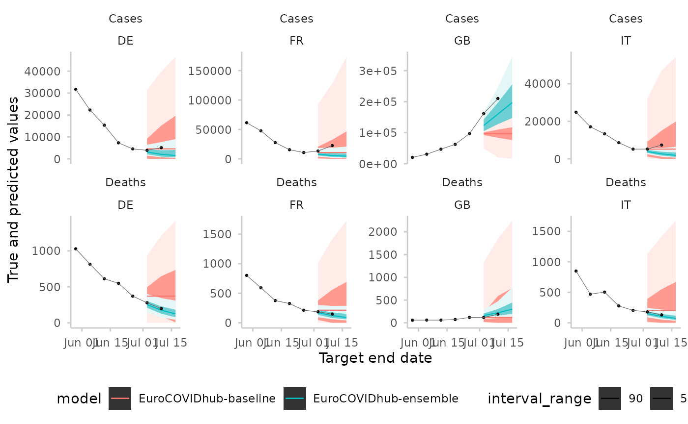
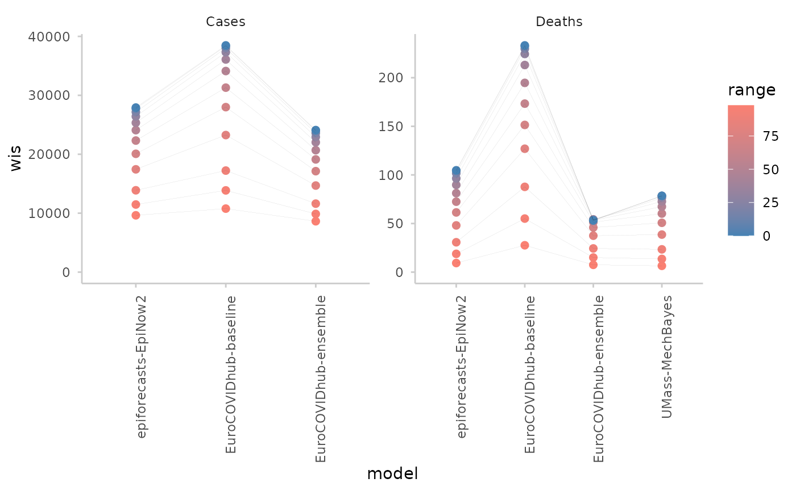
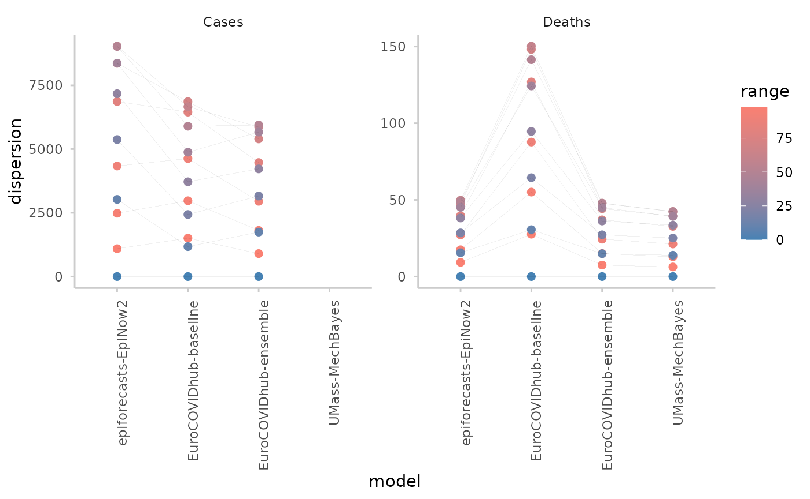
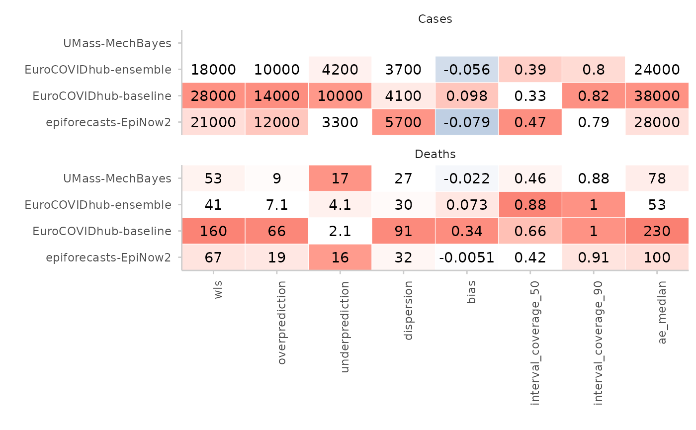
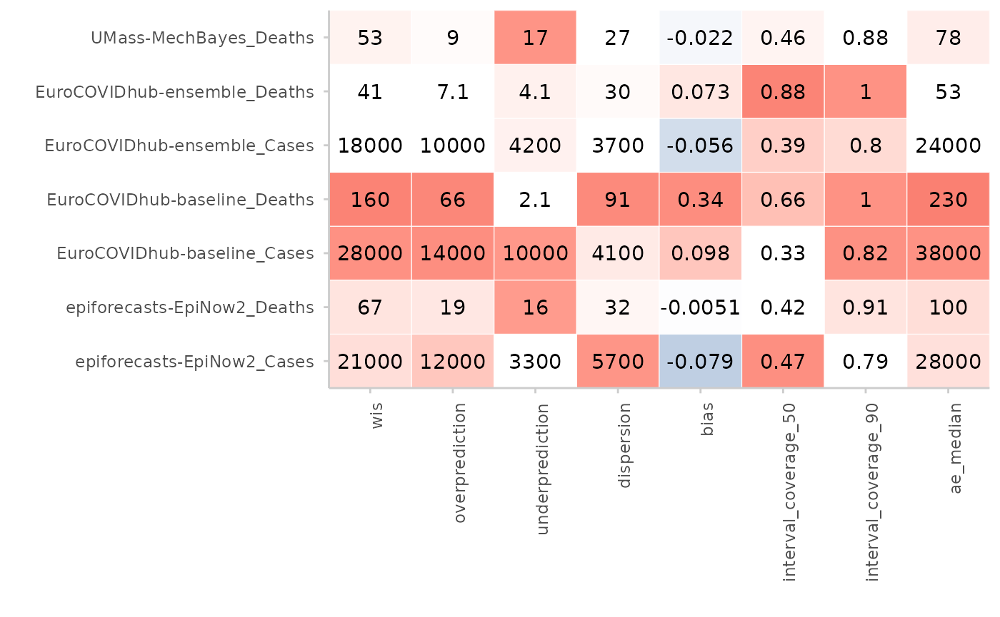

# Deprecated Visualisations

This Vignette provides the code for visualisations that were previously
part of `scoringutils` but have been removed with `scoringutils` version
`2.0`. For alternative ways to implemenent data visualisations, we refer
to the `hubVis` [package](https://github.com/hubverse-org/hubVis).

The example data used is the data shipped with the `scoringutils`
package. It consists of short-term forecasts of COVID-19 cases and
deaths for several European countries, submitted to the European
COVID-19 Forecast Hub. Every week, forecasters submitted 1 to 4 week
ahead forecasts (the “forecast horizon”, here restricted to 1 to 3 week
ahead). The dates for which a forecast was made are called
`target_end_date`. See
e.g. [`?example_quantile`](https://epiforecasts.io/scoringutils/dev/reference/example_quantile.md)
for more information.

``` r
library(scoringutils)
library(data.table)
library(ggplot2)
library(magrittr)
library(magrittr) #pipe operator
```

## Functions `plot_predictions()` and `make_na()`

In previous versions of `scoringutils`, forecasts and observed values
could be visualised using the function `plot_predictions()` and its
`make_na()` helper function. The following shows the function code first
and then an example.

``` r
#" @title Plot Predictions vs True Values
#"
#" @description
#" Make a plot of observed and predicted values
#"
#" @param data a data.frame that follows the same specifications outlined in
#" [score()]. To customise your plotting, you can filter your data using the
#" function [make_NA()].
#" @param by character vector with column names that denote categories by which
#" the plot should be stratified. If for example you want to have a facetted
#" plot, this should be a character vector with the columns used in facetting
#" (note that the facetting still needs to be done outside of the function call)
#" @param x character vector of length one that denotes the name of the variable
#" @param interval_range numeric vector indicating the interval ranges to plot.
#" If 0 is included in `interval_range`, the median prediction will be shown.
#" @return ggplot object with a plot of true vs predicted values
#" @importFrom ggplot2 ggplot scale_colour_manual scale_fill_manual theme_light
#" @importFrom ggplot2 facet_wrap facet_grid aes geom_line .data geom_point
#" @importFrom data.table dcast
#" @importFrom ggdist geom_lineribbon
#" @export
#" @examples
#" library(ggplot2)
#" library(magrittr)
#"
#" example_sample_continuous %>%
#"   make_NA (
#"     what = "truth",
#"     target_end_date >= "2021-07-22",
#"     target_end_date < "2021-05-01"
#"   ) %>%
#"   make_NA (
#"     what = "forecast",
#"     model != "EuroCOVIDhub-ensemble",
#"     forecast_date != "2021-06-07"
#"   ) %>%
#"   plot_predictions (
#"     x = "target_end_date",
#"     by = c("target_type", "location"),
#"     interval_range = c(0, 50, 90, 95)
#"   ) +
#"   facet_wrap(~ location + target_type, scales = "free_y") +
#"   aes(fill = model, color = model)
#"
#" example_sample_continuous %>%
#"   make_NA (
#"     what = "truth",
#"     target_end_date >= "2021-07-22",
#"     target_end_date < "2021-05-01"
#"   ) %>%
#"   make_NA (
#"     what = "forecast",
#"     forecast_date != "2021-06-07"
#"   ) %>%
#"   plot_predictions (
#"     x = "target_end_date",
#"     by = c("target_type", "location"),
#"     interval_range = 0
#"   ) +
#"   facet_wrap(~ location + target_type, scales = "free_y") +
#"   aes(fill = model, color = model)


library(ggdist)
plot_predictions <- function(data,
                             by = NULL,
                             x = "date",
                             interval_range = c(0, 50, 90)) {

  # split truth data and forecasts in order to apply different filtering
  truth_data <- data.table::as.data.table(data)[!is.na(observed)]
  forecasts <- data.table::as.data.table(data)[!is.na(predicted)]

  del_cols <-
    colnames(truth_data)[!(colnames(truth_data) %in% c(by, "observed", x))]

  truth_data <- unique(suppressWarnings(truth_data[, eval(del_cols) := NULL]))

  # find out what type of predictions we have. convert sample based to
  # interval range data

  if ("quantile_level" %in% colnames(data)) {
    forecasts <- scoringutils:::quantile_to_interval(
      forecasts,
      keep_quantile_col = FALSE
    )
  } else if ("sample_id" %in% colnames(data)) {
    # using a scoringutils internal function
    forecasts <- scoringutils:::sample_to_interval_long(
      as_forecast_sample(forecasts),
      interval_range = interval_range,
      keep_quantile_col = FALSE
    )
  }

  # select appropriate boundaries and pivot wider
  select <- forecasts$interval_range %in% setdiff(interval_range, 0)
  intervals <- forecasts[select, ]

  # delete quantile column in intervals if present. This is important for
  # pivoting
  if ("quantile_level" %in% names(intervals)) {
    intervals[, quantile_level := NULL]
  }

  plot <- ggplot(data = data, aes(x = .data[[x]])) +
    theme_scoringutils() +
    ylab("True and predicted values")

  if (nrow(intervals) != 0) {
    # pivot wider and convert range to a factor
    intervals <- data.table::dcast(intervals, ... ~ boundary,
                                   value.var = "predicted")

    # only plot interval ranges if there are interval ranges to plot
    plot <- plot +
      ggdist::geom_lineribbon(
        data = intervals,
        aes(
          ymin = lower, ymax = upper,
          # We use the fill_ramp aesthetic for this instead of the default fill
          # because we want to keep fill to be able to use it for other
          # variables
          fill_ramp = factor(
            interval_range,
            levels = sort(unique(interval_range), decreasing = TRUE)
          )
        ),
        lwd = 0.4
      ) +
      ggdist::scale_fill_ramp_discrete(
        name = "interval_range",
        # range argument was added to make sure that the line for the median
        # and the ribbon don"t have the same opacity, making the line
        # invisible
        range = c(0.15, 0.75)
      )
  }

  # We could treat this step as part of ggdist::geom_lineribbon() but we treat
  # it separately here to deal with the case when only the median is provided
  # (in which case ggdist::geom_lineribbon() will fail)
  if (0 %in% interval_range) {
    select_median <-
      forecasts$interval_range == 0 & forecasts$boundary == "lower"
    median <- forecasts[select_median]

    if (nrow(median) > 0) {
      plot <- plot +
        geom_line(
          data = median,
          mapping = aes(y = predicted),
          lwd = 0.4
        )
    }
  }

  # add observed values
  if (nrow(truth_data) > 0) {
    plot <- plot +
      geom_point(
        data = truth_data,
        show.legend = FALSE,
        inherit.aes = FALSE,
        aes(x = .data[[x]], y = observed),
        color = "black",
        size = 0.5
      ) +
      geom_line(
        data = truth_data,
        inherit.aes = FALSE,
        show.legend = FALSE,
        aes(x = .data[[x]], y = observed),
        linetype = 1,
        color = "grey40",
        lwd = 0.2
      )
  }

  return(plot)
}
```

`plot_predictions()` does the actual work of producing a plot. The `by`
argument is needed so that the user can facet the plot correctly and the
user needs to specify all columns relevant for facetting. `make_NA()`
represents a form of filtering, but instead of filtering entire rows,
the relevant entries in the columns “predicted” or “observed” are made
`NA`. This allows the user to filter observations and forecasts
independently.

``` r
#" @title Make Rows NA in Data for Plotting
#"
#" @description
#" Filters the data and turns values into `NA` before the data gets passed to
#" [plot_predictions()]. The reason to do this is to this is that it allows to
#" "filter" prediction and truth data separately. Any value that is NA will then
#" be removed in the subsequent call to [plot_predictions()].
#"
#" @inheritParams score
#" @param what character vector that determines which values should be turned
#" into `NA`. If `what = "truth"`, values in the column "observed" will be
#" turned into `NA`. If `what = "forecast"`, values in the column "prediction"
#" will be turned into `NA`. If `what = "both"`, values in both column will be
#" turned into `NA`.
#" @param ... logical statements used to filter the data
#" @return A data.table
#" @importFrom rlang enexprs
#" @keywords plotting
#" @export
#"
#" @examples
#" make_NA (
#"     example_sample_continuous,
#"     what = "truth",
#"     target_end_date >= "2021-07-22",
#"     target_end_date < "2021-05-01"
#"   )

make_NA <- function(data = NULL,
                    what = c("truth", "forecast", "both"),
                    ...) {

  stopifnot(is.data.frame(data))
  data <- as.data.table(data)
  what <- match.arg(what)

  # turn ... arguments into expressions
  args <- enexprs(...)

  vars <- NULL
  if (what %in% c("forecast", "both")) {
    vars <- c(vars, "predicted")
  }
  if (what %in% c("truth", "both")) {
    vars <- c(vars, "observed")
  }
  for (expr in args) {
    data <- data[eval(expr), eval(vars) := NA_real_]
  }
  return(data[])
}
```

In the following are a few examples of using the two functions to create
a plot using the scoringutils example data.

Visualising the median forecasts for the example data. The truth data is
restricted to a period between 2021-05-01 and 2021-07-22. The forecast
data is a forecast from the model “EuroCOVIDhub-ensemble” made on the
“2021-06-07”. All other data is set to `NA`, effectively removing it
from the plot.

``` r
median_forecasts <- example_quantile[quantile_level == 0.5]
median_forecasts %>%
  make_NA(what = "truth",
          target_end_date <= "2021-05-01",
          target_end_date > "2021-07-22") %>%
  make_NA(what = "forecast",
          model != "EuroCOVIDhub-ensemble",
          forecast_date != "2021-06-07") %>%
  plot_predictions(
    by = c("location", "target_type"),
    x = "target_end_date"
  ) +
  facet_wrap(location ~ target_type, scales = "free_y")
```


This is the same plot, but with a variety of prediction intervals shown,
instead of just the median.

``` r
example_quantile %>%
  make_NA(what = "truth",
          target_end_date <= "2021-05-01",
          target_end_date > "2021-07-22") %>%
  make_NA(what = "forecast",
          model != "EuroCOVIDhub-ensemble",
          forecast_date != "2021-06-07") %>%
  plot_predictions(
    by = c("location", "target_type"),
    x = "target_end_date",
    interval_range = c(0, 10, 20, 30, 40, 50, 60)
  ) +
  facet_wrap(location ~ target_type, scales = "free_y")
```



And a similar plot, this time based on continuous forecasts. The
predictions are automatically converted to a quantile-based forecasts
for plotting.

``` r
example_sample_continuous %>%
  make_NA(what = "truth",
          target_end_date <= "2021-05-01",
          target_end_date > "2021-07-22") %>%
  make_NA(what = "forecast",
          model != "EuroCOVIDhub-ensemble",
          forecast_date != "2021-06-07") %>%
  plot_predictions(
    by = c("location", "target_type"),
    x = "target_end_date",
    interval_range = c(0, 50, 90, 95)
  ) +
  facet_wrap(location ~ target_type, scales = "free_y")
```


Displaying two forecasts at a time with additional colours:

``` r
example_quantile %>%
  make_NA(what = "truth",
          target_end_date > "2021-07-15",
          target_end_date <= "2021-05-22") %>%
  make_NA(what = "forecast",
          !(model %in% c("EuroCOVIDhub-ensemble", "EuroCOVIDhub-baseline")),
          forecast_date != "2021-06-28") %>%
  plot_predictions(x = "target_end_date", by = c("target_type", "location")) +
  aes(colour = model, fill = model) +
  facet_wrap(target_type ~ location, ncol = 4, scales = "free_y") +
  labs(x = "Target end date")
```



## Function `plot_interval_ranges()` (formerly `plot_ranges()`)

``` r
#" @title Plot Metrics by Range of the Prediction Interval
#"
#" @description
#" Visualise the metrics by range, e.g. if you are interested how different
#" interval ranges contribute to the overall interval score, or how
#" sharpness / dispersion changes by range.
#"
#" @param scores A data.frame of scores based on quantile forecasts as
#" produced by [score()] or [summarise_scores()]. Note that "range" must be included
#" in the `by` argument when running [summarise_scores()]
#" @param y The variable from the scores you want to show on the y-Axis.
#" This could be something like "wis" (the default) or "dispersion"
#" @param x The variable from the scores you want to show on the x-Axis.
#" Usually this will be "model"
#" @param colour Character vector of length one used to determine a variable
#" for colouring dots. The Default is "range".
#" @return A ggplot2 object showing a contributions from the three components of
#" the weighted interval score
#" @importFrom ggplot2 ggplot aes aes geom_point geom_line
#" expand_limits theme theme_light element_text scale_color_continuous labs
#" @export
#" @examples
#" library(ggplot2)
#" ex <- data.table::copy(example_quantile)
#" ex$range <- scoringutils:::get_range_from_quantile(ex$quantile)
#" scores <- suppressWarnings(score(as_forecast_quantile(ex), metrics = list("wis" = wis)))
#" summarised <- summarise_scores(
#"   scores,
#"   by = c("model", "target_type", "range")
#" )
#" plot_interval_ranges(summarised, x = "model") +
#"   facet_wrap(~target_type, scales = "free")

plot_interval_ranges <- function(scores,
                                 y = "wis",
                                 x = "model",
                                 colour = "range") {
  plot <- ggplot(
    scores,
    aes(
      x = .data[[x]],
      y = .data[[y]],
      colour = .data[[colour]]
    )
  ) +
    geom_point(size = 2) +
    geom_line(aes(group = range),
      colour = "black",
      linewidth = 0.01
    ) +
    scale_color_continuous(low = "steelblue", high = "salmon") +
    theme_scoringutils() +
    expand_limits(y = 0) +
    theme(
      legend.position = "right",
      axis.text.x = element_text(
        angle = 90, vjust = 1,
        hjust = 1
      )
    )

  return(plot)
}
```

The functionality currently relies on a hack. In previous versions of
`scoringutils`, scores were computed per interval range/per quantile.
Now, `scoringutils` returns one score per forecast, not per interval
range/quantile. We therefore need to add a `range` column, using an
internal function
[`get_range_from_quantile()`](https://epiforecasts.io/scoringutils/dev/reference/get_range_from_quantile.md).
This column will be interpreted as one that defines the unit of a single
forecast by `scoringutils`. It also means that we will get a warning
about different number of quantile levels for different forecasts
(because the 0% prediction interval only has one median forecast, while
all other prediction intervals have two (a lower and an upper bound)).

``` r
range_example <- copy(example_quantile) %>%
  na.omit() %>%
  .[, range := scoringutils:::get_range_from_quantile(quantile_level)]

sum_scores <- range_example %>%
  as_forecast_quantile() %>%
  score(metrics = list(wis = wis, dispersion = dispersion_quantile)) %>%
  summarise_scores(by = c("model", "target_type", "range")) %>%
  suppressWarnings()

plot_interval_ranges(sum_scores, x = "model") +
  facet_wrap(~target_type, scales = "free")
```



Plotting dispersion instead of WIS:

``` r
plot_interval_ranges(sum_scores, y = "dispersion", x = "model") +
  facet_wrap(~target_type, scales = "free_y")
```



## Function `plot_score_table()`

This function allowed users to turn a table of (summarised) scores into
a coloured table. The function had hard-coded information about what
colour scale to pick for each metric. With scoringutils 2.0.0, we
allowed users to assign their own names to metrics or use custom scoring
functions. If you only stick to the default names provided by
scoringutils, the function should still work. However, the functionality
is not easily generalisable, so we decided to deprecate the function.

``` r
#' @title Plot Coloured Score Table
#'
#' @description
#' Plots a coloured table of summarised scores obtained using
#' [score()].
#'
#' @param y the variable to be shown on the y-axis. Instead of a single character string,
#' you can also specify a vector with column names, e.g.
#' `y = c("model", "location")`. These column names will be concatenated
#' to create a unique row identifier (e.g. "model1_location1").
#' @param by A character vector that determines how the colour shading for the
#' plot gets computed. By default (`NULL`), shading will be determined per
#' metric, but you can provide additional column names (see examples).
#' @param metrics A character vector with the metrics to show. If set to
#' `NULL` (default), all metrics present in `scores` will be shown.
#'
#' @returns A ggplot object with a coloured table of summarised scores
#' @inheritParams get_pairwise_comparisons
#' @importFrom ggplot2 ggplot aes element_blank element_text labs coord_cartesian coord_flip
#' @importFrom data.table setDT melt
#' @importFrom stats sd
#' @export
#'
#' @examples
#' library(ggplot2)
#' library(magrittr) # pipe operator
#' \dontshow{
#'   data.table::setDTthreads(2) # restricts number of cores used on CRAN
#' }
#'
#' scores <- score(as_forecast_quantile(example_quantile)) %>%
#'   summarise_scores(by = c("model", "target_type")) %>%
#'   summarise_scores(by = c("model", "target_type"), fun = signif, digits = 2)
#'
#' plot_score_table(scores, y = "model", by = "target_type") +
#'   facet_wrap(~target_type, ncol = 1)
#'
#' # can also put target description on the y-axis
#' plot_score_table(scores,
#'                  y = c("model", "target_type"),
#'                  by = "target_type")

plot_score_table <- function(scores,
                             y = "model",
                             by = NULL,
                             metrics = NULL) {

  # identify metrics -----------------------------------------------------------
  id_vars <- get_forecast_unit(scores)
  metrics <- get_metrics(scores)

  cols_to_delete <- names(scores)[!(names(scores) %in% c(metrics, id_vars))]
  suppressWarnings(scores[, eval(cols_to_delete) := NULL])

  # compute scaled values ------------------------------------------------------
  # scaling is done in order to colour the different scores
  # for most metrics larger is worse, but others like bias are better if they
  # are close to zero and deviations in both directions are bad

  # define which metrics are scaled using min (larger is worse) and
  # which not (metrics like bias where deviations in both directions are bad)
  metrics_zero_good <- c("bias", "interval_coverage_deviation")
  metrics_no_color <- "coverage"

  metrics_min_good <- setdiff(metrics, c(
    metrics_zero_good, metrics_no_color
  ))

  # write scale functions that can be used in data.table
  scale <- function(x) {
    scaled <- x / sd(x, na.rm = TRUE)
    return(scaled)
  }
  scale_min_good <- function(x) {
    scaled <- (x - min(x)) / sd(x, na.rm = TRUE)
    return(scaled)
  }

  # pivot longer and add scaled values
  df <- data.table::melt(scores,
    value.vars = metrics,
    id.vars = id_vars,
    variable.name = "metric"
  )

  df[metric %in% metrics_min_good, value_scaled := scale_min_good(value),
    by = c("metric", by)
  ]
  df[metric %in% metrics_zero_good, value_scaled := scale(value),
    by = c("metric", by)
  ]
  df[metric %in% metrics_no_color, value_scaled := 0,
    by = c("metric", by)
  ]

  # create identifier column for plot ------------------------------------------
  # if there is only one column, leave column as is. Reason to do that is that
  # users can then pass in a factor and keep the ordering of that column intact
  if (length(y) > 1) {
    df[, identifCol := do.call(paste, c(.SD, sep = "_")),
       .SDcols = y[y %in% names(df)]]
  } else {
    setnames(df, old = eval(y), new = "identifCol")
  }

  # plot -----------------------------------------------------------------------
  # make plot with all metrics that are not NA
  plot <- ggplot(
    df[!is.na(value), ],
    aes(y = identifCol, x = metric)
  ) +
    geom_tile(aes(fill = value_scaled), colour = "white", show.legend = FALSE) +
    geom_text(aes(y = identifCol, label = value)) +
    scale_fill_gradient2(low = "steelblue", high = "salmon") +
    theme_scoringutils() +
    theme(
      legend.title = element_blank(),
      legend.position = "none",
      axis.text.x = element_text(
        angle = 90, vjust = 1,
        hjust = 1
      )
    ) +
    labs(x = "", y = "") +
    coord_cartesian(expand = FALSE)

  return(plot)
}
```

The main functionality the old function provided, was scaling the scores
in order to obtain reasonable colour shades. It would do this per
metric, but one could also pass in additional grouping variables through
the `by` argument. This allowed users to achieve a faceting of the table
(note that of course scores also needed to be summarised according to
the same grouping).

``` r
scores <- score(as_forecast_quantile(example_quantile)) %>%
  summarise_scores(by = c("model", "target_type")) %>%
  summarise_scores(by = c("model", "target_type"), fun = signif, digits = 2)
#> ℹ Some rows containing NA values may be removed. This is fine if not
#>   unexpected.

plot_score_table(scores, y = "model", by = "target_type") +
  facet_wrap(~target_type, ncol = 1)
```



The function also allowed users to combine different facets into one, by
creating a combined y-variable. This was done by passing a vector of
column names to the `y` argument.

``` r
# can also put target description on the y-axis
plot_score_table(scores,
                 y = c("model", "target_type"),
                 by = "target_type")
```


