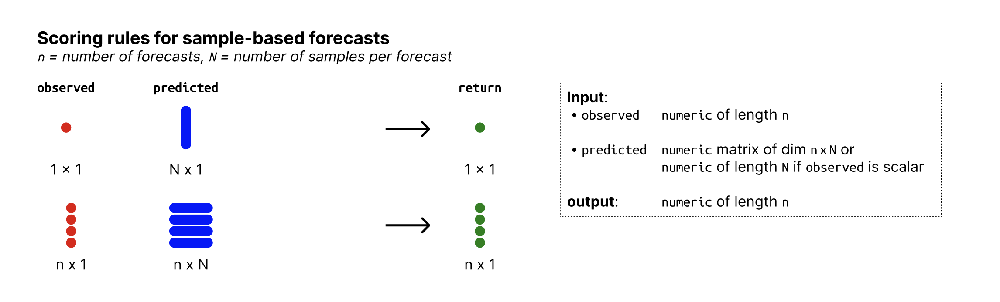

# Determine bias of forecasts

Determines bias from predictive Monte-Carlo samples. The function
automatically recognises whether forecasts are continuous or integer
valued and adapts the Bias function accordingly.

## Usage

``` r
bias_sample(observed, predicted)
```

## Arguments

- observed:

  A vector with observed values of size n

- predicted:

  nxN matrix of predictive samples, n (number of rows) being the number
  of data points and N (number of columns) the number of Monte Carlo
  samples. Alternatively, if n = 1, `predicted` can just be a vector of
  size n.

## Value

Numeric vector of length n with the biases of the predictive samples
with respect to the observed values.

## Details

For continuous forecasts, Bias is measured as

\$\$ B_t (P_t, x_t) = 1 - 2 \* (P_t (x_t)) \$\$

where \\P_t\\ is the empirical cumulative distribution function of the
prediction for the observed value \\x_t\\. To handle ties appropriately
(which can occur when predictions equal observations for exampele due to
rounding), \\P_t(x_t)\\ is computed using mid-ranks: the fraction of
predictive samples strictly smaller than \\x_t\\ plus half the fraction
equal to \\x_t\\.

For integer valued forecasts, Bias is measured as

\$\$ B_t (P_t, x_t) = 1 - (P_t (x_t) + P_t (x_t + 1)) \$\$

to adjust for the integer nature of the forecasts.

In both cases, Bias can assume values between -1 and 1 and is 0 ideally.

## Input format



Overview of required input format for sample-based forecasts

## References

The integer valued Bias function is discussed in Assessing the
performance of real-time epidemic forecasts: A case study of Ebola in
the Western Area region of Sierra Leone, 2014-15 Funk S, Camacho A,
Kucharski AJ, Lowe R, Eggo RM, et al. (2019) Assessing the performance
of real-time epidemic forecasts: A case study of Ebola in the Western
Area region of Sierra Leone, 2014-15. PLOS Computational Biology 15(2):
e1006785.
[doi:10.1371/journal.pcbi.1006785](https://doi.org/10.1371/journal.pcbi.1006785)

## Examples

``` r
## integer valued forecasts
observed <- rpois(30, lambda = 1:30)
predicted <- replicate(200, rpois(n = 30, lambda = 1:30))
bias_sample(observed, predicted)
#>  [1]  0.660 -0.025  0.710 -0.930  0.870  0.435 -0.885 -0.940 -0.515 -0.790
#> [11]  0.975 -0.975 -0.620 -0.740 -0.640  0.395  0.695 -0.765 -0.935 -0.680
#> [21] -0.725 -0.320  0.355  0.730  0.250  0.995 -0.650  0.235  0.250  0.850

## continuous forecasts
observed <- rnorm(30, mean = 1:30)
predicted <- replicate(200, rnorm(30, mean = 1:30))
bias_sample(observed, predicted)
#>  [1] -0.46  0.02  0.02  0.12 -0.18 -0.07  0.96 -0.60  0.16 -0.31  0.79  0.49
#> [13] -0.74 -0.48  0.26 -0.56  0.82  0.89  0.41 -0.31  0.19  0.47 -0.85  0.32
#> [25]  0.15 -0.16  0.34 -0.30  0.80  0.27
```
