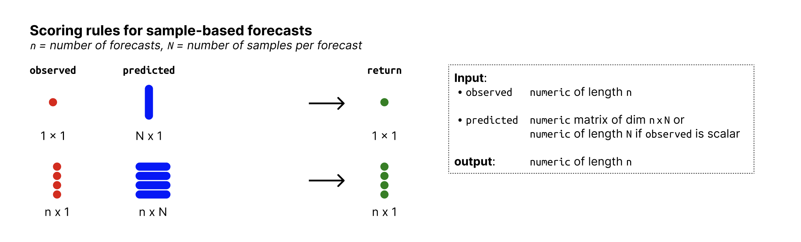

# Get default metrics for sample-based forecasts

For sample-based forecasts, the default scoring rules are:

- "crps" =
  [`crps_sample()`](https://epiforecasts.io/scoringutils/dev/reference/crps_sample.md)

- "overprediction" =
  [`overprediction_sample()`](https://epiforecasts.io/scoringutils/dev/reference/crps_sample.md)

- "underprediction" =
  [`underprediction_sample()`](https://epiforecasts.io/scoringutils/dev/reference/crps_sample.md)

- "dispersion" =
  [`dispersion_sample()`](https://epiforecasts.io/scoringutils/dev/reference/crps_sample.md)

- "log_score" =
  [`logs_sample()`](https://epiforecasts.io/scoringutils/dev/reference/logs_sample.md)

- "dss" =
  [`dss_sample()`](https://epiforecasts.io/scoringutils/dev/reference/dss_sample.md)

- "mad" =
  [`mad_sample()`](https://epiforecasts.io/scoringutils/dev/reference/mad_sample.md)

- "bias" =
  [`bias_sample()`](https://epiforecasts.io/scoringutils/dev/reference/bias_sample.md)

- "ae_median" =
  [`ae_median_sample()`](https://epiforecasts.io/scoringutils/dev/reference/ae_median_sample.md)

- "se_mean" =
  [`se_mean_sample()`](https://epiforecasts.io/scoringutils/dev/reference/se_mean_sample.md)

## Usage

``` r
# S3 method for class 'forecast_sample'
get_metrics(x, select = NULL, exclude = NULL, ...)
```

## Arguments

- x:

  A forecast object (a validated data.table with predicted and observed
  values, see
  [`as_forecast_binary()`](https://epiforecasts.io/scoringutils/dev/reference/as_forecast_binary.md)).

- select:

  A character vector of scoring rules to select from the list. If
  `select` is `NULL` (the default), all possible scoring rules are
  returned.

- exclude:

  A character vector of scoring rules to exclude from the list. If
  `select` is not `NULL`, this argument is ignored.

- ...:

  unused

## Input format



Overview of required input format for sample-based forecasts

## See also

Other get_metrics functions:
[`get_metrics()`](https://epiforecasts.io/scoringutils/dev/reference/get_metrics.md),
[`get_metrics.forecast_binary()`](https://epiforecasts.io/scoringutils/dev/reference/get_metrics.forecast_binary.md),
[`get_metrics.forecast_multivariate_point()`](https://epiforecasts.io/scoringutils/dev/reference/get_metrics.forecast_multivariate_point.md),
[`get_metrics.forecast_multivariate_sample()`](https://epiforecasts.io/scoringutils/dev/reference/get_metrics.forecast_multivariate_sample.md),
[`get_metrics.forecast_nominal()`](https://epiforecasts.io/scoringutils/dev/reference/get_metrics.forecast_nominal.md),
[`get_metrics.forecast_ordinal()`](https://epiforecasts.io/scoringutils/dev/reference/get_metrics.forecast_ordinal.md),
[`get_metrics.forecast_point()`](https://epiforecasts.io/scoringutils/dev/reference/get_metrics.forecast_point.md),
[`get_metrics.forecast_quantile()`](https://epiforecasts.io/scoringutils/dev/reference/get_metrics.forecast_quantile.md),
[`get_metrics.scores()`](https://epiforecasts.io/scoringutils/dev/reference/get_metrics.scores.md)

## Examples

``` r
get_metrics(example_sample_continuous, exclude = "mad")
#> $bias
#> function (observed, predicted) 
#> {
#>     assert_input_sample(observed, predicted)
#>     predicted <- ensure_sample_matrix(predicted)
#>     prediction_type <- get_type(predicted)
#>     n_pred <- ncol(predicted)
#>     if (prediction_type == "continuous") {
#>         p_lt <- rowSums(predicted < observed)/n_pred
#>         p_eq <- rowSums(predicted == observed)/n_pred
#>         p_x <- p_lt + 0.5 * p_eq
#>         res <- 1 - 2 * p_x
#>         return(res)
#>     }
#>     else {
#>         p_x <- rowSums(predicted <= observed)/n_pred
#>         p_xm1 <- rowSums(predicted <= (observed - 1))/n_pred
#>         res <- 1 - (p_x + p_xm1)
#>         return(res)
#>     }
#> }
#> <bytecode: 0x5580c11c0340>
#> <environment: namespace:scoringutils>
#> 
#> $dss
#> function (observed, predicted, ...) 
#> {
#>     assert_input_sample(observed, predicted)
#>     scoringRules::dss_sample(y = observed, dat = predicted, ...)
#> }
#> <bytecode: 0x5580c81e3e48>
#> <environment: namespace:scoringutils>
#> 
#> $crps
#> function (observed, predicted, separate_results = FALSE, ...) 
#> {
#>     assert_input_sample(observed, predicted)
#>     crps <- scoringRules::crps_sample(y = observed, dat = predicted, 
#>         ...)
#>     if (separate_results) {
#>         predicted <- ensure_sample_matrix(predicted)
#>         medians <- apply(predicted, 1, median)
#>         dispersion <- scoringRules::crps_sample(y = medians, 
#>             dat = predicted, ...)
#>         difference <- crps - dispersion
#>         overprediction <- fcase(observed < medians, difference, 
#>             default = 0)
#>         underprediction <- fcase(observed > medians, difference, 
#>             default = 0)
#>         return(list(crps = crps, dispersion = dispersion, underprediction = underprediction, 
#>             overprediction = overprediction))
#>     }
#>     else {
#>         return(crps)
#>     }
#> }
#> <bytecode: 0x5580c8039f40>
#> <environment: namespace:scoringutils>
#> 
#> $overprediction
#> function (observed, predicted, ...) 
#> {
#>     crps <- crps_sample(observed, predicted, separate_results = TRUE, 
#>         ...)
#>     return(crps$overprediction)
#> }
#> <bytecode: 0x5580caa543b8>
#> <environment: namespace:scoringutils>
#> 
#> $underprediction
#> function (observed, predicted, ...) 
#> {
#>     crps <- crps_sample(observed, predicted, separate_results = TRUE, 
#>         ...)
#>     return(crps$underprediction)
#> }
#> <bytecode: 0x5580cb0ee120>
#> <environment: namespace:scoringutils>
#> 
#> $dispersion
#> function (observed, predicted, ...) 
#> {
#>     crps <- crps_sample(observed, predicted, separate_results = TRUE, 
#>         ...)
#>     return(crps$dispersion)
#> }
#> <bytecode: 0x5580cb0ed5f8>
#> <environment: namespace:scoringutils>
#> 
#> $log_score
#> function (observed, predicted, ...) 
#> {
#>     assert_input_sample(observed, predicted)
#>     if (get_type(predicted) == "integer") {
#>         cli_warn(c("Predictions appear to be integer-valued.", 
#>             `!` = "The log score uses kernel density estimation, which may not be\n        appropriate for integer-valued forecasts.", 
#>             i = "See the {.pkg scoringRules} package for alternatives for\n        discrete probability distributions."))
#>     }
#>     scoringRules::logs_sample(y = observed, dat = predicted, 
#>         ...)
#> }
#> <bytecode: 0x5580cb0ecad0>
#> <environment: namespace:scoringutils>
#> 
#> $ae_median
#> function (observed, predicted) 
#> {
#>     assert_input_sample(observed, predicted)
#>     predicted <- ensure_sample_matrix(predicted)
#>     median_predictions <- apply(predicted, MARGIN = 1, FUN = median)
#>     ae_median <- abs(observed - median_predictions)
#>     return(ae_median)
#> }
#> <bytecode: 0x5580c3ce0f90>
#> <environment: namespace:scoringutils>
#> 
#> $se_mean
#> function (observed, predicted) 
#> {
#>     assert_input_sample(observed, predicted)
#>     predicted <- ensure_sample_matrix(predicted)
#>     mean_predictions <- rowMeans(predicted)
#>     se_mean <- (observed - mean_predictions)^2
#>     return(se_mean)
#> }
#> <bytecode: 0x5580cb0ee6a8>
#> <environment: namespace:scoringutils>
#> 
```
