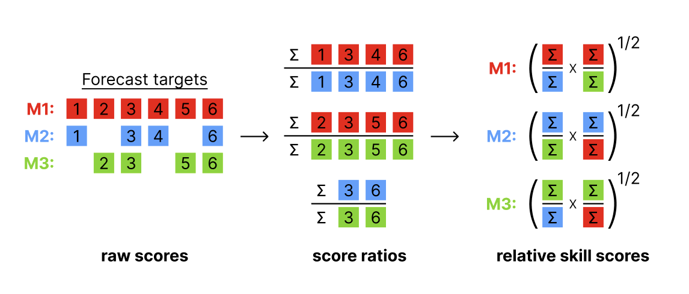

# Obtain pairwise comparisons between models

Compare scores obtained by different models in a pairwise tournament.
All combinations of two models are compared against each other based on
the overlapping set of available forecasts common to both models.

The input should be a `scores` object as produced by
[`score()`](https://epiforecasts.io/scoringutils/dev/reference/score.md).
Note that adding additional unrelated columns can unpredictably change
results, as all present columns are taken into account when determining
the set of overlapping forecasts between two models.

The output of the pairwise comparisons is a set of mean score ratios,
relative skill scores and p-values.



Illustration of the pairwise comparison process.

*Mean score ratios*

For every pair of two models, a mean score ratio is computed. This is
simply the mean score of the first model divided by the mean score of
the second. Mean score ratios are computed based on the set of
overlapping forecasts between the two models. That means that only
scores for those targets are taken into account for which both models
have submitted a forecast.

*(Scaled) Relative skill scores*

The relative score of a model is the geometric mean of all mean score
ratios which involve that model. If a baseline is provided, scaled
relative skill scores will be calculated as well. Scaled relative skill
scores are simply the relative skill score of a model divided by the
relative skill score of the baseline model.

*p-values*

In addition, the function computes p-values for the comparison between
two models (again based on the set of overlapping forecasts). P-values
can be computed in two ways: based on a nonparametric Wilcoxon
signed-rank test (internally using
[`wilcox.test()`](https://rdrr.io/r/stats/wilcox.test.html) with
`paired = TRUE`) or based on a permutation test. The permutation test is
based on the difference in mean scores between two models. The default
null hypothesis is that the mean score difference is zero (see
[`permutation_test()`](https://epiforecasts.io/scoringutils/dev/reference/permutation_test.md)).
Adjusted p-values are computed by calling
[`p.adjust()`](https://rdrr.io/r/stats/p.adjust.html) on the raw
p-values.

The code for the pairwise comparisons is inspired by an implementation
by Johannes Bracher. The implementation of the permutation test follows
the function `permutationTest` from the `surveillance` package by
Michael Höhle, Andrea Riebler and Michaela Paul.

## Usage

``` r
get_pairwise_comparisons(
  scores,
  compare = "model",
  by = NULL,
  metric = intersect(c("wis", "crps", "brier_score"), names(scores)),
  baseline = NULL,
  ...
)
```

## Arguments

- scores:

  An object of class `scores` (a data.table with scores and an
  additional attribute `metrics` as produced by
  [`score()`](https://epiforecasts.io/scoringutils/dev/reference/score.md)).

- compare:

  Character vector with a single colum name that defines the elements
  for the pairwise comparison. For example, if this is set to "model"
  (the default), then elements of the "model" column will be compared.

- by:

  Character vector with column names that define further grouping levels
  for the pairwise comparisons. By default this is `NULL` and there will
  be one relative skill score per distinct entry of the column selected
  in `compare`. If further columns are given here, for example,
  `by = "location"` with `compare = "model"`, then one separate relative
  skill score is calculated for every model in every location.

- metric:

  A string with the name of the metric for which a relative skill shall
  be computed. By default this is either "crps", "wis" or "brier_score"
  if any of these are available.

- baseline:

  A string with the name of a model. If a baseline is given, then a
  scaled relative skill with respect to the baseline will be returned.
  By default (`NULL`), relative skill will not be scaled with respect to
  a baseline model.

- ...:

  Additional arguments for the comparison between two models. See
  [`compare_forecasts()`](https://epiforecasts.io/scoringutils/dev/reference/compare_forecasts.md)
  for more information.

## Value

A data.table with the results of pairwise comparisons containing the
mean score ratios (`mean_scores_ratio`), unadjusted (`pval`) and
adjusted (`adj_pval`) p-values, and relative skill values of each model
(`..._relative_skill`). If a baseline model is given then the scaled
relative skill is reported as well (`..._scaled_relative_skill`).

## Author

Nikos Bosse <nikosbosse@gmail.com>

Johannes Bracher, <johannes.bracher@kit.edu>

## Examples

``` r
library(magrittr) # pipe operator

scores <- example_quantile %>%
 as_forecast_quantile() %>%
 score()
#> ℹ Some rows containing NA values may be removed. This is fine if not
#>   unexpected.

pairwise <- get_pairwise_comparisons(scores, by = "target_type")
pairwise2 <- get_pairwise_comparisons(
  scores, by = "target_type", baseline = "EuroCOVIDhub-baseline"
)

library(ggplot2)
plot_pairwise_comparisons(pairwise, type = "mean_scores_ratio") +
  facet_wrap(~target_type)
```
