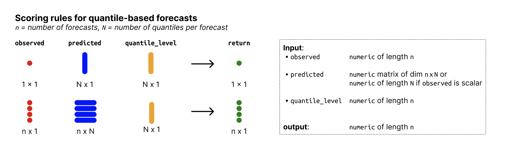

# Quantile score

Proper Scoring Rule to score quantile predictions. Smaller values are
better. The quantile score is closely related to the interval score (see
[`wis()`](https://epiforecasts.io/scoringutils/dev/reference/wis.md))
and is the quantile equivalent that works with single quantiles instead
of central prediction intervals.

The quantile score, also called pinball loss, for a single quantile
level \\\tau\\ is defined as \$\$ \text{QS}\_\tau(F, y) = 2 \cdot \\
\mathbf{1}(y \leq q\_\tau) - \tau\\ \cdot (q\_\tau - y) = \begin{cases}
2 \cdot (1 - \tau) \* q\_\tau - y, & \text{if } y \leq q\_\tau\\ 2 \cdot
\tau \* \|q\_\tau - y\|, & \text{if } y \> q\_\tau, \end{cases} \$\$
with \\q\_\tau\\ being the \\\tau\\-quantile of the predictive
distribution \\F\\, and \\\mathbf{1}(\cdot)\\ the indicator function.

The weighted interval score for a single prediction interval can be
obtained as the average of the quantile scores for the lower and upper
quantile of that prediction interval: \$\$ \text{WIS}\_\alpha(F, y) =
\frac{\text{QS}\_{\alpha/2}(F, y) + \text{QS}\_{1 - \alpha/2}(F, y)}{2}.
\$\$ See the SI of Bracher et al. (2021) for more details.

`quantile_score()` returns the average quantile score across the
quantile levels provided. For a set of quantile levels that form
pairwise central prediction intervals, the quantile score is equivalent
to the interval score.

## Usage

``` r
quantile_score(observed, predicted, quantile_level, weigh = TRUE)
```

## Arguments

- observed:

  Numeric vector of size n with the observed values.

- predicted:

  Numeric nxN matrix of predictive quantiles, n (number of rows) being
  the number of forecasts (corresponding to the number of observed
  values) and N (number of columns) the number of quantiles per
  forecast. If `observed` is just a single number, then predicted can
  just be a vector of size N.

- quantile_level:

  Vector of of size N with the quantile levels for which predictions
  were made.

- weigh:

  Logical. If `TRUE` (the default), weigh the score by \\\alpha / 2\\,
  so it can be averaged into an interval score that, in the limit (for
  an increasing number of equally spaced quantiles/prediction
  intervals), corresponds to the CRPS. \\\alpha\\ is the value that
  corresponds to the (\\\alpha/2\\) or (\\1 - \alpha/2\\), i.e. it is
  the decimal value that represents how much is outside a central
  prediction interval (E.g. for a 90 percent central prediction
  interval, alpha is 0.1).

## Value

Numeric vector of length n with the quantile score. The scores are
averaged across quantile levels if multiple quantile levels are provided
(the result of calling
[`rowMeans()`](https://rdrr.io/r/base/colSums.html) on the matrix of
quantile scores that is computed based on the observed and predicted
values).

## Input format



Overview of required input format for quantile-based forecasts

## References

Strictly Proper Scoring Rules, Prediction,and Estimation, Tilmann
Gneiting and Adrian E. Raftery, 2007, Journal of the American
Statistical Association, Volume 102, 2007 - Issue 477

Evaluating epidemic forecasts in an interval format, Johannes Bracher,
Evan L. Ray, Tilmann Gneiting and Nicholas G. Reich, 2021,
<https://journals.plos.org/ploscompbiol/article?id=10.1371/journal.pcbi.1008618>

## Examples

``` r
observed <- rnorm(10, mean = 1:10)
alpha <- 0.5

lower <- qnorm(alpha / 2, observed)
upper <- qnorm((1 - alpha / 2), observed)

qs_lower <- quantile_score(observed,
  predicted = matrix(lower),
  quantile_level = alpha / 2
)
qs_upper <- quantile_score(observed,
  predicted = matrix(upper),
  quantile_level = 1 - alpha / 2
)
interval_score <- (qs_lower + qs_upper) / 2
interval_score2 <- quantile_score(
  observed,
  predicted = cbind(lower, upper),
  quantile_level = c(alpha / 2, 1 - alpha / 2)
)

# this is the same as the following
wis(
  observed,
  predicted = cbind(lower, upper),
  quantile_level = c(alpha / 2, 1 - alpha / 2)
)
#>  [1] 0.3372449 0.3372449 0.3372449 0.3372449 0.3372449 0.3372449 0.3372449
#>  [8] 0.3372449 0.3372449 0.3372449
```
