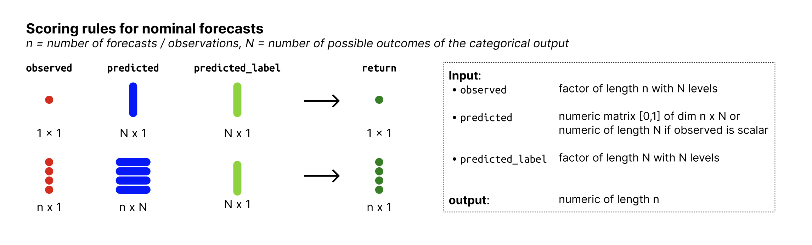

# Ranked Probability Score for ordinal outcomes

The Ranked Probability Score (RPS) measures the difference between the
predicted and observed cumulative distribution functions. It is a proper
scoring rule that takes the ordering of categories into account. Small
values are better (best is zero, worst is N - 1 where N is the number of
categories).

## Usage

``` r
rps_ordinal(observed, predicted, predicted_label)
```

## Arguments

- observed:

  A factor of length n with N levels holding the observed values.

- predicted:

  nxN matrix of predictive probabilities, n (number of rows) being the
  number of observations and N (number of columns) the number of
  possible outcomes.

- predicted_label:

  A factor of length N, denoting the outcome that the probabilities in
  `predicted` correspond to.

## Value

A numeric vector of size n with ranked probability scores

## Input format



Overview of required input format for nominal forecasts

## Examples

``` r
factor_levels <- c("one", "two", "three")
predicted_label <- factor(factor_levels, levels = factor_levels, ordered = TRUE)
observed <- factor(c("three", "three", "two"), levels = factor_levels, ordered = TRUE)
predicted <- matrix(
  c(0.8, 0.1, 0.1,
    0.1, 0.2, 0.7,
    0.4, 0.4, 0.2),
  nrow = 3,
  byrow = TRUE
)
rps_ordinal(observed, predicted, predicted_label)
#> [1] 1.45 0.10 0.20
```
