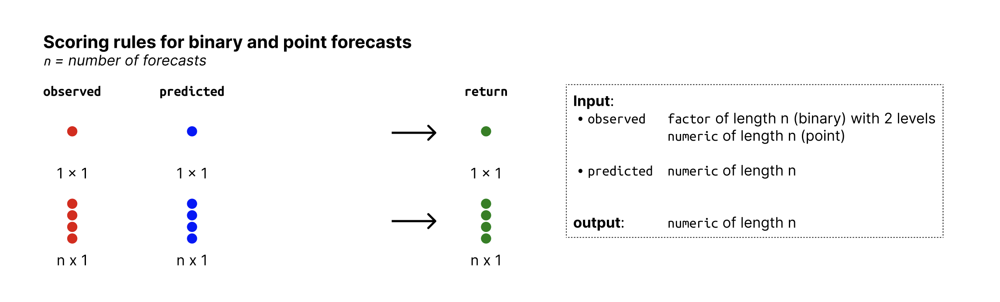

# Metrics for binary outcomes

**Brier score**

The Brier Score is the mean squared error between the probabilistic
prediction and the observed outcome. The Brier score is a proper scoring
rule. Small values are better (best is 0, the worst is 1).

\$\$ \textrm{Brier\\Score} = (\textrm{prediction} - \textrm{outcome})^2,
\$\$ where \\\textrm{outcome} \in \\0, 1\\\\, and \\\textrm{prediction}
\in \[0, 1\]\\ represents the probability that the outcome is equal to
1.

**Log score for binary outcomes**

The Log Score is the negative logarithm of the probability assigned to
the observed value. It is a proper scoring rule. Small values are better
(best is zero, worst is infinity).

## Usage

``` r
brier_score(observed, predicted)

logs_binary(observed, predicted)
```

## Arguments

- observed:

  A factor of length n with exactly two levels, holding the observed
  values. The highest factor level is assumed to be the reference level.
  This means that `predicted` represents the probability that the
  observed value is equal to the highest factor level.

- predicted:

  A numeric vector of length n, holding probabilities. Values represent
  the probability that the corresponding outcome is equal to the highest
  level of the factor `observed`.

## Value

A numeric vector of size n with the Brier scores

A numeric vector of size n with log scores

## Details

The functions require users to provide observed values as a factor in
order to distinguish its input from the input format required for
scoring point forecasts. Internally, however, factors will be converted
to numeric values. A factor `observed = factor(c(0, 1, 1, 0, 1)` with
two levels (`0` and `1`) would internally be coerced to a numeric vector
(in this case this would result in the numeric vector
`c(1, 2, 2, 1, 1)`). After subtracting 1, the resulting vector
(`c(0, 1, 1, 0)` in this case) is used for internal calculations. All
predictions are assumed represent the probability that the outcome is
equal of the last/highest factor level (in this case that the outcome is
equal to 1).

You could alternatively also provide a vector like
`observed = factor(c("a", "b", "b", "a"))` (with two levels, `a` and
`b`), which would result in exactly the same internal representation.
Probabilities then represent the probability that the outcome is equal
to "b". If you want your predictions to be probabilities that the
outcome is "a", then you could of course make `observed` a factor with
levels swapped, i.e.
`observed = factor(c("a", "b", "b", "a"), levels = c("b", "a"))`

## Input format



Overview of required input format for binary and point forecasts

## See also

Other log score functions:
[`logs_categorical()`](https://epiforecasts.io/scoringutils/dev/reference/scoring-functions-nominal.md),
[`logs_sample()`](https://epiforecasts.io/scoringutils/dev/reference/logs_sample.md)

## Examples

``` r
observed <- factor(sample(c(0, 1), size = 30, replace = TRUE))
predicted <- runif(n = 30, min = 0, max = 1)

brier_score(observed, predicted)
#>  [1] 0.103883541 0.103479469 0.736347541 0.492881837 0.019028321 0.051913159
#>  [7] 0.371622492 0.091405046 0.002508718 0.134183037 0.563726215 0.676740260
#> [13] 0.219198284 0.576250384 0.829213209 0.902790319 0.095664107 0.165681601
#> [19] 0.110046310 0.524043529 0.553046089 0.416323836 0.455132489 0.964977045
#> [25] 0.663549182 0.051830302 0.015132274 0.827754385 0.082469422 0.190462642
logs_binary(observed, predicted)
#>  [1] 0.38906488 0.38813944 1.95268169 1.21084784 0.14843409 0.25856945
#>  [7] 0.94060513 0.36001290 0.05138498 0.45619545 1.38956784 1.72958636
#> [13] 0.63146178 1.42342142 2.41476266 2.99879269 0.37004413 0.52262842
#> [19] 0.40306642 1.28702298 1.36129228 1.03629014 1.12280789 4.03602573
#> [25] 1.68516024 0.25833390 0.13126346 2.40583763 0.33851919 0.57344644
```
