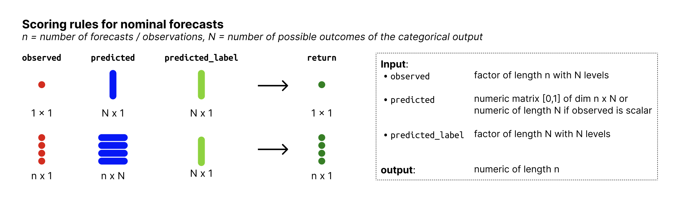

# Log score for categorical outcomes

**Log score for categorical (nominal or ordinal) outcomes**

The Log Score is the negative logarithm of the probability assigned to
the observed value. It is a proper scoring rule. Small values are better
(best is zero, worst is infinity).

## Usage

``` r
logs_categorical(observed, predicted, predicted_label)
```

## Arguments

- observed:

  Factor of length n with N levels holding the observed values.

- predicted:

  nxN matrix of predictive probabilities, n (number of rows) being the
  number of observations and N (number of columns) the number of
  possible outcomes.

- predicted_label:

  Factor of length N, denoting the outcome that the probabilities in
  `predicted` correspond to.

## Value

A numeric vector of size n with log scores

## Input format



Overview of required input format for nominal forecasts

## See also

Other log score functions:
[`logs_sample()`](https://epiforecasts.io/scoringutils/dev/reference/logs_sample.md),
[`scoring-functions-binary`](https://epiforecasts.io/scoringutils/dev/reference/scoring-functions-binary.md)

## Examples

``` r
factor_levels <- c("one", "two", "three")
predicted_label <- factor(c("one", "two", "three"), levels = factor_levels)
observed <- factor(c("one", "three", "two"), levels = factor_levels)
predicted <- matrix(
  c(0.8, 0.1, 0.1,
    0.1, 0.2, 0.7,
    0.4, 0.4, 0.2),
  nrow = 3,
  byrow = TRUE
)
logs_categorical(observed, predicted, predicted_label)
#> [1] 0.2231436 0.3566749 0.9162907
```
