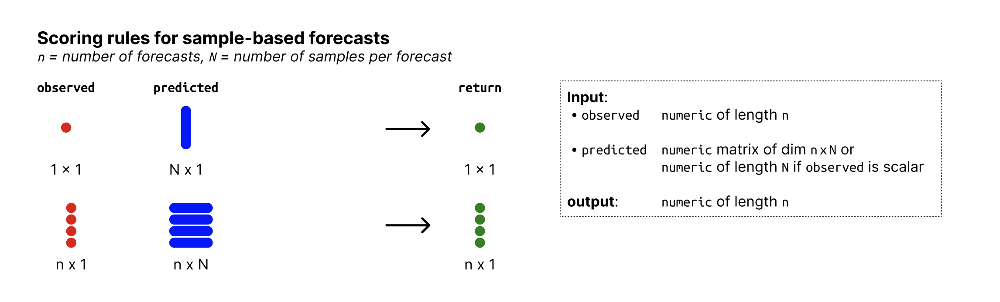

# Squared error of the mean (sample-based version)

Squared error of the mean calculated as

\$\$ \textrm{mean}(\textrm{observed} - \textrm{mean prediction})^2 \$\$
The mean prediction is calculated as the mean of the predictive samples.

## Usage

``` r
se_mean_sample(observed, predicted)
```

## Arguments

- observed:

  A vector with observed values of size n

- predicted:

  nxN matrix of predictive samples, n (number of rows) being the number
  of data points and N (number of columns) the number of Monte Carlo
  samples. Alternatively, if n = 1, `predicted` can just be a vector of
  size n.

## Input format



Overview of required input format for sample-based forecasts

## Examples

``` r
observed <- rnorm(30, mean = 1:30)
predicted_values <- matrix(rnorm(30, mean = 1:30))
se_mean_sample(observed, predicted_values)
#>  [1] 1.385961359 2.840631832 0.563788699 0.356389380 0.858331477 3.606268887
#>  [7] 0.157880074 6.666548840 2.816835943 0.562024085 0.484509868 3.809361150
#> [13] 0.368769078 1.570164233 2.714350780 1.512258863 2.207051334 2.724803527
#> [19] 0.866446251 0.034394909 1.406837546 0.005078808 3.812047069 5.737942798
#> [25] 1.490066803 3.471397540 2.612408037 0.930702120 0.219383033 5.971547387
```
