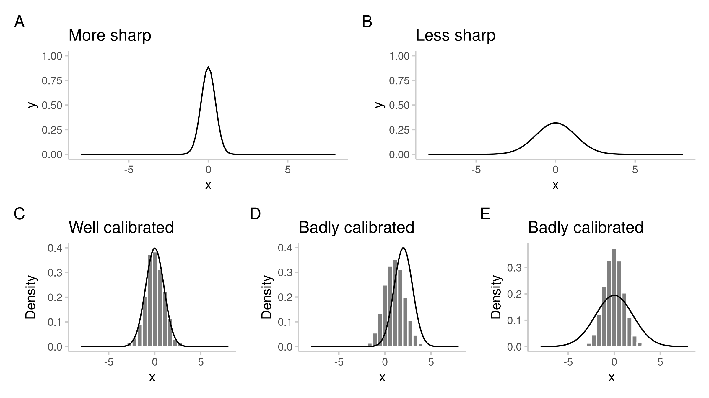
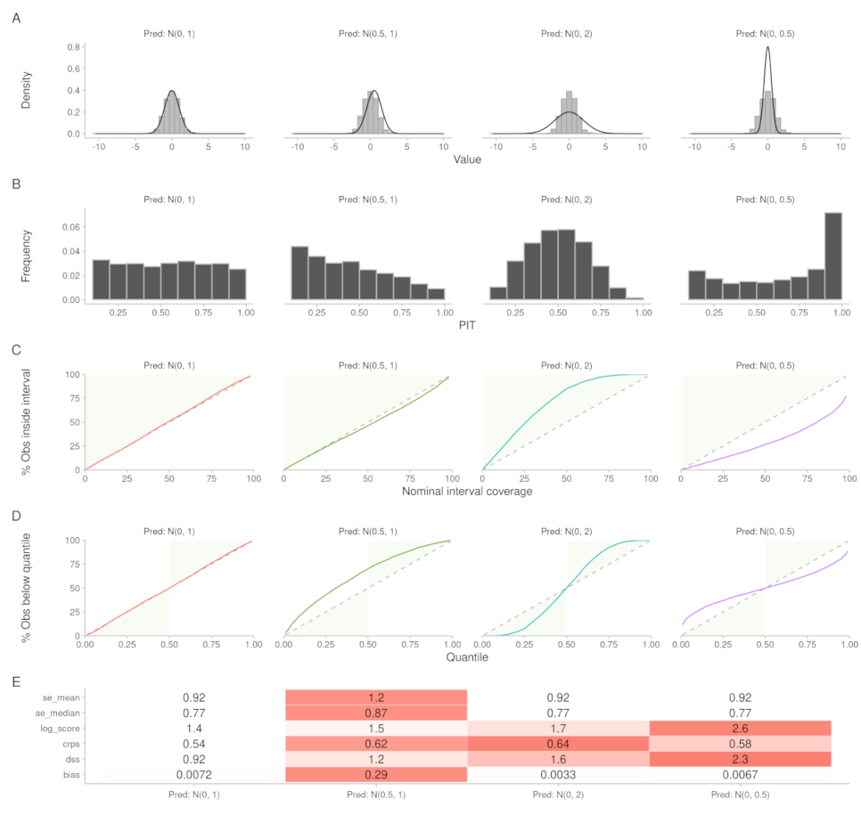
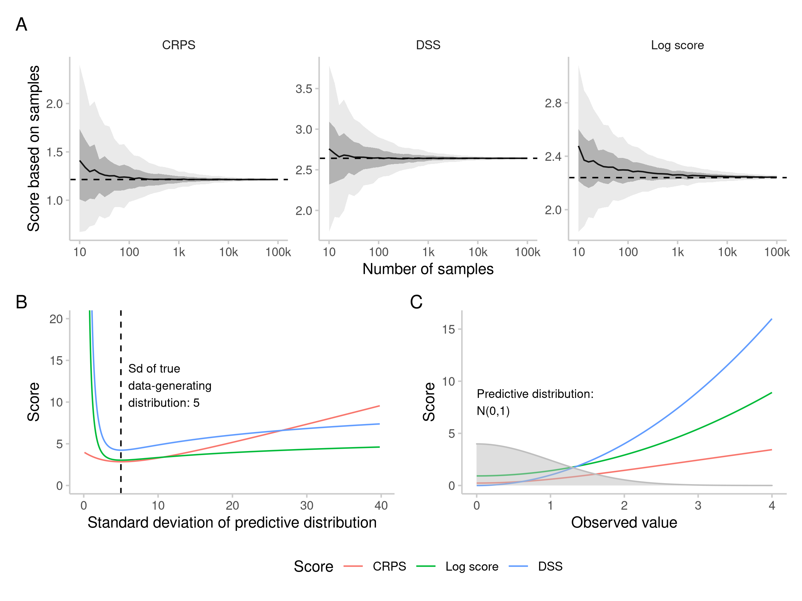
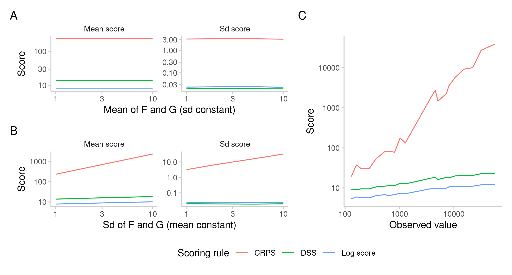

```{r, setup, include=FALSE}
options(prompt = 'R> ', continue = '+ ', width = 70)

library(scoringutils)
library(knitr)
library(dplyr)
library(magrittr)
library(kableExtra)
library(formatR)
library(data.table)
library(patchwork)

opts_chunk$set(
  cache = TRUE,
  warning = FALSE, 
  message = FALSE, 
  out.width = "100%"
)
```

```{r eval = FALSE, include=FALSE}
trackdown::update_file("inst/manuscript/manuscript.Rmd", gfile = "scoringutils-paper", hide_code = FALSE)
# trackdown::download_file("inst/manuscript/manuscript.Rmd", gfile = "scoringutils-paper")
```

# Introduction

Good forecasts are of great interest to decision makers in various fields like finance \citep{timmermannForecastingMethodsFinance2018, elliottForecastingEconomicsFinance2016}, weather predictions \citep{gneitingWeatherForecastingEnsemble2005, kukkonenReviewOperationalRegionalscale2012} or infectious disease modeling \citep{reichCollaborativeMultiyearMultimodel2019, funkShorttermForecastsInform2020, cramerEvaluationIndividualEnsemble2021, bracherShorttermForecastingCOVID192021, europeancovid-19forecasthubEuropeanCovid19Forecast2021}. Throughout the COVID-19 pandemic, forecasts from different research institutions on COVID-19 targets like reported cases and deaths have been systematically collated by several collaborative ensemble forecasting efforts (“Forecast Hubs”) in the US, Germany and Poland, and Europe. An integral part of assessing and improving their usefulness is forecast evaluation. For decades, researchers have developed and refined an arsenal of techniques not only to forecast, but also to evaluate these forecasts (see e.g. \cite{goodRationalDecisions1952}, \cite{epsteinScoringSystemProbability1969, murphyNoteRankedProbability1971a, mathesonScoringRulesContinuous1976},  \cite{gneitingProbabilisticForecastsCalibration2007}, \cite{funkAssessingPerformanceRealtime2019}, \cite{gneitingStrictlyProperScoring2007}, \cite{bracherEvaluatingEpidemicForecasts2021}). Yet even with this rich body of research available, evaluating models, and in particular, comparing the performance of several models, is not trivial. 

There already exist a few \proglang{R} \citep{R} packages which implement a wide variety of scoring metrics. The \pkg{scoringRules} package \citep{scoringRules} offers a very extensive collection of functions with efficient implementations of different proper scoring rules (some of which are directly reused in \pkg{scoringutils}). \pkg{scoringutils} complements \pkg{scoringRules} in important ways, as the latter focuses on proper scoring rules only and does not implement other evaluation metrics or provide functionality to compare forecast performance visually. \pkg{scoringutils} also adds functionality to score predictive distributions that are represented by a set of quantiles and is able to handle situations with missing data. The \pkg{topmodels} package \citep{topmodels} provides users with various graphical tools to visually evaluate and compare different forecasts. However, visualisations are only available for forecasts based on the model classes `lm`, `glm`, `crch` `disttree`, and the package is as of today not on CRAN. The \pkg{tscount} package \citep{tscount} offers functionality to fit flexible time series models and compare the quality of the generated forecasts using different proper scoring rules. The application of these rules, however, is confined to forecasts of class `tsglm`. Other packages like \pkg{Metrics} \citep{Metrics} and \pkg{MLmetrics} \citep{MLmetrics} provide a collection of metrics geared towards machine learning problems, but also lack plotting functionality as well as support for a variety of metrics and tools commonly used to evaluate and compare probabilistic forecasts. In contrast to the above, \pkg{scoringutils} not only provides metrics to score individual forecasts, but simplifies the process of comparing different forecasts against each other. It accepts arbitrary forecasts regardless of how they were created by leveraging base R classes and automatically returns a variety of suitable metrics, depending on the type and format of the input forecast. It also provides functionality to facilitate comparing forecasters even when individual forecasts are missing and offers a range of plotting functions to visualise different aspects of forecast performance. The \pkg{scoringutils} package is also unique in its extensive support for forecasts in a quantile format as used by various COVID-19 Forecast Hubs \citep{cramerEvaluationIndividualEnsemble2021, bracherShorttermForecastingCOVID192021, europeancovid-19forecasthubEuropeanCovid19Forecast2021, bracherNationalSubnationalShortterm2021}, which also make use of \pkg{scoringutils} for their evaluations.

The remainder of this section will provide an overview of the fundamental ideas behind forecast evaluation. Section \ref{metrics} will give a detailed theoretical explanation of the evaluation metrics in \pkg{scoringutils} and when to use them. Section \ref{evaluation-example} will demonstrate how to conduct an evaluation in \pkg{scoringutils} using forecasts of COVID-19 submitted to the European Forecast Hub \citep{europeancovid-19forecasthubEuropeanCovid19Forecast2021} as a case study. In the following we will use the words “model” and “forecaster” interchangeably, regardless of how forecasts were actually generated. 

## Forecast types and forecast formats

In its most general sense, a forecast is the forecaster’s stated belief about the future \citep{gneitingStrictlyProperScoring2007} that can come in many different forms. Quantitative forecasts are either point forecasts or probabilistic in nature and can make statements about continuous, discrete or binary outcome variables. Point forecasts only give one single number for the expected or most likely outcome. Probabilistic forecasts, in contrast, by definition provide a full predictive probability distribution. This makes them much more useful in any applied setting, as we learn about the forecaster's uncertainty and their belief about all aspects of the underlying data-generating distribution. 

The \pkg{scoringutils} package focuses on probabilistic forecasts, and specifically on forecasts that are represented through either predictive samples or through quantiles of the predictive distributions, making it possible to evaluate arbitrary forecasts even if a closed form (i.e. parametric) distribution is not available. A variety of parametric distributions can be scored directly using \pkg{scoringRules}, but this is not yet supported in \pkg{scoringutils}. 

Predictive samples offer a lot of flexibility. However, the number of samples necessary to store in order to represent the predictive distribution satisfactorily may be high. This loss of precision is usually especially pronounced in the tails of the predictive distribution. For that reason, often quantiles or central prediction intervals are reported instead. One recent example of this are the COVID-19 Forecast Hubs \citep{cramerCOVID19ForecastHub2020, cramerEvaluationIndividualEnsemble2021, bracherShorttermForecastingCOVID192021, bracherNationalSubnationalShortterm2021, europeancovid-19forecasthubEuropeanCovid19Forecast2021}. For binary or multinomial prediction targets, common in many classification problems, a probabilistic forecast is represented by the probability that an outcome will come true. Table \ref{tab:forecast-types} summarises the different forecast types and formats. 
\begin{table}[]
\centering
\caption{Forecast and forecast target types. Forecasts can be probabilistic in nature, or a point forecast only. Depending on the type of the target (discrete, continuous or binary) different representations of the predictive distribution are possible.}
\label{tab:forecast-types}
\begin{tabular}{@{}lll@{}}
\toprule
Forecast type                        & Target type          & Representation of the predictive distribution  \\ \midrule
\multicolumn{1}{l}{Point forecast}  & \multicolumn{1}{l}{\begin{tabular}[c]{@{}l@{}}continuous\\ discrete\\ binary\end{tabular}} & one single number for the predicted outcome \\ \midrule
\multicolumn{1}{l}{\multirow{2}{*}{Probabilistic forecast}} & \begin{tabular}[c]{@{}l@{}}continuous\\ discrete\end{tabular} & \begin{tabular}[c]{@{}l@{}}predictive samples, \\ closed analytical form, \\ or quantiles \end{tabular} \\ \cmidrule(lr){2-3}
\multicolumn{1}{l}{} & binary & binary probabilities                                                                                    \\ \bottomrule
\end{tabular}
\end{table}

## The Forecasting paradigm 

Any forecaster should aim to provide a predictive distribution $F$ that is equal to the unknown true data-generating distribution $G$ \citep{gneitingProbabilisticForecastsCalibration2007}. For an ideal forecast, we therefore have 

$$ F = G, $$

where $F$ and $G$ are both cumulative distribution functions. As we don't know the true data-generating distribution $G$, we cannot assess the similarity between the two distributions directly. \cite{gneitingProbabilisticForecastsCalibration2007} instead suggest to focus on two central aspects of the predictive distribution: calibration and sharpness (illustrated in Figure \ref{fig:forecast-paradigm}). Calibration refers to the statistical consistency (i.e. absence of systematic deviations) between the predictive distribution and the observations. One can distinguish several forms of calibration which are discussed in detail by \cite{gneitingProbabilisticForecastsCalibration2007}. Sharpness is a feature of the forecast only and describes how concentrated the predictive distribution is, i.e. how informative the forecasts are. The general forecasting paradigm states that a forecaster should maximise sharpness of the predictive distribution subject to calibration \citep{gneitingProbabilisticForecastsCalibration2007}. 

```{r forecast-paradigm, echo = FALSE, fig.cap= "Schematic illustration of sharpness (A, B) and calibration (C, D, E). Sharpness is a property of the forecast (black distributions) only, while calibration is the consistency between the forecasts and the observations drawn from the true data-generating distribution (grey histograms). For illustrative purposes, the probability density function (PDF) rather than the cumulative density function (CDF) is shown.", fig.show="hold"}


```

# Scoring metrics implemented in \pkg{scoringutils} {short-title="Scoring metrics implemented in scoringutils" #metrics}

An overview of the metrics implemented in \pkg{scoringutils} can be found in Table \ref{tab:metrics-summary}, while Table \ref{tab:score-table-detailed} in the Appendix provides mathematical definitions and further details. Some of the metrics in \pkg{scoringutils} focus on sharpness or calibration alone, others are so-called proper scoring rules \citep{gneitingStrictlyProperScoring2007}, which combine both aspects into a single number. A scoring rule is proper if the ideal forecaster (i.e. one using the data-generating distribution) receives the lowest score in expectation. The scoring rule is called strictly proper, if its optimum is unique. This ensures that a forecaster evaluated by a strictly proper scoring rule is always incentivised to state their best estimate. Looking at calibration and sharpness independently can be helpful to learn about specific aspects of the forecasts and improve them. Proper scoring rules are especially useful to assess and rank predictive performance of forecasters. 

\newpage 

```{r metrics-summary, echo = FALSE, cache=FALSE}
# use package data and delete unnecessary columns
data <- metrics |>
  select(-Name, -Functions) |>
  unique()

data <- data[, lapply(.SD, FUN = function(x) {
  x <- gsub("+", '$\\checkmark$', x, fixed = TRUE)
  x <- gsub("-", '$-$', x, fixed = TRUE)
  x <- gsub("~", '$\\sim$', x, fixed = TRUE)
  return(x)
})]
setnames(data, old = c("Discrete", "Continuous", "Binary", "Quantile"),
         new = c("D", "C", "B", "Q"))

cap <- "Summary table of scores available in \\pkg{scoringutils}. This table (including corresponding function names) can be accessed by calling \\code{scoringutils::metrics} in \\proglang{R}. Not all metrics are implemented for all types of forecasts and forecasting formats, as indicated by tickmarks, '-', or '$\\sim$' (depends). D (discrete forecasts based on predictive samples), C (continuous, sample-based forecasts), B (binary), and Q (any forecasts in a quantile-based format) refer to different forecast formats. While the distinction is not clear-cut (e.g. binary is a special case of discrete), it is useful in the context of the package as available functions and functionality may differ. For a more detailed description of the terms used in this table see the corresponding paper sections (e.g. for 'global' and 'local' see section \\ref{localglobal}). For mathematical defintions of the metrics see Table \\ref{tab:score-table-detailed}."

data[, 1:6] |>
  kableExtra::kbl(format = "latex", booktabs = TRUE,
                  escape = FALSE,
                  longtable = TRUE,
                  caption = cap,
                  align = c("lccccl"),
                  linesep = c('\\addlinespace')) |>
  kableExtra::column_spec(1, width = "2.9cm") |>
  kableExtra::column_spec(6, width = "9.3cm") |>
  kableExtra::kable_styling(latex_options = c("striped",
                                              "repeat_header, scale_down"),
                            # full_width = TRUE,
                            font_size = 7.5)
```

\newpage

## Assessing calibration

There are many ways in which a forecast can be miscalibrated, i.e. systematically deviate from the observations. We also discuss metrics measuring bias, as this is an especially common form of miscalibration. 

### Probabilistic calibration {#probabilistic-calibration}

The form of calibration most commonly focused on is called probabilistic calibration (for other form of calibration, see \cite{gneitingProbabilisticForecastsCalibration2007}). Probabilistic calibration means that the forecast distributions are consistent with the true data-generating distributions in the sense that on average, $\tau$\% of true observations will be below the corresponding $\tau$-\%-quantiles of the cumulative forecast distributions. This also implies that nominal coverage of the central prediction intervals (proportion of observations that should ideally be covered by the prediction intervals) corresponds to empirical coverage (proportion of observations actually covered). For example, the central 50\% prediction intervals of all forecasts should really contain around 50\% of the observed values, the 90\% central intervals should contain around 90\% of observations etc. Forecasts that are too narrow and do not cover the required proportion of observations are called overconfident or under-dispersed, while predictive distributions that are too wide are often called underconfident, over-dispersed or conservative. 

One can visualise probabilistic calibration in different ways and \pkg{scoringutils} offers three options. *Interval coverage plots* (see row 3 in Figure \ref{fig:calibration-plots}) show nominal coverage of the central prediction intervals against the percentage of observed values that fall inside the corresponding prediction intervals. Ideally forecasters should lie on the diagonal line. A shift to the left means a forecaster is too conservative and issues a predictive distribution that is too wide and covers more of the observed values than needed. A shift to the right means a forecaster is overconfident and the forecast distribution is too narrow. Similarly, *quantile coverage plots* (row 4 in Figure \ref{fig:calibration-plots}) show the quantiles of the predictive distribution against the percentage of observed values below the corresponding predictive quantiles. For quantiles below the median, a line to the right of the diagonal (predictive quantiles lower than the quantiles of the data-generating distribution) means a forecaster is too conservative, while for quantiles above the median, a line to the left of the diagonal line (predictive quantiles higher than the quantiles of the data-generating distribution) implies conservative predictions. 

A similar way to visualise the same information is the probability integral transform (PIT) histogram \citep{dawidPresentPositionPotential1984}. The PIT is equal to $F(x_t)$, the cumulative predictive distribution evaluated at the observed value $x_t$ (see more details in Table \ref{tab:score-table-detailed}). If forecasts are probabilistically calibrated, then the transformed values will be uniformly distributed (for a proof see e.g. @angusProbabilityIntegralTransform1994). When plotting a histogram of PIT values (see row 2 in Figure \ref{fig:calibration-plots}), bias usually leads to a triangular shape, a U-shaped histogram corresponds to forecasts that are under-dispersed (too sharp) and a hump-shape appears when forecasts are over-dispersed (too wide). 

It is in principle possible to formally test probabilistic calibration, for example by employing a test on the uniformity of PIT values. In practice this can be difficult as forecasts and therefore also PIT values are often correlated. We therefore advise against using formal tests in most applied settings. It is also important to note that uniformity of the PIT histogram (or a diagonal on quantile and interval coverage plots) indicates probabilistic calibration, but does not guarantee that forecasts are indeed calibrated in every relevant sense. \cite{gneitingProbabilisticForecastsCalibration2007, hamillInterpretationRankHistograms2001a} provide examples with different forecasters who are clearly mis-calibrated, but have uniform PIT histograms. 

```{r calibration-plots, echo = FALSE,  fig.pos = "!h", out.extra = "", fig.cap= "A: Different forecasting distributions (black) against observations sampled from a standard normal distribution (grey histograms). B: PIT histograms based on the predictive distributions and the sampled observations shown in A. C: Empirical vs. nominal coverage of the central prediction intervals for simulated observations and predictions. Areas shaded in green indicate that the forecasts are too wide (i.e. underconfident), covering more true values than they actually should, while areas in white indicate that the model generates too narrow predictions and fails to cover the desired proportion of true values with its prediction intervals. D: Quantile coverage values, with green areas indicating too wide (i.e. conservative) forecasts. E: Scores for the standard normal predictive distribution and the observations drawn from different data-generating distributions.", cache = FALSE}

```

### Bias
Biased forecasts systematically over- or under-predict the observed values. The bias metric implemented in \pkg{scoringutils} follows \cite{funkAssessingPerformanceRealtime2019}, with slight adaptations for different forecast formats. It captures how much probability mass of the forecast was above or below the true value (mapped to values between -1 and 1, with 0 being ideal) and therefore represents a general tendency to over- or under-predict in relative terms. A value of -1 implies that the entire probability mass of the predictive distribution was below the observed value (and analogously above it for a value of 1). 

For forecasts in a quantile format, bias is also reflected in the over- and underprediction components of the weighted interval score (a proper scoring rule explained in more detail in section \ref{wis}). These measure over- and underprediction on an absolute scale (analogous to the absolute error of a point forecast), rather than a relative scale. However, it is not clear what the decomposition 'should' look like and a forecast can be well calibrated and still have different amounts of over- and underprediction. High overprediction or underprediction values can therefore not immediately be interpreted as systematic bias. 

## Assessing sharpness

Sharpness is the ability to produce narrow forecasts. In contrast to calibration it does not depend on the actual observations and is a quality of the forecast only \citep{gneitingProbabilisticForecastsCalibration2007}. Sharpness is therefore only useful subject to calibration, as exemplified in Figure \ref{fig:forecast-paradigm}. For forecasts provided as samples from the predictive distribution, \pkg{scoringutils} calculates dispersion (the inverse of sharpness) as the normalised median absolute deviation (MAD), following \cite{funkAssessingPerformanceRealtime2019} (for details see Table \ref{tab:metrics-summary}). For quantile forecasts, we instead report the dispersion component of the weighted interval score (see details in section \ref{wis} and \ref{tab:score-table-detailed}) which corresponds to a weighted average of the individual interval widths. 

## Proper scoring rules

### Proper scoring rules for sample-based forecasts (CRPS, log score and DSS)

For forecasts in a sample format, the \pkg{scoringutils} package implements the following proper scoring rules by providing wrappers to the corresponding functions in the \pkg{scoringRules} package: the (continuous) ranked probability score (CRPS) \citep{epsteinScoringSystemProbability1969, murphyNoteRankedProbability1971a, mathesonScoringRulesContinuous1976, gneitingStrictlyProperScoring2007}, the logarithmic score (log score) \citep{goodRationalDecisions1952}, and the Dawid-Sebastiani-score (DSS) \citep{dawidCoherentDispersionCriteria1999} (formal definitions are given in Table \ref{tab:score-table-detailed}). Compared to the implementations in the \pkg{scoringRules} these are exposed to the user through a slightly adapted interface. Other, closed form variants of the CRPS, log score and DSS are available in the \pkg{scoringRules} package. 

When scoring forecasts in a sample-based format, the choice is usually between the log score and the CRPS. The DSS is much less commonly used. It is easier to compute, but apart from that does not have immediate advantages over the other options. DSS, CRPS and log score differ in several important aspects: ease of estimation and speed of convergence, treatment of over- and underconfidence, sensitivity to distance \cite{winklerScoringRulesEvaluation1996}, sensitivity to outlier predictions, and sensitivity to the order of magnitude of the forecast quantity. 

#### Estimation details and the number of samples required for accurate scoring

The CRPS, DSS and log score are in principle all applicable to continuous as well as discrete forecasts. However, they differ in how easily and accurately scores can be computed based on predictive samples. This is an issue for the log score in particular, which equals the negative log density of the predictive distribution evaluated at the observed value and therefore requires a density estimation. The kernel density estimation used in \pkg{scoringutils} (through the function \fct{log\_sample} from the \pkg{scoringRules} package) may be particularly inappropriate for discrete values (see also Table \ref{tab:score-table-detailed}). The log score is therefore not computed for discrete predictions in \pkg{scoringutils}. For a small number of samples, estimated scores may deviate considerably from the exact scores computed based on closed-form predictive functions. This is especially pronounced for the log score, as illustrated in Figure \ref{fig:score-convergence} (adapted from \citep{jordanEvaluatingProbabilisticForecasts2019}). 

```{r score-convergence, echo = FALSE, fig.cap="Top: Estimation of scores from predictive samples (adapted from \\citep{jordanEvaluatingProbabilisticForecasts2019}). Scores were computed based on samples of differing size (from 10 to 100,000). This was repeated 500 times for each sample size. The black line is the mean score across the 500 repetitions, shaded areas represent 50\\% and 90\\% intervals, and the dashed line represents the true calculated score.  Bottom left: Change in score when the uncertainty of the predictive distribution is changed. The true distribution is N(0,5) with the true standard deviation marked with a dashed line, while the standard deviation of the predictive distribution is varied along the x-axis. Log score and DSS clearly punish overconfidence much more severely than underconfidence. Bottom right: Score achieved for a standard normal predictive distribution (illustrated in grey) and different true observed values. Log score and DSS punish instances more harshly where the observed value is far away from the predictive distribution.", fig.show="hold"}

```

#### Overconfidence, underconfidence and outliers

Proper scoring rules differ in how they penalise over- or underconfident forecasts. The log score and the DSS penalise overconfidence much more severely than underconfidence, while the CRPS does not distinguish between over- and underconfidence and penalises both rather leniently \citep{macheteContrastingProbabilisticScoring2012} (see Figure \ref{fig:score-convergence}B, left panel). Similarly, the CRPS is relatively lenient with regards to outlier predictions compared to the log score and the DSS (see Figure \ref{fig:score-convergence}B, right panel). The CRPS, which can be thought of as a generalisation of the absolute error to a predictive distribution, scales linearly with the distance between forecast distribution and true value. The log score, on the other hand, as the negative logarithm of the predictive density evaluated at the observed value, can quickly tend to infinity if the probability assigned to the observed outcome is close to zero. Whether or not harsh penalisation of overconfidence and bad predictions is desirable or not depends of course on the setting. If, for example, one wanted to forecast hospital bed capacity, it may be prudent to score forecasts using a log score as one might prefer to be too cautious rather than too confident. 

#### Sensitivity to distance - local vs\. global scores {#localglobal}

The CRPS and the DSS are so-called global scoring rules, which means that the score is sensitive to the distance of the entire predictive distribution from the observed value. The log score, on the other hand, is local and the resulting score depends only on the probability density assigned to the actual outcome, ignoring the rest of the predictive distribution (see Figure \ref{fig:score-locality}). 
Sensitivity to distance (taking the entire predictive distribution into account) may be a desirable property in most settings that involve decision making. A prediction which assigns high probability to results far away from the observed value is arguably less useful than a forecast which assigns a lot of probability mass to values closer to the observed outcome (the probability assigned to the actual outcome being equal for both forecasts). The log score is only implicitly sensitive to distance in expectation if we assume that values close to the observed value are actually more likely to occur. The fact that the log score only depends on the outcome that actually realised, however, may make it more appropriate for inferential purposes (see \citep{winklerScoringRulesEvaluation1996}) and it is commonly used in Bayesian statistics \citep{gelmanUnderstandingPredictiveInformation2014}. 

```{r score-locality, echo = FALSE, fig.cap="Probabilities assigned by two hypothetical forecasters, A and B, to the possible number of goals in a football match. The true number later observed, 2, is marked with a dashed line. Both forecasters assign a probability of 0.35 to the observed outcome, 2. Forecaster A's prediction is centred around the observed value, while Forecaster B assigns significant probability to outcomes far away from the observed value. Judged by a local score like the Log Score, both forecasters receive the same score. A global score like the CRPS and the DSS penalises forecaster B more severely."}

include_graphics("output/score-locality.png")
```

#### Sensitivity to the order of magnitude of the forecast quantity

Average scores usually scale with the order of magnitude of the quantity we try to forecast (as the variance of the data-generating distribution usually increases with the mean). Figure \ref{fig:score-scale} illustrates the effect of an increase in scale of the forecast target on average scores. This relation makes it harder to compare forecasts for very different targets, or assess average performance if the quantity of interest varies substantially over time. Average scores tend to be dominated by forecasts for targets with high absolute numbers. This is especially the case for the CRPS (as a generalisation of the absolute error), for which average scores tend to increase strongly with the order of magnitude of the quantity to forecast (see Figure \ref{fig:score-scale}. The log score and the DSS tend to be more robust against this effect and on average increase more slowly with an increase in the variance of the forecast target.

```{r score-scale, echo = FALSE, fig.cap="Scores depend on the variability of the data and therefore implicitly on the order of magnitude of the observed value. A: Mean and standard deviation of scores from a simulation of perfect forecasts with predictive distribution $F$ equal to the true data-generating distribution $G$. The standard deviation of the two distributions was held constant at $\\sigma$, and for different mean values $\\mu$ 100 pairs of forecasts and observations were simulated. Every simulated forecast consisted of 1000 draws from the data-generating distribution $G$ and 5000 draws from the (same) predictive distribution $F$. For all three scoring rules, mean and sd of the calculated scores stay constant regardless of the mean $\\mu$ of $F$ and $G$. B: Same setup, but now the mean of $F$ and $G$ was held constant at $\\mu = 1$ and the standard deviation $\\sigma$ was varied. Average scores increase for all three scoring rules, but most strongly for the CRPS. Standard deviations of the estimated scores stay roughly constant for the DSS and log score, but also increase for the CRPS. C: Scores for forecasts of COVID-19 cases and deaths from the European Forecast Hub ensemble based on the example data provided in the package."}


```

### Proper scoring rule for quantile-based forecasts (WIS) {#wis}
For forecasts in an interval or quantile format, \pkg{scoringutils} offers the weighted interval score (WIS) \citep{bracherEvaluatingEpidemicForecasts2021}. The WIS has very similar properties to the CRPS and can be thought of as a quantile-based approximation. For an increasing number of equally-spaced prediction intervals the WIS converges to the CRPS. One additional benefit of the WIS is that it can easily be decomposed into three additive components: an uncertainty penalty (called dispersion or sharpness penalty) for the width of a prediction interval and penalties for over- and underprediction (if a value falls outside of a prediction interval). 

### Proper scoring rules for binary outcomes (BS and log score)

Binary forecasts can be scored using the Brier score (BS) or the log score. The Brier score \citep{brierVERIFICATIONFORECASTSEXPRESSED1950} corresponds to the squared difference between the given probability and the outcome (either 0 or 1) and equals the ranked probability score for the case of only two possible outcomes \citep{epsteinScoringSystemProbability1969, murphyNoteRankedProbability1971a}. The log score corresponds to the log of the probability assigned to the observed outcome. Just as with continuous forecasts, the log score penalises overconfidence much more harshly than underconfidence. The Brier score, on the other hand, penalises over- and underconfidence similarly \citep{macheteContrastingProbabilisticScoring2012} and is more forgiving of outlier predictions. 

## Pairwise comparisons {#pairwisetheory}

Raw scores for different forecasting models are not directly comparable in the case of missing forecasts, as forecasting targets usually differ in their characteristics (e.g. the scale of the forecast target, how difficult targets are to forecast etc.). One way to mitigate this are relative skill scores based on pairwise comparisons \citep{cramerEvaluationIndividualEnsemble2021}. Models enter a 'pairwise tournament', where all possible pairs of models are compared based on the overlapping set of available forecasts common to both models (omitting comparisons where there is no overlapping set of forecasts). For every pair, the ratio of the mean scores of both models is computed. The relative skill score of a model is then the geometric mean of all mean score ratios which involve that model. This gives us an indicator of performance relative to all other models, with the orientation depending on the score used (e.g. for the proper scoring rules presented above, a relative skill score below 1 indicates better performance). As two models can only be fairly compared if they have overlapping forecasts it is advisable to only compare forecasts that are at least 50\% complete (to avoid comparisons of models that have no overlapping forecasts). Furthermore, pairwise comparisons are only possible if all scores have the same sign. One can also compute a scaled relative skill score by providing a baseline model. All individual relative skill scores are then scaled by (i.e. divided by) the relative score of the baseline model. 

It is in principle possible to compute p-values to determine whether two models perform significantly differently. \pkg{scoringutils} allows to compute these using either the Wilcoxon rank sum test (also known as Mann-Whitney-U test) \citep{mannTestWhetherOne1947} or a permutation test. In practice, this is complicated by the fact that both tests assume independent observations. In reality, however, forecasts by a model may be correlated across time or another dimension (e.g. if a forecaster has a bad day, they might perform badly across different targets for a given forecast date). P-values may therefore be too liberal in suggesting significant differences where there aren't any. One way to mitigate this is to aggregate observations over a category where one suspects correlation (for example averaging across all forecasts made on a given date) before making pairwise comparisons. A test that is performed on aggregate scores will likely be more conservative. 

# Evaluating forecasts using scoringutils {#evaluation-example}

This section details the core features of \pkg{scoringutils}, explains the expected data input formats and illustrates how to evaluate and compare forecasts using the example data provided in the package. \pkg{scoringutils} offers comprehensive functionality to conduct a forecast evaluation and allows users to check inputs, score forecasts and visualise results. Most functions operate on a `data.frame`-based format, but the package also provides a set of function to score individual forecasts directly which operate on vectors/matrices. These will not be discussed in this paper and we refer to the vignettes and package documentation for further information\footnote{https://epiforecasts.io/scoringutils/}. Some helper functions for data-handling, as well as example data sets and tables with additional information about available scoring metrics are also included in the package. 

## Example data

The example data included in the package and used in this paper consists of one to three week ahead forecasts made between May and September 2021 for COVID-19 cases and deaths from four different forecasting models. It represents a small subset of short-term predictions for COVID-19 cases and deaths submitted to the European Forecast Hub \citep{europeancovid-19forecasthubEuropeanCovid19Forecast2021}. The European Forecast Hub each week collates, aggregates and evaluates one to four week ahead predictions of different COVID-19 related targets submitted by different research groups. Forecasts are submitted in a quantile-based format with a set of 22 quantiles plus the median ($0.01, 0.025, 0.05, ..., 0.5, ... 0.95, 0.975, 0.99$). The full official hub evaluations, which also use \pkg{scoringutils}, can be seen at https://covid19forecasthub.eu/. 

In the following, we will use the \fct{glimpse} function from the package \pkg{tibble} to display outputs more concisely. After loading the \pkg{scoringutils} package we can directly inspect the example data: 

```{r, cache = FALSE}
library(scoringutils)
library(tibble) 

example_quantile |>
  na.omit() |>
  glimpse()
```

## Expected input formats and data checking

Depending on the format of the forecast, a `data.frame` (or similar) is required for most functions with column names as shown in Table \ref{tab:column-requirements}. Point forecasts are defined as forecasts that follow a quantile-based format (and can be mixed with quantile-based forecasts), but which have an `NA` value in the column `"quantile"`. 

```{r, column-requirements, echo=FALSE}
library(data.table)
requirements <- 
  data.table(
    "Format" = c("quantile-based", "sample-based", "binary", "point-forecasts", "pairwise-comparisons"), 
    `Required columns` = c("'true_value', 'prediction', 'quantile'", 
                           "'true_value', 'prediction', 'sample'", 
                           "'true_value', 'prediction'", 
                           "like quantile-based, but with \n NA in the 'quantile' column", 
                           "additionally a column 'model'"), 
    "Example data" = c("example_quantile", "example_integer, \n  example_continuous", "example_binary", "example_point", "~")
  )

requirements |>
  kbl(format = "latex", 
      booktabs = TRUE,
      linesep = c('\\addlinespace'),
      caption = "Overview of the columns required for different input formats.") |>
  kableExtra::column_spec(2, width = "6cm") |>
  kableExtra::column_spec(3, width = "3.7cm") |>
  kableExtra::kable_styling(latex_options = c("striped", 
                                              "repeat_header, scale_down")) 

```
Additional columns may be present to indicate a grouping of forecasts. A combination of different columns should uniquely define the unit of a single forecast, meaning that a single forecast is defined by the combination of values in the other columns. For example, a single forecast could be uniquely defined by a model name, a location, a forecast date and a forecast horizon. 

The function \fct{check\_forecasts} allows to check whether input data conforms to the function requirements and returns a list with entries that provide information on what \pkg{scoringutils} infers from the data. 

```{r,tidy=TRUE, width = 70, tidy.opts=list(width.cutoff=I(70)), echo=TRUE, cache = FALSE}
check_forecasts(example_quantile)
```

The values stored in the list elements \code{target_type} and \code{prediction_type} refer to type of the forecast and the target variable. \code{forecast_unit} contains a vector of the columns which \pkg{scoringutils} thinks denote the unit of a single forecast. This means that in this instance a single forecast (with a set of 23 quantiles) can uniquely be identified by the values in the columns "location", "target\_end\_date", "target\_type", "location\_name", "forecast\_date", "model", "horizon". In this example, having "location" as well as "location\_name" included does not make a difference, as they contain duplicated information. In general, however, it is strongly advised to remove all unnecessary columns that do not help identify a single forecast. \code{unique_values} gives an overview of the number of unique values per column across the entire data set, providing a first hint as to whether the forecast set is complete. \code{messages} or \code{warnings} show messages and warnings created when checking the data. 

## Visualising forecast data

It is helpful to start the evaluation process by examining forecast availability, as missing forecasts can impact the evaluation if missingness correlates with performance. The function \fct{avail_forecasts} returns information about the number of available forecasts, given a level of summary that can be specified through the \code{by} argument. For example, to see how many forecasts there are per model and target_type, we can run

```{r avail-forecasts, echo=TRUE, fig.width = 10, eval = TRUE, fig.cap="Overview of the number of available forecasts."}
avail_forecasts(data = example_integer, 
                by = c("model", "target_type"))
```

and visualise results using the function \fct{plot\_avail\_forecasts}. The plot resulting from running the following code is displayed in Figure \ref{fig:avail-forecasts-plot}. 

```{r avail-forecasts-plot, echo=TRUE, fig.pos = "!h", fig.width = 8, fig.height = 3, eval = TRUE, fig.cap="Overview of the number of available forecasts."}
library(ggplot2)

avail_forecasts(data = example_integer, 
                by = c("model", "target_type", "forecast_date")) |>
  plot_avail_forecasts(x = "forecast_date", 
                       show_numbers = FALSE) + 
  facet_wrap(~ target_type) + 
  labs(y = "Model", x = "Forecast date") 
```

<!-- THIS NEEDS TO BE REWORKED DEPENDING ON WHAT WE DO WITH THE FUNCTION -->

The forecasts and observed values themselves can be visualised using the \fct{plot\_predictions} function and its \fct{make\_na} helper function. \fct{make\_na} represents a form of filtering, but instead of filtering entire rows, the relevant entries in the columns "prediction" or "true\_value" are made `NA`. This allows the user to filter observations and forecasts independently. In order to be able to facet the plot correctly, \fct{plot\_predictions} has a an additional `by` argument in which the user needs to specify all columns relevant for facetting. 
In order to be To display, for example, short-term forecasts for COVID-19 cases and deaths made by the EuroCOVIDhub-ensemble model on June 28 2021 as well as 5 weeks of prior data, we can call the following. The resulting plot is shown in Figure \ref{fig:forecast-visualisation}. 

```{r forecast-visualisation, fig.pos = "!h", fig.width = 10, fig.height = 5, fig.cap = "Short-term forecasts for COVID-19 cases and deaths made by the EuroCOVIDhub-ensemble model on June 28 2021."}

example_quantile %>%
  make_na(what = "truth", 
          target_end_date > "2021-07-15",
          target_end_date <= "2021-05-22") %>%
  make_na(what = "forecast", 
          model != "EuroCOVIDhub-ensemble",
          forecast_date != "2021-06-28") %>%
  plot_predictions(x = "target_end_date", by = c("target_type", "location")) +
  aes(colour = model, fill = model) +
  facet_wrap(target_type ~ location, ncol = 4, scales = "free_y") +
  labs(x = "Target end date")
```

## Scoring forecasts with \fct{score} {short-title="Scoring forecasts with score()" #scoring}

The function \fct{score} evaluates predictions against observed values and automatically applies the appropriate scoring metrics depending on the input data. 

We can simply call: 

```{r}
score(example_quantile) |>
  glimpse()
```

The above produces one score for every forecast. However, we usually like to summarise scores to learn about average performance across certain categories. This can be done using the function \fct{summarise\_scores}, which returns one summarised score per category (column name) specified in the argument \code{by}. To return, for example, one score per model and forecast target, we can run the following: 

```{r}
score(example_quantile) |>
  summarise_scores(by = c("model", "target_type")) |>
  glimpse()
```

Summarised scores can then be visualised using the function \fct{scores\_table}. In order to display scores it is often useful to round the output to e.g. two significant digits, which can be achieved through another call of \fct{summarise\_scores}. The output of the following is shown in Figure \ref{fig:score-table}: 

```{r score-table, fig.width = 11, fig.cap="Coloured table to visualise the computed scores. Red colours indicate that a value is higher than ideal, blue indicates it is lower than ideal and the opacity indicates the strength of the deviation from the ideal."}
score(example_quantile) |>
  summarise_scores(by = c("model", "target_type")) |>
  summarise_scores(fun = signif, digits = 2) |>
  plot_score_table(y = "model", by = "target_type") + 
  facet_wrap(~ target_type)
```

While \fct{summarise\_scores} accepts arbitrary summary functions, care has to be taken when using something else than \fct{mean}, because scores may lose propriety when using other summary functions. For example, the median of several individual scores (individually based on a proper scoring rule) is usually not proper. A forecaster judged by the median of several scores may be incentivised to misrepresent their true belief in a way that is not true for the mean score.  

The user must exercise additional caution and should usually avoid aggregating scores across categories which differ much in the magnitude of the quantity to forecast, as forecast errors usually increase with the order of magnitude of the forecast target. In the given example, looking at one score per model (i.e. specifying \code{summarise_by = c("model")}) is problematic, as overall aggregate scores would be dominated by case forecasts, while performance on deaths would have little influence. Similarly, aggregating over different forecast horizons is often ill-advised as the mean will be dominated by further ahead forecast horizons. In some instances it may be helpful to look at relative skill scores instead (see sections \ref{pairwisetheory} and \ref{pairwisecode}). 

As a proxy for calibration, we are often interested in empirical coverage-levels of certain central prediction intervals, for example the percentage of true values which fell inside all 50% or 90% prediction intervals. For any quantile-based forecast, we can simply add this information using the function \fct{add\_coverage}. The function has a \code{by} argument which accepts a vector of column names defining the level of grouping for which empirical coverage is computed. Note that these column names should be equal to those passed to \code{by} in subsequent calls of \fct{summarise\_forecasts}. 

For sample-based forecasts, calculating coverage requires an extra step, namely estimating quantiles of the predictive distribution from samples. The function \fct{sample\_to\_quantile} takes a \code{data.frame} in a sample-based format and outputs one in a quantile-based format, which can then be passed to \fct{score} and \fct{add\_coverage}: 

```{r}
q <- c(0.01, 0.025, seq(0.05, 0.95, 0.05), 0.975, 0.99)

example_integer |>
  sample_to_quantile(quantiles = q) |>
  score() |>
  add_coverage(ranges = c(50, 90), by = c("model", "target_type")) |>
  summarise_scores(by = c("model", "target_type")) |>
  glimpse()
```

The process is designed to require conscious action by the user, because the estimation of quantiles from predictive samples may be biased if the number of available samples is not sufficiently large. 

## Pairwise comparisons {#pairwisecode}

In order to obtain a model ranking, we recommend looking at the relative skill in terms of an appropriate proper scoring rule instead of the raw score whenever forecasts are missing. 
Relative skill scores can either be obtained by specifying \code{relative_skill = TRUE} in the function \fct{summarise\_scores}, or by calling the function \fct{pairiwse\_comparison}. In both cases, pairwise comparisons are computed according to the grouping specified in the argument \code{by}: internally, the \code{data.frame} with all scores gets split into different \code{data.frame}s according to the values specified in \code{by} (excluding the column 'model'). Relative scores are then computed for every individual group separately. In the example below we specify \code{by = c("model", "target_type")}, which means that there is one relative skill score per model, calculated separately for the different forecasting targets. Using the argument \code{baseline}, we can compute relative skill with respect to a baseline model. 

```{r}
score(example_quantile) |>
  pairwise_comparison(by = c("model", "target_type"), 
                      baseline = "EuroCOVIDhub-baseline") |>
  glimpse()
```

Pairwise comparisons should usually be made based on unsummarised scores (the function \fct{pairwise\_comparison} internally summarises over samples and quantiles automatically, but nothing else), as summarising can change the set of overlapping forecasts between two models and distort relative skill scores. When using \fct{pairwise\_comparison}, the function \fct{summarise\_scores} should therefore usually not be called beforehand. One potential exception to this is when one is interested in the p-values obtained from pairwise comparisons. As forecasts are usually highly correlated (which the calculation of p-values do not account for), it may be sensible to summaries over a few categories (provided there are no missing values within the categories summarised over) to reduce correlation and obtain more conservative p-values. 

Using the function \fct{plot\_pairwise\_comparison} we can visualise the mean score ratios between all models. The output of the following code is shown in Figure \ref{fig:pairwise-plot}. 

```{r pairwise-plot, echo=TRUE, fig.width = 8, fig.cap="Ratios of mean scores based on overlapping forecast sets. When interpreting the plot one should look at the model on the y-axis, and the model on the x-axis is the one it is compared against. If a tile is blue, then the model on the y-axis performed better. If it is red, the model on the x-axis performed better in direct comparison. In the example above, the EuroCOVIDhub-ensemble performs best (it only has values smaller than one), while the EuroCOVIDhub-baseline performs worst (and only has values larger than one). For cases, the UMass-MechBayes model is excluded as there are no case forecasts available and therefore the set of overlapping forecasts is empty."}
score(example_quantile) |>
  pairwise_comparison(by = c("model", "target_type"), 
                      baseline = "EuroCOVIDhub-baseline") |>
  plot_pairwise_comparison() + 
  facet_wrap(~ target_type)
```

## Model diagnostics

The \pkg{scoringutils} package offers a variety of functions to aid the user in diagnosing issues with models.
For example, to detect systematic patterns it may be useful to visualise a single metric across several dimensions. The following produces a heatmap of bias values across different locations and forecast targets (output shown in Figure \ref{fig:score-heatmap}). 

```{r score-heatmap, fig.pos = "!h", fig.width = 8, fig.cap = "Heatmap of bias values for different models across different locations and forecast targets. Bias values are bound between -1 (underprediction) and 1 (overprediction) and should be 0 ideally. Red tiles indicate an upwards bias (overprediction), while blue tiles indicate a downwards bias (under-predicction)"}
score(example_continuous) |>
  summarise_scores(by = c("model", "location", "target_type")) |>
  plot_heatmap(x = "location", metric = "bias") + 
    facet_wrap(~ target_type) 

```

For quantile-based forecasts, it is helpful to visualise the decomposition of the weighted interval score into its components: dispersion, overprediction and underprediction. This can be achieved using the function \fct{plot\_wis}, as shown in Figure \ref{fig:wis-components} 

```{r wis-components-code, eval = FALSE, fig.pos = "!h", fig.width = 8, fig.cap = "Decomposition of the weighted interval score (WIS) into dispersion, overprediction and underprediction. The WIS components measure over- and underprediction in absolute, rather than relative terms."}
score(example_quantile) |>
  summarise_scores(by = c("model", "target_type")) |>
  plot_wis(relative_contributions = FALSE) + 
  facet_wrap(~ target_type, 
             scales = "free_x") 
```

```{r wis-components, echo = FALSE, fig.pos = "!h", fig.width = 9.5, fig.show = "hold", fig.cap = "Decomposition of the weighted interval score (WIS) into dispersion, overprediction and underprediction. A: absolute contributions, B: contributions normalised to 1."}
p1 <- score(example_quantile) |>
  summarise_scores(by = c("model", "target_type")) |>
  plot_wis(relative_contributions = FALSE) + 
  facet_wrap(~ target_type, 
             scales = "free_x") + 
  theme(panel.spacing = unit(1.5, "lines"))

p2 <- score(example_quantile) |>
  summarise_scores(by = c("model", "target_type")) |>
  plot_wis(relative_contributions = TRUE) + 
  facet_wrap(~ target_type, 
             scales = "free_x") + 
  theme(axis.title.y = element_blank(), 
        axis.text.y = element_blank()) + 
  theme(panel.spacing = unit(1.5, "lines")) + 
  labs(x = "Normalised WIS contributions")

p1 + p2 +
  plot_annotation(tag_levels = "A") + 
  plot_layout(guides = "collect") &
  theme(legend.position = "bottom") 
  
```

Special attention should be given to calibration. The most common way of assessing calibration (more precisely: probabilistic calibration) are PIT histograms, as explained in section \ref{probabilistic-calibration}. Ideally, PIT values should be uniformly distributed after the transformation.

We can compute PIT values in the following way:

```{r}
example_continuous |>
  pit(by = "model") 
```

and create PIT histograms using the function \fct{plot\_pit}. The output of the following is shown in Figure \ref{fig:pit-plots}: 

```{r pit-plots, fig.pos = "!h", fig.cap="PIT histograms of all models stratified by forecast target. Histograms should ideally be uniform. A u-shape usually indicates overconfidence (forecasts are too narrow), a hump-shaped form indicates underconfidence (forecasts are too uncertain) and a triangle-shape indicates bias.", fig.width = 8, fig.height=4}
example_continuous |>
  pit(by = c("model", "target_type")) |>
  plot_pit() + 
  facet_grid(target_type ~ model)
```

We can also look at interval and quantile coverage plots (explained in more detail in section \ref{probabilistic-calibration}) using the functions \fct{plot\_interval\_coverage} and \fct{plot\_quantile\_coverage}. These plots require that the columns "range" and "quantile", respectively, be present in the scores to plot, and therefore need to be included in the `by` argument when summarising scores. The output of the following is shown in Figure \ref{fig:coverage}. 

```{r coverage-code, eval = FALSE, fig.width = 10, fig.pos = "!h", fig.show='hold', fig.cap = "Interval coverage and quantile coverage plots. Areas shaded in green indicate that the forecasts are too wide (i.e. underconfident), while areas in white indicate that the model is overconfident and generates too narrow predictions intervals."}
cov_scores <- score(example_quantile) |>
  summarise_scores(by = c("model", "target_type", "range", "quantile"))

plot_interval_coverage(cov_scores) + 
  facet_wrap(~ target_type)

plot_quantile_coverage(cov_scores) + 
  facet_wrap(~ target_type)
```

```{r coverage, echo = FALSE, fig.height = 6, fig.width = 10, fig.pos = "!h", fig.show='hold', fig.cap = "Interval coverage (A) and quantile coverage (B) plots. Areas shaded in green indicate that the forecasts are too wide (i.e. underconfident), while areas in white indicate that the model is overconfident and generates too narrow predictions intervals."}
cov_scores <- score(example_quantile) |>
  summarise_scores(by = c("model", "target_type", "range", "quantile"))

p1 <- plot_interval_coverage(cov_scores) + 
  facet_wrap(~ target_type) + 
  theme(panel.spacing = unit(2, "lines"))

p2 <- plot_quantile_coverage(cov_scores) + 
  facet_wrap(~ target_type) + 
  theme(panel.spacing = unit(2, "lines"))

p1 / p2 +
  plot_annotation(tag_levels = "A") + 
  plot_layout(guides = "collect") &
  theme(legend.position = "bottom") 

```


It may sometimes be interesting to see how different scores correlate with each other. We can examine this using the function \fct{correlation}. When dealing with quantile-based forecasts, it is important to call \fct{summarise\_scores} before \fct{correlation} in order to summarise over quantiles before computing correlations. The plot resulting from the following code is shown in Figure \ref{fig:correlation-plot}. 

```{r correlation-plot, fig.pos = "!h", fig.width=8, fig.height=4, fig.cap = "Correlation between different scores"}
correlations <- example_quantile |>
  score() |>
  summarise_scores() |>
  correlation() 

correlations |>
  glimpse()

correlations |>
  plot_correlation()
```

## Summary and discussion

Forecast evaluation is invaluable to understanding and improving current forecasts. The \pkg{scoringutils} package aims to facilitate this process and make it easier, even for less experienced users. It provides a fast, flexible and convenient evaluation framework based on `data.frame`s, but also makes a set of scoring functions available to more experienced users to be used in other packages or pipelines. A set of visualisations and plotting functions help with diagnosing issues with models and allow for thorough comparison between different forecasting approaches. 

The package is still under active development and we warmly welcome contributions to \pkg{scoringutils}. In the future we hope to extend the number of scoring metrics supported. This includes spherical scoring rules \citep{gneitingStrictlyProperScoring2007, joseCharacterizationSphericalScoring2009, macheteContrastingProbabilisticScoring2012}, evaluation of multinomial prediction tasks, as well as a broader range of scoring metrics for point forecasts. We also plan to expand the plotting functionality and hope to make templates available for automated scoring reports. 

## Acknowledgments

<!-- % The results in this paper were obtained using -->
<!-- % \proglang{R}~\Sexpr{paste(R.Version()[6:7], collapse = ".")} with the -->
<!-- % \pkg{MASS}~\Sexpr{packageVersion("MASS")} package. \proglang{R} itself -->
<!-- % and all packages used are available from the Comprehensive -->
<!-- % \proglang{R} Archive Network (CRAN) at -->
<!-- % \url{https://CRAN.R-project.org/}. -->

Funding statements

NIB received funding from the Health Protection Research Unit (grant code NIHR200908). HG MISSING. AC acknowledges funding by the NIHR, the Sergei Brin foundation, USAID, and the Academy of Medical Sciences. EvL acknowledges funding by the National Institute for Health Research (NIHR) Health Protection Research Unit (HPRU) in Modelling and Health Economics (grant number NIHR200908) and the European Union's Horizon 2020 research and innovation programme - project EpiPose (101003688). SF's work was supported by the Wellcome Trust (grant: 210758/Z/18/Z), and the NIHR (NIHR200908). SA's work was funded by the Wellcome Trust (grant: 210758/Z/18/Z). This study is partially funded by the National Institute for Health Research (NIHR) Health Protection Research Unit in Modelling and Health Economics, a partnership between UK Health Security Agency and Imperial College London in collaboration with LSHTM (grant code NIHR200908); and acknowledges funding from the MRC Centre for Global Infectious Disease Analysis (reference MR/R015600/1), jointly funded by the UK Medical Research Council (MRC) and the UK Foreign, Commonwealth & Development Office (FCDO), under the MRC/FCDO Concordat agreement and is also part of the EDCTP2 programme supported by the European Union. Disclaimer: “The views expressed are those of the author(s) and not necessarily those of the NIHR, UKHSA or the Department of Health and Social Care. 
We thank Community Jameel for Institute and research funding
<!-- % All acknowledgments (note the AE spelling) should be collected in this -->
<!-- % unnumbered section before the references. It may contain the usual information -->
<!-- % about funding and feedback from colleagues/reviewers/etc. Furthermore, -->
<!-- % information such as relative contributions of the authors may be added here -->
<!-- % (if any). -->

<!-- %% -- Bibliography ------------------------------------------------------------- -->
<!-- %% - References need to be provided in a .bib BibTeX database. -->
<!-- %% - All references should be made with \cite, \citet, \citep, \citealp etc. -->
<!-- %%   (and never hard-coded). See the FAQ for details. -->
<!-- %% - JSS-specific markup (\proglang, \pkg, \code) should be used in the .bib. -->
<!-- %% - Titles in the .bib should be in title case. -->
<!-- %% - DOIs should be included where available. -->

<!-- %% -- Appendix (if any) -------------------------------------------------------- -->
<!-- %% - With proper section titles and _not_ just "Appendix". -->

\newpage

\appendix

# (APPENDIX) Detailed Information on Metrics {-} 

```{r score-table-detailed, echo=FALSE, cache = FALSE}

data <- readRDS(system.file("metrics-overview/metrics-detailed.Rda", package = "scoringutils"))

data[, 1:2] |>
  kableExtra::kbl(format = "latex", booktabs = TRUE,
                  escape = FALSE,
                  caption = "Detailed explanation of all the metrics,",
                  longtable = TRUE,
                  linesep = c('\\addlinespace')) |>
  kableExtra::column_spec(1, width = "1.1in") |>
  kableExtra::column_spec(2, width = "4.625in") |>
  kableExtra::kable_styling(latex_options = c("striped", "repeat_header"))

```

\newpage


<!-- ## Code formatting -->

<!-- In general, don't use Markdown, but use the more precise LaTeX commands instead: -->

<!-- * \proglang{Java} -->
<!-- * \pkg{plyr} -->

<!-- One exception is inline code, which can be written inside a pair of backticks (i.e., using the Markdown syntax). -->

<!-- If you want to use LaTeX commands in headers, you need to provide a `short-title` attribute. You can also provide a custom identifier if necessary. See the header of Section \ref{r-code} for example. -->

<!-- # \proglang{R} code {short-title="R code" #r-code} -->

<!-- Can be inserted in regular R markdown blocks. -->

<!-- ```{r} -->
<!-- x <- 1:10 -->
<!-- x -->
<!-- ``` -->

<!-- ## Features specific to \pkg{rticles} {short-title="Features specific to rticles"} -->

<!-- * Adding short titles to section headers is a feature specific to \pkg{rticles} (implemented via a Pandoc Lua filter). This feature is currently not supported by Pandoc and we will update this template if [it is officially supported in the future](https://github.com/jgm/pandoc/issues/4409). -->
<!-- * Using the `\AND` syntax in the `author` field to add authors on a new line. This is a specific to the `rticles::jss_article` format. -->
