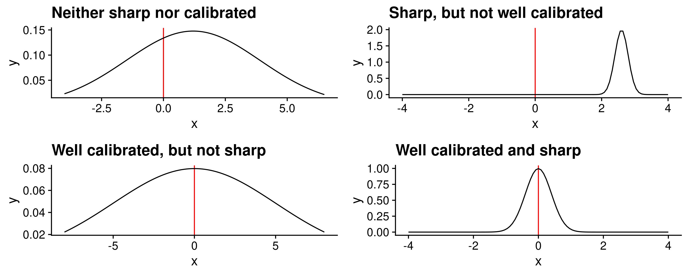
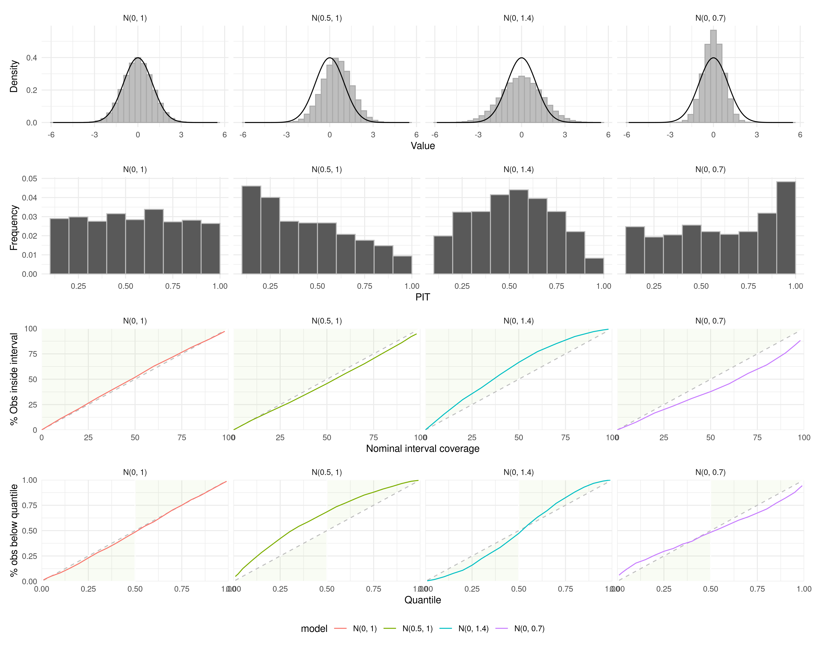
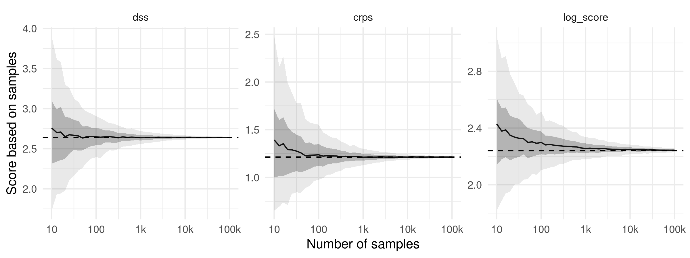
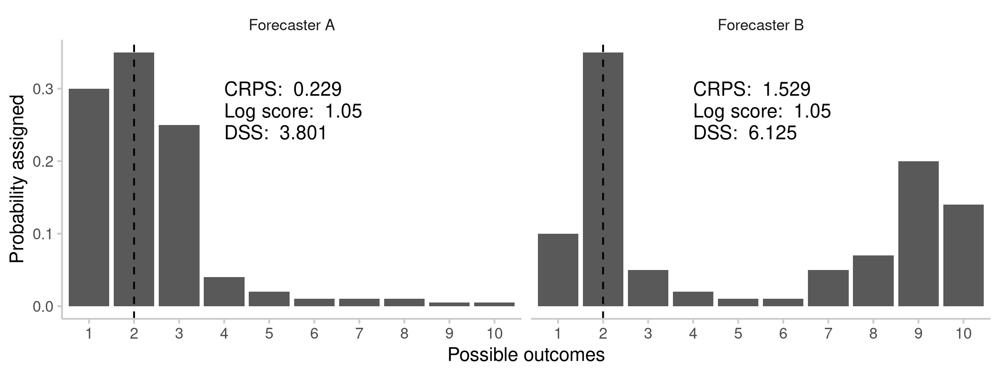

```{r, setup, include=FALSE}
options(prompt = 'R> ', continue = '+ ', width = 70)

library(knitr)
library(dplyr)
library(magrittr)
library(kableExtra)
library(formatR)

opts_chunk$set(
  cache = TRUE,
  warning = FALSE, 
  message = FALSE, 
  out.width = "100%"
)
```

# Introduction

Good forecasts are of great interest to decision makers in various fields like finance \citep{timmermannForecastingMethodsFinance2018, elliottForecastingEconomicsFinance2016}, weather predictions \citep{gneitingWeatherForecastingEnsemble2005, kukkonenReviewOperationalRegionalscale2012} or infectious disease modeling \citep{reichCollaborativeMultiyearMultimodel2019, funkShorttermForecastsInform2020, cramerEvaluationIndividualEnsemble2021, bracherShorttermForecastingCOVID192021, europeancovid-19forecasthubEuropeanCovid19Forecast2021}. An integral part of assessing and improving their usefulness is forecast evaluation. For decades, researchers have developed and refined an arsenal of techniques not only to forecast, but also to evaluate these forecasts (see e.g. \cite{bracherEvaluatingEpidemicForecasts2021}, \cite{funkAssessingPerformanceRealtime2019}, \cite{gneitingProbabilisticForecastsCalibration2007}, and \cite{gneitingStrictlyProperScoring2007}). Yet even with this rich body of research available, implementing a complete forecast evaluation in \proglang{R} is not trivial. 

Some packages exist that bundle different scoring metrics together, but none offer the user a standalone solution to forecast evaluation. The \pkg{scoringRules} package \citep{scoringRules} offers a very extensive collection of proper scoring rules. Its exclusive focus on proper scoring rules and the fact that all functions are implemented using vectors and matrices instead of data.frames, however, make it more suitable for experienced users or as a building block in larger application. It also lacks features like pairwise comparisons between forecast models and plotting functionality that are invaluable in the evaluation process. Other packages like \pkg{Metrics} \citep(Metrics) and \pkg{MLmetrics} \citep{MLmetrics} are geared towards machine learning problems and don't implement the set of metrics and scoring rules desired for forecast evaluation. The \pkg{scoringutils} package aims to bring forth a standardised and tested toolkit. It offers convenient automated forecast evaluation in a data.table format, but also provides experienced users with a set of reliable lower-level scoring metrics they can build upon in other applications. In addition it implements a wide range of flexible plots that are able to cover most day-to-day use cases. 

The remainder of this section will provide an overview of the fundamental ideas behind forecast evaluation. Section \ref{metrics} will give a detailed theoretical explanation of the evaluation metrics in \pkg{scoringutils} and when to use them. Section \ref{evalutation-example} will demonstrate how to conduct an evaluation in \pkg{scoringutils} using forecasts of COVID-19 submitted to the European Forecast Hub \citep{europeancovid-19forecasthubEuropeanCovid19Forecast2021} as a case study. 

<!-- Could also make this an entire section? -->

\subsection{Forecast types and forecast formats}

In its most general sense, a forecast is the forecaster’s stated belief about the future \citep{gneitingStrictlyProperScoring2007} that can come in many different forms. Quantitative forecasts are either point forecasts or probabilistic in nature and can make statements about continuous, discrete or binary outcome variables. Point forecasts only give one single number for the most likely outcome, but do not quantify the forecaster's uncertainty. This limits their usefulness, as a very certain forecast may, for example, warrant a very different course of actions than does a very uncertain one. Probabilistic forecasts, in contrast, by definition provide a full predictive distribution. This makes them much more useful in any applied setting, as we learn about the forecaster's uncertainty and their belief about all aspects of the underlying data-generating distribution (including e.g. skewness or the width of its tails). Probabilistic forecasts are therefore the focus of this paper as well as the \pkg{scoringutils} package. 

The predictive distribution of a probabilistic forecast can be represented in different ways with implications for the appropriate evaluation approach. For most forecasting problems, predictive distributions are not readily available in a closed form (and the \pkg{scoringutils} package therefore does not support scoring them directly). Instead, predictive distributions are often represented by a set of quantiles or predictive samples. Predictive samples require a lot of storage space and also come with a loss of precision that is especially pronounced in the tails of the predictive distribution, where quite a lot of samples are needed to accurately characterise the distribution. For that reason, often quantiles or central prediction intervals are reported instead [citation FORECAST HUBS]. For binary or multinomial prediction targets, common in many classification problems, a probabilistic forecasts is represented by the probability that an outcome will come true. Table \ref{tab:forecast-types} summarises the different forecast types and formats. While specific metrics may differ depending on the forecast type or format, the general forecasting paradigm \cite{gneitingProbabilisticForecastsCalibration2007} that guides the evaluation process is the same.


```{r forecast-types, echo = FALSE}

data <- readRDS(system.file("metrics-overview/forecast-types.Rda",
                            package = "scoringutils"))

data %>%
  dplyr::mutate_all(linebreak) %>%
  kableExtra::kbl(format = "latex",
                  valign = "middle",
                  caption = "Forecasts can be distinguished by whether they are probabilistic in nature, or a point forecast only. Depending on the type of the target (discrete, continuous or binary) different representation of the predictive distribution are possible.",
                  booktabs = TRUE,
                  escape = FALSE,
                  linesep = c('\\addlinespace')) %>%
  # kableExtra::column_spec(1, width = "3.5cm") %>%
  # kableExtra::column_spec(2, width = "2.5cm") %>%
  # kableExtra::column_spec(3, width = "4.5cm") %>%
  kableExtra::row_spec(0, bold = TRUE) %>%
  # kableExtra::row_spec(1, hline = TRUE) %>%
  kableExtra::kable_styling()  %>%
  kableExtra::collapse_rows()
```

## The Forecasting paradigm 

Any forecaster should aim to minimise the difference between the (cumulative) predictive distribution $F$ and the unknown true data-generating distribution $G$ \citep{gneitingProbabilisticForecastsCalibration2007}. For an ideal forecast, we therefore have 

$$ F = G, $$

where $F$ and $G$ are both cumulative distribution functions. As we don't know the true data-generating distribution, we cannot assess the difference between the two distributions directly. \cite{gneitingProbabilisticForecastsCalibration2007} instead suggest to focus on two central aspects of the predictive distribution, calibration and sharpness (illustrated in Figure \ref{fig:forecast-paradigm}. Calibration refers to the statistical consistency (i.e. absence of systematic deviations) between the predictive distribution and the observations. Sharpness is a feature of the forecast only and describes how concentrated the predictive distribution is, i.e. how precise the forecasts are. The general forecasting paradigm states that we should maximise sharpness of the predictive distribution subject to calibration. A model that made very precise forecasts would at best be useless if the forecasts were wrong most of the time. On the other hand, a model may be well calibrated, but not sharp enough to be useful. Take a weather forecast that would assign 30 percent rain probability for every single day. It may be (marginally) calibrated when looking at the average rainfall over the course of a year, but it doesn't give much guidance on a day to day basis. \cite{gneitingProbabilisticForecastsCalibration2007} discuss different forms of calibration in more detail. 


```{r forecast-paradigm, echo = FALSE, fig.cap= "Schematic illustration of calibration and sharpness. The true value is represented in red, the predictive distribution is shown in black"}

```


# Scoring metrics implemented in \pkg{scoringutils} {short-title="Scoring metrics implemented in scoringutils" #metrics}

The \pkg{scoringutils} package implements a variety of metrics which focus on sharpness or calibration alone, as well as several so-called proper scoring rules \citep{gneitingStrictlyProperScoring2007}, which combine both aspects into a single number. Looking at calibration and sharpness independently can be helpful to learn about specific model aspects and improve them. Proper scoring rules are especially useful to assess and rank predictive performance of a forecaster. A scoring rule is proper if a perfect forecaster (the predictive distribution equals the data-generating distribution) receives the lowest score on average. This makes sure that a forecaster evaluated by a proper scoring rule is always incentivised to state their best estimate. Table \ref{tab:table-summary-scores} gives an overview of the metrics implemented in \pkg{scoringutils} and when they are applicable,  while table \ref{tab:score-table} in the Appendix provides mathematical definitions, as well as a more thorough explanation of all the metrics. 

<!-- Figure \ref{fig:calibration-plots} gives an applied example of different scoring metrics and visualisations for simple toy data.  -->

```{r metrics-summary, echo = FALSE}

data <- readRDS(system.file("metrics-overview/metrics-summary.Rda", package = "scoringutils"))

data[, 1:6] %>%
  kableExtra::kbl(format = "latex", booktabs = TRUE, 
                  escape = FALSE,
                  longtable = TRUE,
                  caption = "Summary table of scores available in \\pkg{scoringutils} and when they are applicable. ",
                  align = c("lccccl"),
                  linesep = c('\\addlinespace')) %>%
  kableExtra::column_spec(1, width = "3.3cm") %>%
  # kableExtra::column_spec(2, width = "1.2cm") %>%
  # kableExtra::column_spec(3, width = "1.2cm") %>%
  # kableExtra::column_spec(4, width = "1.0cm") %>%
  # kableExtra::column_spec(5, width = "1.0cm") %>%
  kableExtra::column_spec(6, width = "4.8cm") %>%
  # kableExtra::column_spec(7, width = "1.1cm") %>%
  # kableExtra::column_spec(8, width = "3.4cm") %>%
  kableExtra::kable_styling(latex_options = c("striped", 
                                              "repeat_header, scale_down"), 
                            # full_width = TRUE, 
                            font_size = 8) 
```

## Assessing calibration

There are many ways in which a forecast can be miscalibrated, i.e. systematically deviate from the observations (see \cite{gneitingProbabilisticForecastsCalibration2007} for a discussion of different forms of calibration). 
<!-- Maybe add those forms of miscalibration here -->
\pkg{scoringutils} can help to assess some of them. 

### Bias
Biased forecasts systematically over- or under-predict the observed values. The bias metric implemented in \pkg{scoringutils} follows \citep{funkAssessingPerformanceRealtime2019} with slight adaptations for different forecast formats. It captures how much probability mass of the forecast was above or below the true value (mapped to values between -1 and 1 with 0 being ideal) and therefore represents a general tendency to over- or under-predict in relative terms. A value of -1 implies that the entire probability mass of the predictive distribution was below the observed value (and analogously above it for a value of 1). 

For forecasts in a quantile-based format, there exists a second possibility to assess bias: The weighted interval score (explained in more detail in section XXX) can be decomposed into three components, two of which capture over- and under-prediction. These two error terms are unbound and assess bias on an absolute scale (analogous to the absolute error of a point forecast), rather than a relative scale. 

### Pobabilistic calibration

Probabilistic calibration means that the forecast distributions are consistent with the true data-generating distributions in the sense that on average, $\tau$\% of true observations will be below the corresponding $\tau$-\%-quantiles of the forecast distributions. This also implies that nominal coverage of the central prediction intervals corresponds to empirical coverage. For example, the central 50\% prediction intervals of all forecasts should really contain around 50\% of the observed values, the 90\% central intervals should contain around 90\% of observations etc. 

We can visualise probabilistic calibration in different ways and \pkg{scoringutils} offers three possibilities. Interval coverage plots (see Figure \ref{fig:calibration-plots}) show nominal coverage of the central prediction intervals against the percentage of observed values that fell inside the corresponding prediction intervals. Ideally forecasters should lie on the 45° line. A shift to the left means a forecaster is too conservative and issues a predictive distribution that is too wide and covers more of the observed values than needed. A shift to the right means a forecaster is too confident and the forecast distribution is too narrow. Similarly, quantile coverage plots (Figure \ref{fig:calibration-plots}) show the quantiles of the predictive distribution against the percentage of observed values below the corresponding predictive quantiles. For quantiles below the median, line to the right of the 45° degree line (predictive quantiles lower than the quantiles of the data-generating distribution) means a forecaster is too conservative, while for quantiles above the median, a line to the left of the 45° degree line (predictive quantiles higher than the quantiles of the data-generating distribution) implies conservative predictions. 

<!-- gneitingProbabilisticForecastsCalibration2007 -->
A similar way to visualise the same information is the probability integral transform (PIT) histogram \citep{dawidPresentPositionPotential1984}. The PIT is equal to $F(x_t)$, the predictive distribution evaluated at the observed value (see more details in Table XXX). If forecasts are probabilistically calibrated, then the transformed values will follow a uniform distribution. When plotting a histogram of PIT values, bias ususally leads to a triangular shape, a U-shaped histogram corresponds to forecasts that are under-dispersed (too sharp) and a hump-shape appears when forecasts are over-dispersed (too wide). 

It is in principle possible formally test probabilistic calibration, for example by employing a test on the uniformity of PIT values (e.g. the Anderson-Darling test [CITATION]). In practice this is often difficult as forecasts (for example made on the same forecast date) and therefore also PIT values are often correlated. We therefore advise against using formal tests in most applied settings. It is also important to note that uniformity of the PIT histogram (or a 45° degree line in quantile and interval coverage plots) indicates probabilistic calibration, but does not guarantee that forecasts are indeed calibrated in every relevant sense. \cite{gneitingProbabilisticForecastsCalibration2007} [CITATION other paper that did it first] provide examples with different forecasters who are clearly mis-calibrated , but have uniform PIT histograms. 

```{r calibration-plots, echo = FALSE, fig.cap= "Calibration plots for different forecast distributions."}

```

<!-- Marginal calibration?  -->


## Metrics to assess sharpness

Sharpness is the ability to produce narrow forecasts. It does not depend on the actual observations and is a quality of the forecast only \ref{gneitingProbabilisticForecastsCalibration2007}. Sharpness is therefore only useful subject to calibration, as exemplified above in Figure \ref{fig:calibration-example}. We may be willing to trade off a little calibration for a lot more sharpness, but usually not much. 
For sample-based forecasts, \pkg{scoringutils} calculates dispersion (as the inverse of sharpness) as the normalised median absolute deviation about the median (MADN), following \cite{funkAssessingPerformanceRealtime2019} (for details see Table \ref{tab:score-overview}). For quantile forecasts, we instead report the dispersion component of the weighted interval score (see section XXX) which corresponds to a weighted average of the individual interval widths. 


## Proper scoring rules for sample-based forecasts (CRPS, logS and DSS)

For sample-based forecasts, the \pkg{scoringutils} provides the following proper scoring rules: the (continuous) ranked probability score (CRPS) [CITATION], the log score (logS) [CITATION], and the Dawid-Sebastiani-score (DSS) [CITATION] (formal definitions are given in Table \ref{tab:score-table}). The corresponding functions are imported from the \pkg{scoringRules} package and exposed to the user through a slightly adapted interface. Other, non-sample-based variants of the CRPS, logS and DSS are available in the \pkg{scoringRules} package. 

The DSS is much less commonly used than the logS and the CRPS. 

When scoring forecasts in a sample-based format, the choice is usually between the logS and the CRPS. The DSS is much less commonly used. It is easier to compute, but apart from that does not have immediate advantages over the former two. 

CRPS and logS differ in three important aspects: sensitivity to distance \cite{winklerScoringRulesEvaluation1996}, sensitivity to outlier predictions, and sensitivity to the order of magnitude of the forecast quantity. 

### Estimation details and speed of convergence

All three scores are in principle applicable to continuous as well as discrete forecasts. However, the fact that \pkg{scoringutils} uses sample-based approximations makes estimation more complicated, especially for the log score. For the CRPS and the DSS, approximate scores can be computed based on the empirical distribution function, i.e. using samples directly. For the log score (which equals the negative log density of the predictive distribution evaluated at the observed value), a density estimation is required first. The \pkg{scoringRules} implementation of the log score used within \pkg{scoringutils} performs a kernel density estimation that may in particular be inappropriate for discrete values (see also Table \ref{tab:table-summary-scores}). The logS is therefore not computed for discrete predictions in \pkg{scoringutils}. The sample-based version of the log score also tends to converge more slowly than the CRPS or the DSS to the exact score, as illustrated in Figure \ref{fig:score-convergence}. 

```{r score-convergence, echo = FALSE, fig.cap="Convergence of different scores.", fig.width=10}

```

### Sensitivity to distance - local vs\. global scores

The CRPS is a so-called global scoring rule, which means that the score is sensitive to the distance of the entire predictive distribution from the observed value. The log score, on the other hand is local and not sensitive to the distance between the observed value and the predictive distribution. The resulting score does not depend on the overall distance between the observed value and the distribution, but only on the probability density assigned to the actual outcome. Figure \ref{fig:score-locality} illustrates the case of two hypothetical forecasters predicting the number of goals in a football match. Both assign the same probability to the outcome that was later observed, but forecaster B gives significant probability to outcomes far away from the observed outcome. The crps as a global scoring rule takes the entire predictive distribution into account and will assign a worse score to forecaster B. The log score is only determined by the probability assigned to the observed outcome and therefore both forecasters receive the same score. Sensitivity to distance (taking the entire predictive distribution into account) may be an advantage in most settings that involve decision making. Forecaster A's prediction that assigns high probability to results far away from the observed value is arguably less useful than B's forecast that assigns higher probability to values closer to it (the probability assigned to the actual outcome being equal for both forecasts). The log score is only implicitly sensitive to distance if we assume that values close to the observed value are actually more likely to occur. The logS may, however, be more appropriate for inferential purposes (see \cite{winklerScoringRulesEvaluation1996}) and is commonly used in Bayesian statistics [CITATION]. 

```{r score-locality, echo = FALSE, fig.cap="Probabilities assigned by to hypothetical forecasters, A and B, to the possible number of goals in a football match. The true number later observed, 2, is marked with a dashed line. Both forecasters assign a probability of 0.35 to the observed outcome, 2. Forecaster A's prediction is centred around the observed value, while Forecaster B assigns significant probability to outcomes far away from the observed value. Judged by a local score like the Log Score, both forecasters receive the same score. A global score like the CRPS punishes forecaster B more severly."}


```

### Robustness to outlier predictions
A second important difference is how forecasts are treated that deviate strongly from the observed outcome. The CRPS can be thought of as a generalisation of the absolute error to a predictive distribution. It therefore scales linearly with the distance between forecast distribution and true value. The log score, however, is the log of the predictive density evaluated at the observed value. It can quickly go to negative infinity if the probability assigned to the observed outcome is close to zero. The CRPS is therefore considered more stable than the log score. The behaviour of the DSS is in between the two. Whether or not harsh punishment of bad predictions is desirable or not depends of course on the setting. \cite{bracherEvaluatingEpidemicForecasts2021} exemplify that in practice there may indeed be substantial differences between how the CRPS and log score judge the same forecast. 

### Sensitivity to the order of magnitude of the forecast quantity
As the CRPS is a generalisation of the absolute value, overall scores depend on the order of magnitude of the quantity we try to forecast. This makes it harder to compare forecasts for very different targets, or assess average performance if the quantity of interest varies substantially over time. Average scores are dominated by forecasts for targets with high absolute numbers. This may be desirable,if we care most about forecasts in situations where numbers are high, but usually it is not. LogS and DSS are more robust against this effect. Another way to address this issue by using pairwise comparisons will be introduced later. 

## Proper scoring rule for quantile-based forecasts (WIS)
For forecasts in an interval or quantile format, \pkg{scoringutils} offers the weighted interval score (WIS) \citep{bracherEvaluatingEpidemicForecasts2021}. The WIS has very similar properties to the CRPS and can be thought of as a quantile-based approximation. For an increasing number of equally-spaced prediction intervals the WIS converges to the CRPS. One additional benefit of the WIS is that it can easily be decomposed into three additive components: an uncertainty penalty (called dispersion or sharpness penalty) for the width of a prediction interval and penalties for over- and under-prediction (if a value falls outside of a prediction interval). This can be very helpful in diagnosing model problems. It may even be useful to convert samples into quantiles and use the WIS instead of the CRPS to make use of this decomposition for the purpose of model diagnostics. 
<!-- Think about this again -->

## Proper scoring rules for binary outcomes (BS and logS)

Binary forecasts can be scored using the Brier score (BS) [CITATION], which corresponds to the squared difference between the given probability and the outcome (either 0 or 1). 

ADD EXPLANATION OF LOG SCORE FOR BINARY OUTCOMES AND WHEN TO USE WHICH

## Pairwise comparisons

If what we care about is to determine which model performs best, pairwise comparisons between models are a suitable approach [CITATION CRAMER et al.]. In turn, each pair of models is evaluated based on the targets that both models have predicted. The mean score by one model is divided by the mean score of the other model to obtain the mean score ratio (see Table \ref{tab:score-overview}, a measure of relative performance. To obtain an overall relative skill score for a model, we take the geomatric mean of all mean score ratios that involve that model  (omitting comparisons where there is no overlapping set of forecasts). This gives us an indicator of performance relative to all other models. The orientation depends on the score used. For the proper scoring rules described above, smaller is better and a relative skill score smaller than 1 indicates that a model is performing better than the average model. We can obtain a scaled relative skill score by dividing a model's relative skill by the relative skill of a baseline model. A scaled relative skill smaller than one then means that the model in question performed better than the baseline. 

It is in principle possible to obtain p-values that help determine whether two models perform significantly differently. \pkg{scoringutils} allows to compute these using either the Wilcoxon rank sum test or a permutation test. In practice, this is slightly complicated by the fact that both tests assume independent observations. In reality, however, forecasts by a model may be correlated across time or another dimension (e.g. if a forecaster has a bad day, they will likely perform badly across different targets for a given forecast date). P-values may therefore be too quick to suggest significant differences where there aren't any. One way to mitigate this is to aggregate observations over a category where one suspects correlation (fore example averaging across all forecasts made on a given date) before making pairwise comparisons. A test that is performed on aggregate scores will likely be more conservative. 

# Evaluating forecasts using scoringutils {#evalutation-example}

\pkg{scoringutils} offers two principal ways of scoring forecasts. We suggest a convenient evaluation workflow that is centred around function which accept data.frames as input. However, \pkg{scoringutils} also exports lower-level functions which work with vectors and matrices, allowing more experienced users to use the functioniality in their own evaluation pipelines. For these lower-level functions we refer to the 

<!-- Maybe have an overview of which functions are available in the package -->

The following section shows an example evaluation of short-term predictions for COVID-19 cases and deaths submitted to the European Forecast Hub \citep{europeancovid-19forecasthubEuropeanCovid19Forecast2021}. The European Forecast Hub each week collates, aggregates and evaluates one to four week ahead predictions of different COVID-19 related targets submitted by different research groups. Forecasts are submitted in a quantile-based format with a set of 22 quantiles plus the median ($0.01, 0.025, 0.05, ..., 0.5, ... 0.95, 0.975, 0.99$). The following example evaluation is based on a subset of forecasts from the European Forecast Hub which includes one to three week ahead forecasts made between May and September 2021 for COVID-19 cases and deaths from four different models. The full official hub evaluations, which also use \pkg{scoringutils}, can be seen at https://covid19forecasthub.eu/. 

The example data used here follows a quantile-based format, but the evaluation process works analogously for forecasts in a different format. We will point out differences to scoring different forecast formats where appropriate. The example data set (as well as versions of it in different formats) is also included in the \pkg{scoringutils} package. 

<!-- The evaluation process looks as follows: First we load, prepare and visualise (some of) the data. Then we obtain forecast scores and a model ranking based on pairwise-comparisons, followed by a more detailed analysis of calibration and sharpness.  -->

## Data, data checks and input formats

```{r}
# load packages
library(scoringutils)
library(dplyr)
library(ggplot2)

# load forecasts
data(example_quantile)
```

All higher level functions that allow for convenient evaluation of forecasts expect a \code{data.frame} or similar. Lower-level functions (discussed in a later section) accept inputs as vectors and matrices. 

We omit \code{NA} values as the data set also contains entries for which we have an observed value, but no forecast. 

```{r}
example_quantile |>
  na.omit() |>
  glimpse()
```

For forecasts in a quantile-based format it is necessary to have columns called \code{true_value}, \code{prediction} and \code{quantile}. It is recommended (although not necessary except in order to do pairwise comparisons) to have a column called "model" with an identifier for the forecaster.
Table \ref{tab:column-requirements} shows the columns expected for different input formats. 

```{r, column-requirements, echo=FALSE}
library(data.table)
requirements <- 
  data.table(
    "Format" = c("quantile-based", "sample-based", "binary", "pairwise-comparisons"), 
    `Required columns` = c("'true_value', 'prediction', 'quantile'", 
                           "'true_value', 'prediction', 'sample'", 
                           "'true_value', 'prediction'", 
                           "additionally a column 'model'")
  )

requirements |>
  kbl(format = "latex", 
      caption = "Overview of the columns required for different input formats.")
```

We can check whether the data conforms to the requirements by running \fct{check\_forecasts}. 

```{r,tidy=TRUE, tidy.opts=list(width.cutoff=I(70)), echo=FALSE}
check_forecasts(example_quantile)
```

This returns a list with different entries giving information about what \pkg{scoringutils} infers from the data. \code{target_type} \code{prediction_type} refer to the forecast format. \code{forecast_unit} contains a vector of the columns which \pkg{scoringutils} thinks denote the unit of a single forecast. This means that in this instance a single forecast (with a set of 23 quantiles) can uniquely be identified by the values in the columns "location", "target\_end\_date", "target\_type", "location\_name", "forecast\_date", "model", "horizon". In this example, having "location" as well as "location\_name" included does not make a difference, as they contain duplicated information. In general, however, it is strongly advised to remove all unnecessary columns that do not help identify a single forecast. \code{unique_values} gives an overview of the number of unique values per column across the entire data set, providing a first hint as to whether the forecast set is complete. \code{warnings} shows potential warnings about the data. In this example, \pkg{scoringutils} warns that there are observed values present for which there is no corresponding forecast. These warnings can often be ignored, but may provide important information. If there are errors that cannot be ignored, a list entry \code{errors} will appear. 

It is helpful to start the evaluation process by visualising data availability, as missing forecasts can impact the evaluation if missingness is not random, but instead correlates with performance. The function \fct{show\_avail\_forecasts} returns a heatmap with the number of available forecasts. By default, the function treats a set of different quantiles or samples as one forecast. However, the user can specify manually which elements to treat as one forecast and which categories to sum over to count the number of available forecasts. 


```{r avail-forecasts, echo=TRUE, fig.width = 10, eval = TRUE, fig.cap="Overview of the number of available forecasts."}
show_avail_forecasts(data = example_quantile, 
                     facet_formula = ~ target_type,
                     x = "target_end_date", 
                     show_numbers = FALSE,
                     legend_position = "bottom") 
```

The forecasts and observed values themselves can be visualised using the \fct{plot\_predictions} function. Data visualisation is of course highly context-dependent, but the function tries to accommodate most practical use-cases. In addition to basic plotting functionality it offers the user an optional ad hoc way to filter both forecasts and observed values. This makes it possible to tweak the plot in a beginner-friendly way without having to manipulate the data separately. Forecasts and observed values can be passed in separately (and are merged internally) or as a single data.frame. Conditions to filter on need to be provided as a list of strings, where each of the strings represents an expression that can be evaluated to filter the data. To display, for example, short-term forecasts for COVID-19 cases and deaths made by the EuroCOVIDhub-ensemble model on June 28 2021 as well as 5 weeks of prior data, we can call: % 


```{r forecast-visualisation, fig.width = 10, fig.cap = "Short-term forecasts for COVID-19 cases and deaths made by the EuroCOVIDhub-ensemble model on June 28 2021."}
plot_predictions(data = example_quantile,
                 x = "target_end_date",
                 filter_truth = list('target_end_date <= "2021-07-15"',
                                     'target_end_date > "2021-05-22"'),
                 filter_forecasts = list("model == 'EuroCOVIDhub-ensemble'",
                                         'forecast_date == "2021-06-28"')) + 
  facet_wrap(target_type ~ location, ncol = 4) + 
  theme(legend.position = "bottom")
```

The output is shown in Figure \ref{fig:forecast-visualisation}.

## Scoring forecasts with \fct{eval\_forecasts} {short-title="Scoring forecasts with score()"}

The actual scoring of forecasts based on observed values can be performed using the function \fct{eval\_forecasts}. The function automatically detects the forecast type and format (as shown in the output of \fct{check\_forecasts}), applies the appropriate scoring metrics and can in addition also aggregate results as well as perform pairwise comparisons between models. Internally, operations are handled using \pkg{data.table} to allow for fast and efficient computation. 

```{r}
scores <- score(example_quantile)
glimpse(scores)
```

The above produces one score for every forecast. However, we usually like to summarise scores to learn about average performance. 

We can either run a separate function to summarise the scores, 


```{r}
summarised_scores <- 
  summarise_scores(scores = scores, 
                   by = c("model", "target_type"))
```

or we score and summarise in one function call: 

```{r}
summarised_scores <- 
  score(example_quantile) %>%
  summarise_scores(by = c("model", "target_type"))
```

```{r}
summarised_scores
```

\fct{eval\_forecasts} and \fct{summarise\_scores} aggregate scores by taking the mean over according to the grouping specified in \code{summarise_by}. In the above example, if \code{summarise_by = c("model", "target_type")}, then scores would be averaged over all other categories to obtain one score per model and forecast target type. For a more detailed analysis we could for example specify \code{summarise_by = c("mode", "target_type", "location")} to additionally stratify by country. Summarised scores can be visualised using the function \fct{scores\_table} as is shown in Figure \ref{fig:score-table}. 

If we wanted to have one score per quantile or one per prediction interval range, we could use something like \code{summarise_by = c("model", "quantile", "range")}. This would allow us to examine interval or quantile coverage or makes it possible to analyse the accuracy of the tails of the forecasts. In addition to the mean, we can also obtain the standard deviation of the scores over which we average, as well as any desired quantile, by specifying \code{sd = TRUE} and for example \code{quantiles = c(0.5)} for the median. 

The user must, however, exercise some caution when aggregating scores. As explained above, many of the metrics are absolute and scale with the magnitude of the quantity to forecast. This makes it sometimes ill-advised to average over them. In the given example, looking at one score per model (i.e. specifying \code{summarise_by = c("model")}) is problematic, as overall aggregate scores would be dominated by case forecasts, while errors on death forecasts would have little influence. Similarly, aggregating over different forecast horizons is often not a good idea as the mean will be dominated by further ahead forecast horizons. 

```{r score-table, fig.width = 12, fig.cap="Coloured table to visualise the computed scores."}
score_table(summarised_scores, y = "model") + 
  facet_wrap( ~ target_type)
```

In order to obtain a model ranking, we recommend to look at the relative skill in terms of an appropriate proper scoring rule instead of the raw score. Relative skill scores can be aggregated more easily across different forecast targets as they are less influenced by the order of magnitude of the quantity to forecast than e.g. the WIS or the CRPS. 

Again there are two possible ways to do pairwise comparisons. First, the function \fct{pairiwse\_comparison} can be called to compare models against each other. Here \code{summarise_by} denotes what relative skill scores shall be computed for. \code{summarise_by = "model"} means there will be one relative skill score per model, while \code{summarise_by = c("target_type", "target_type")} would mean there is one relative skill score per model, computed completely separately for different target types. 

When using \fct{pairwise\_comparison}, it is important that the scores used as input have not been summarised in any way. 

```{r}
pairwise <- pairwise_comparison(scores, 
                                baseline = "EuroCOVIDhub-baseline")

pairwise2 <- pairwise_comparison(scores, 
                                by = c("model", "target_type"), 
                                baseline = "EuroCOVIDhub-baseline")
```

Pairwise comparisons between models [CITATION] can be obtained in two different ways. First, relative skill scores based on pairwise comparisons are by default returned from \fct{eval\_forecasts}. These will be computed separately for the categories defined in the \code{summarise_by} argument (excluding the category 'model'). Alternatively, a set of scores can be post-processed using the separate function \fct{pairwise\_comparison}. This approach is to be used for visualisation and if p-values for the pairwise comparisons are needed, as those are not returned from \fct{eval\_forecasts}. Usually, one would compute scores without specifying a \code{summarise_by} argument, but sometimes it may be sensible to average over certain scores, for example for predictions generated at a certain date. This allows to reduce the correlation between observations that enter the computation of p-values, which in turn makes the test less liberal. 
Using the function \fct{plot\_pairwise\_comparison} we can visualise the mean score ratios between all models as well as the 

The result is a \code{data.table} with different scores and metrics in a tidy format that can easily be used for further manipulation and plotting. 


```{r pairwise-plot, echo=TRUE, fig.width = 10, fig.cap="Ratios of mean scores based on overlapping forecast sets. If a tile is blue, then the model on the y-axis performed better. If it is red, the model on the x-axis performed better in direct comparison."}

```

## Visualising aggregate scores and rankings
A good starting point for an evaluation is the following score table that visusalises the scores we produced above. We can facet the table to account for the different forecast targets: 


The most informative metric in terms of model ranking is the relative\_skill. However, interpretation is not always straightforward and has to be done carefully. We can see that performance varied quite a bit across different metrics, where some models did well on one target, but poorly on another. Especially the Exponential growth/decline model stands out as it received the lowest relative skill score for hospital admissions, but the highest for the total number of beds occupied. Looking back at Figure \ref{fig:avail-forecasts}, we see that the model has only submitted very few forecasts over all. It may therefore be sensible to require all models to have submitted forecasts for at least 50\% of all forecast targets in order to enter the pairwise comparisons. For similar reasons, the interval score may be deceiving if looked at in isolation. As can be seen, the DetSEIRwithNB MLE model received a lower relative skill score, but a higher interval score than the DetSEIRwithNB MCMC model. This, again, can be explained by the fact that they forecasted different targets. The interval score, as an absolute metric, is highly influenced by the absolute value of the quantity that is forecasted. For the same reason, one should be careful when summarising interval scores from different locations or forecast targets, as the average score will be dominated by outliers as well as differences in the absolute level. Assuming a large enough set of available overlapping forecasts, the relative skill score is more robust. It therefore is reasonable to assume that the DetSEIRwithNB MLE forecasted quantities with a higher absolute value, but tended to perform worse than the DetSEIRwithNB MCMC model as far as we can tell based on the set of all pariwise comparisons. This can be confirmed for the direct comparison between the two by looking at the mean score ratios from the pairwise comparisons. These can be obtained by calling

In terms of actually understanding \textit{why} one model performs well or badly, the other metrics shown in Figure \ref{fig:score-table} provide additional insight. We turn to them in the following. 

## Visual model diagnostics

For forecasts in an interval format, looking at the components of the weighted interval score separately is a natural next step. We can see in Figure \ref{fig:wis-components} that the majority of penalties come from over-and underprediction, instead of the sharpness component. We also see that most models tended to either over- or underpredict actual numbers.  


```{r wis-components, fig.width = 10, fig.cap = "CAPTION"}
wis_components(summarised_scores, 
               relative_contributions = TRUE, 
               x_text_angle = 0) + 
  facet_wrap(~ target_type, 
             scales = "free_x") + 
  coord_flip() + 
  theme(legend.position = "bottom")
```

We can have a closer look at calibration using the functions \fct{interval\_coverage} and \fct{quantile\_coverage}. The interval coverage plot shows the proportion of all true values that fall within all the different prediction intervals. This gives a visual impression of probabilistic calibration \ref{gneitingProbabilisticForecastsCalibration2007}. Ideally, $x$ percent of true values should be covered by the $x$\%-prediction intervals, resulting in a 45° line. Areas shaded in green indicate that the model is covering more true values than it actually should, while areas in white indicate that the model fails to cover the desired proportion of true values with its prediction intervals. The majority of the models were too confident in their predictions, while some showed showed good calibration. The quantile coverage plot shows the proportion of all true values below certain predictive quantiles. While this plot is slightly harder to interpret, it also includes information about bias as and allows to separate the lower and upper boundaries of the prediction intervals. We can see, for example, that the Exponential growth/decline model was consistently biased downwards. Figure \ref{fig:coverage}


```{r pit-plots, out.width="49%", fig.show='hold'}
pit <- pit(example_quantile, 
              by = "model", "target")

plot_pit(pit)
```


```{r coverage, fig.width = 10, fig.show='hold', fig.cap = "Interval coverage"}
cov_scores <- score(example_quantile) %>%
  summarise_scores(by = c("model", "target_type", "range", "quantile"))

interval_coverage(cov_scores) + 
  facet_wrap(~ target_type)
```

```{r quantile-coverage, fig.width = 10, fig.show='hold', fig.cap = "Quantile coverage"}
quantile_coverage(cov_scores) + 
  facet_wrap(~ target_type)
```

DO I WANT TO INCLUDE PIT PLOTS AS WELL? I GUESS? NEED TO LOOK AT THE IMPLEMENTATION FOR QUANTILE FORECASTS

```{r calibration-pit, fig.cap = "PIT histograms"}
# pit-plots, echo=TRUE, fig=TRUE, height=5.2, width=12>>=
# out <- score(example_quantile, 
#                      summarise_by = c("model"), 
#                      pit_plots = TRUE)

```

Look at e.g. bias by location? Figure \ref{fig:bias-heatmap}

```{r heatmap-location, fig.width = 10, fig.cap="Heatmap of interval scores by location"}
scores <- score(example_quantile) %>%
  summarise_scores(by = c("model", "target_type", "location_name"))

plot_heatmap(scores, 
              metric = "interval_score", x = "location_name") + 
  facet_wrap(~ target_type, scale = "free_x")
```


## Summary and discussion

COMING SOON. 


<!-- % The results in this paper were obtained using -->
<!-- % \proglang{R}~\Sexpr{paste(R.Version()[6:7], collapse = ".")} with the -->
<!-- % \pkg{MASS}~\Sexpr{packageVersion("MASS")} package. \proglang{R} itself -->
<!-- % and all packages used are available from the Comprehensive -->
<!-- % \proglang{R} Archive Network (CRAN) at -->
<!-- % \url{https://CRAN.R-project.org/}. -->


## Acknowledgments


<!-- % All acknowledgments (note the AE spelling) should be collected in this -->
<!-- % unnumbered section before the references. It may contain the usual information -->
<!-- % about funding and feedback from colleagues/reviewers/etc. Furthermore, -->
<!-- % information such as relative contributions of the authors may be added here -->
<!-- % (if any). -->


<!-- %% -- Bibliography ------------------------------------------------------------- -->
<!-- %% - References need to be provided in a .bib BibTeX database. -->
<!-- %% - All references should be made with \cite, \citet, \citep, \citealp etc. -->
<!-- %%   (and never hard-coded). See the FAQ for details. -->
<!-- %% - JSS-specific markup (\proglang, \pkg, \code) should be used in the .bib. -->
<!-- %% - Titles in the .bib should be in title case. -->
<!-- %% - DOIs should be included where available. -->

<!-- %% -- Appendix (if any) -------------------------------------------------------- -->
<!-- %% - With proper section titles and _not_ just "Appendix". -->

\newpage

\appendix

# (APPENDIX) Supplementary information {-} 

```{r score-table-detailed, echo=FALSE}

data <- readRDS(system.file("metrics-overview/metrics-detailed.Rda", package = "scoringutils"))

data[, 1:2] %>%
  kableExtra::kbl(format = "latex", booktabs = TRUE,
                  escape = FALSE,
                  caption = "Detailed explanation of all the metrics,",
                  longtable = TRUE,
                  linesep = c('\\addlinespace')) %>%
  kableExtra::column_spec(1, width = "1.1in") %>%
  kableExtra::column_spec(2, width = "4.625in") %>%
  kableExtra::kable_styling(latex_options = c("striped", "repeat_header"))

```


\newpage


<!-- ## Code formatting -->

<!-- In general, don't use Markdown, but use the more precise LaTeX commands instead: -->

<!-- * \proglang{Java} -->
<!-- * \pkg{plyr} -->

<!-- One exception is inline code, which can be written inside a pair of backticks (i.e., using the Markdown syntax). -->

<!-- If you want to use LaTeX commands in headers, you need to provide a `short-title` attribute. You can also provide a custom identifier if necessary. See the header of Section \ref{r-code} for example. -->

<!-- # \proglang{R} code {short-title="R code" #r-code} -->

<!-- Can be inserted in regular R markdown blocks. -->

<!-- ```{r} -->
<!-- x <- 1:10 -->
<!-- x -->
<!-- ``` -->

<!-- ## Features specific to \pkg{rticles} {short-title="Features specific to rticles"} -->

<!-- * Adding short titles to section headers is a feature specific to \pkg{rticles} (implemented via a Pandoc Lua filter). This feature is currently not supported by Pandoc and we will update this template if [it is officially supported in the future](https://github.com/jgm/pandoc/issues/4409). -->
<!-- * Using the `\AND` syntax in the `author` field to add authors on a new line. This is a specific to the `rticles::jss_article` format. -->
