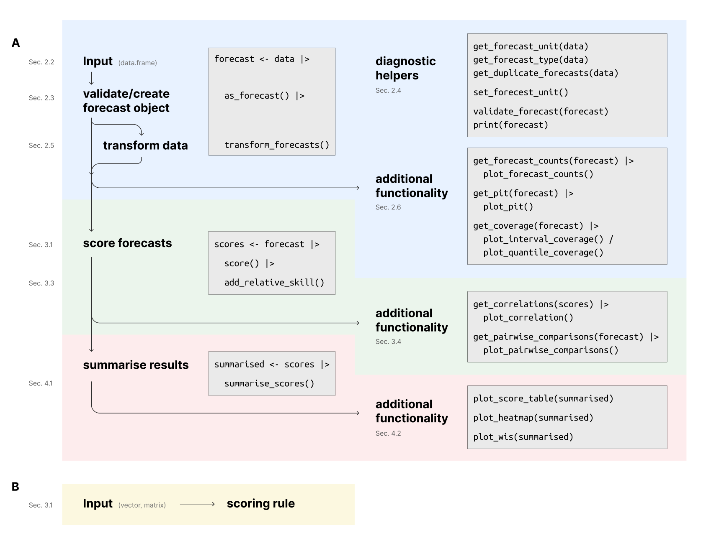
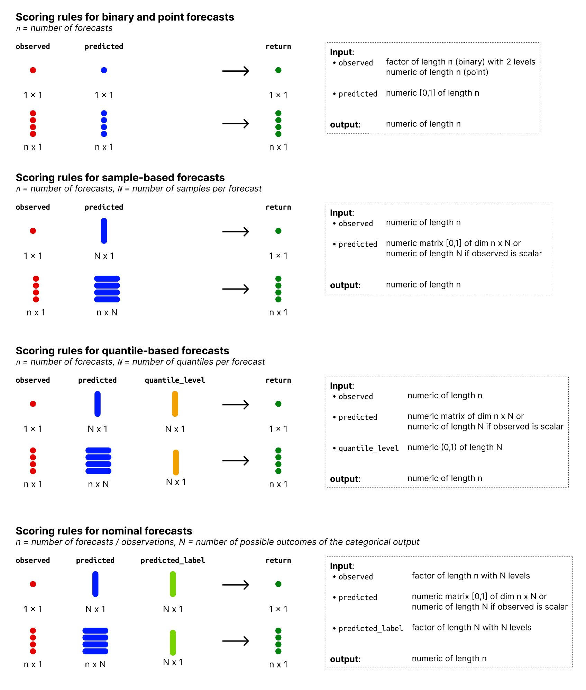
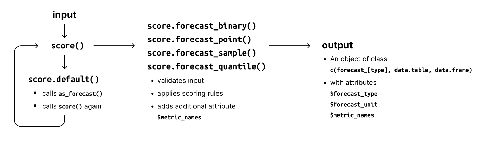
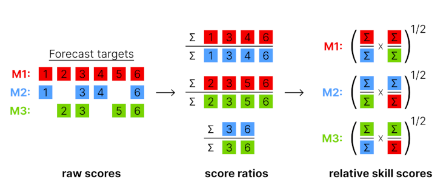

```{r, setup, include=FALSE}
options(prompt = 'R> ', continue = '+ ', width = 70)

library("scoringutils")
library("knitr")
library("dplyr")
library("magrittr")
library("kableExtra")
library("xtable")
library("formatR")
library("data.table")
library("patchwork")
library("ggplot2")

xtable2kable <- function(x) {
  out <- capture.output(print(x, table.placement = NULL))[-(1:2)]
  out <- paste(out, collapse = "\n")
  structure(out, format = "latex", class = "knitr_kable")
}

opts_chunk$set(
  cache = FALSE,
  warning = FALSE, 
  message = FALSE, 
  out.width = "100%"
)
```

```{r eval = FALSE, include=FALSE}
trackdown::update_file("inst/manuscript/manuscript.Rmd", gfile = "scoringutils-paper", hide_code = FALSE)
# trackdown::download_file("inst/manuscript/manuscript.Rmd", gfile = "scoringutils-paper")
```

# Introduction

Good forecasts are of great interest to decision makers in various fields like finance \citep{timmermannForecastingMethodsFinance2018, elliottForecastingEconomicsFinance2016}, weather predictions \citep{gneitingWeatherForecastingEnsemble2005, kukkonenReviewOperationalRegionalscale2012} or infectious disease modeling \citep{reichCollaborativeMultiyearMultimodel2019, funkShorttermForecastsInform2020, cramerEvaluationIndividualEnsemble2021, bracherNationalSubnationalShortterm2022, sherrattPredictivePerformanceMultimodel2022}. 
For decades, researchers, especially in the field of weather forecasting, have therefore developed and refined an arsenal of techniques to evaluate predictions (see for example \cite{goodRationalDecisions1952}, \cite{epsteinScoringSystemProbability1969, murphyNoteRankedProbability1971a, mathesonScoringRulesContinuous1976}, \cite{gneitingProbabilisticForecastsCalibration2007}, \cite{funkAssessingPerformanceRealtime2019}, \cite{gneitingStrictlyProperScoring2007}, \cite{bracherEvaluatingEpidemicForecasts2021}). 

Various \proglang{R} \citep{R} packages cover a wide variety of scoring rules, plots and metrics that are useful in assessing the quality of a forecast. Existing packages offer functionality that is well suited to evaluate a variety of predictive tasks, but also come with important limitations. 

Some packages such as \pkg{tscount} \citep{tscount}, \pkg{topmodels} \citep{topmodels}, \pkg{GLMMadaptive} \citep{GLMMadaptive}, \pkg{cvGEE} \citep{cvGEE} or \pkg{fabletools} \citep{fabletools} expect that forecasts were generated in a certain way and require users to supply an object of a specific class to compute scores. These packages provide excellent tools for users operating within the specific package framework but are by their nature not generally applicable to many use cases practitioners might encounter. 

Packages such as \pkg{scoringRules} \citep{scoringRules}, \pkg{Metrics} \citep{Metrics}, \pkg{MLmetrics} \citep{MLmetrics}, \pkg{verification} \citep{verification}, \pkg{SpecsVerification} \citep{SpecsVerification}, \pkg{surveillance} \citep{surveillance}, \pkg{predtools} \citep{predtools}, or \pkg{probably} \citep{probably} provide an extensive collection of tools, scoring rules and visualisations for various use cases. However, most scoring functions operate on vectors and matrices. This is desirable in many applications but can make it difficult to simultaneously evaluate multiple forecasts across several dimensions, such as time, space, and different types of targets. 

\pkg{scoring} \citep{scoring} operates on a data.frame and uses a formula interface, making this task easier. However, \pkg{scoring} only exports a few scoring rules and does not allow users to supply their own. \pkg{yardstick} \citep{yardstick}, which builds on the \pkg{tidymodels} \citep{tidymodels} framework, is the most general and flexible other forecast evaluation package. It allows users to apply arbitrary scoring rules to a data.frame of forecasts, independently of how they were created. However, \pkg{yardstick} is primarily focused on point forecasts and classification tasks. It currently lacks general support for probabilistic forecasts (forecasts in the form of a full predictive distribution, represented e.g., by a set of quantiles or samples from the forecast distribution). Probabilistic forecasts are desirable, as they allow decision makers to take into account the uncertainty of a forecast \citep{gneitingProbabilisticForecastsCalibration2007}, and are widely used, e.g., in Meteorology or Epidemiology. 

\pkg{scoringutils} aims to fill the existing gap in the ecosystem by providing a flexible general-purpose tool for the evaluation of probabilistic forecasts. It offers a coherent \code{data.table}-based framework and workflow that allows users to evaluate and compare forecasts across multiple dimensions using a wide variety of default and user-provided scoring rules. Notably, \pkg{scoringutils} is the first package to offer extensive support for probabilistic forecasts in the form of predictive quantiles, a format that is currently used by several infectious disease Forecast Hubs \citep{reichCollaborativeMultiyearMultimodel2019, cramerCOVID19ForecastHub2020, sherrattPredictivePerformanceMultimodel2022, bracherNationalSubnationalShortterm2022}.
The package provides broad functionality to check the data and diagnose issues, to visualise forecasts and missing data, to transform data before scoring \citep[see][]{bosseScoringEpidemiologicalForecasts2023}, to apply various metrics and scoring rules to data, to handle missing forecasts, to aggregate scores and to visualise the results of the evaluation. \pkg{scoringutils} makes extensive use of \pkg{data.table} \citep{data.table} to ensure fast and memory-efficient computations. The core functionality is designed around S3 classes, allowing users to expand on the generics and methods implemented in the package. 
\pkg{scoringutils} provides extensive documentation and case studies, as well as sensible defaults for scoring forecasts. 

```{r workflow-scoringutils, echo = FALSE, fig.pos = "!h", out.width="100%", fig.cap= "Illustration of the suggested workflow for evaluating forecasts with \\pkg{scoringutils}. A: Workflow for working with forecasts in a \\code{data.table}-based format. The left side shows the core workflow of the package: 1) validating and processing inputs, 2) scoring forecasts and 3) summarising scores. The right side shows additional functionality that is available at the different stages of the evaluation process. The part in blue is covered by Section \\ref{sec:inputs} and includes all functions related to processing and validating inputs as well as obtaining additional information about the forecasts. The part in green is covered by Section \\ref{sec:scoring} and includes all functions related to scoring forecasts and obtaining additional information about the scores. The part in red is covered by Section \\ref{sec:summarising} and includes all functions related to summarising scores and additional visualisations based on summarised scores. B: An alternative workflow, allowing users to call scoring rules directly with vectors/matrices as inputs.", fig.show="hold"}

```

### Paper outline and package workflow

The structure of this paper follows the suggested package workflow which consists of 1) validating and processing inputs, 2) scoring forecasts and 3) summarising scores. This workflow is illustrated in Figure \ref{fig:workflow-scoringutils}, which displays the core workflow (left side) as well as additional functionality that is available at different stages of the evaluation process (right side).

Section \ref{sec:inputs} is centred around validating inputs, \code{forecast} objects, and the associated functionality. It explains the expected input formats and how to validate inputs and diagnose issues. It provides an overview of the types of forecasts supported by \pkg{scoringutils} and the different S3 classes used to represent these forecast types. It also provides information on a variety of functions that can be used to visualise forecasts, transform inputs or obtain additional information and visualisations.

Section \ref{sec:scoring} is centred around scoring forecasts and the additional functionality that is available to manipulate and analyse scores further. It explains how to score forecasts, either in a \code{data.table}-format or in a format based on matrices and vectors. It also provides information on additional information that can be computed from scores, such as correlations between scores or relative skill scores based on pairwise comparisons. These can be useful to mitigate the effects of missing forecasts.

Section \ref{sec:summarising} is centred around summarised scores. It explains how to summarise scores and gives information on additional visualisations that can be created based on summarised scores.

Section \ref{sec:discussion} discusses the merits and limitations of the package in its current version as explores avenues for future work.

All functionality will be illustrated using the example data shipped with the package, which is based on a subset of case and death forecasts submitted every week between May and September 2021 to the European COVID-19 Forecast Hub \citep{sherrattPredictivePerformanceMultimodel2022}. Following the convention of the different COVID-19 Forecast Hubs, we will restrict examples to two-week-ahead forecasts. 

The code for this package and paper can be found on \url{https:github.com/epiforecasts/scoringutils}. The full package documentation as well as an overview of all existing functions can also be seen on \url{https://epiforecasts.io/scoringutils}. 

\section{Inputs, forecast types and input validation} \label{sec:inputs}

## Input formats and types of forecasts

Forecasts differ in the exact prediction task and in how the forecaster chooses to represent their prediction. To distinguish different kinds of forecasts, we use the term "forecast type" (which is more a convenient classification than a formal definition). Currently, `scoringutils` distinguishes five different forecast types: "point", "binary", "nominal", "quantile" and "sample" forecasts.

- "Point" denotes a forecast for a continuous or discrete outcome variable that is represented by a single number.
- "Binary" denotes a probability forecast for a binary (yes/no) outcome variable. This is sometimes also called "soft binary classification".
- "Nominal" denotes a probability forecast for a variable where the outcome can assume one of multiple unordered classes. This represents a generalisation of binary forecasts to multiple possible outcomes.
- "Quantile" or "quantile-based" is used to denote a probabilistic forecast for a continuous or discrete outcome variable, with the forecast distribution represented by a set of predictive quantiles. While a single quantile would already satisfy the requirements for a quantile-based forecast, most scoring rules expect a set of quantiles which are symmetric around the median (thus forming the lower and upper bounds of central "prediction intervals") and will error (or return `NA` if `na.rm = TRUE`) if this is not the case. 
- "Sample" or "sample-based" is used to denote a probabilistic forecast for a continuous or discrete outcome variable, with the forecast represented by a finite set of samples drawn from the predictive distribution. A single sample technically suffices, but would lead to very imprecise results.

\begin{table}[h]
\centering
\resizebox{\textwidth}{!}{
\setlength\tabcolsep{10pt}
\begin{tabular}{@{}lllll@{}} % Define the table with five columns
\toprule
\textbf{Forecast type} & & & \textbf{column} & \textbf{type} \\
\midrule
% Classification
\multirow{5}{*}{\makecell[cl]{Categorical\\forecast}}    & \multirow{2}{*}{Binary}     & Soft classification & \texttt{observed} & factor with 2 levels \\ 
                                &                             & {\footnotesize(prediction is probability)}  & \texttt{predicted} & numeric [0,1] \\
\cmidrule(l){2-5} 
                                & \multirow{3}{*}{\makecell[cl]{Nominal\\{\footnotesize(multiclass)}}} & \multirow{3}{*}{\makecell[cl]{Soft classification\\{\footnotesize(prediction is probability)}}} 
                                                                  & \texttt{observed}   & factor with $N$ levels \\ 
                                &                                 & & \texttt{predicted} & numeric [0,1] \\
                                &                                 & & \texttt{predicted\_label} & factor with $N$ levels \\
\midrule

% Point forecasts
\multirow{2}{*}{Point forecast} & & & \texttt{observed}  & numeric                \\
                                 & & & \texttt{predicted} & numeric                \\
\midrule

% Probabilistic forecast
\multirow{6}{*}{\makecell[cl]{Probabilistic\\forecast}} & & \multirow{3}{*}{Sample format} & \texttt{observed} & numeric                \\
                                                         &                      &               & \texttt{predicted} & numeric                \\
                                                         &                      &               & \texttt{sample\_id} & numeric              \\
\cmidrule(l){3-5} 
                                                         &                      & \multirow{3}{*}{Quantile format}  & \texttt{observed} & numeric                \\
                                                         &                      &               & \texttt{predicted} & numeric                \\
                                                         &                      &               & \texttt{quantile\_level} & numeric [0,1]  \\
\bottomrule
\end{tabular}
}
\caption{Formatting requirements for data inputs. For binary forecasts, the column \texttt{observed} must be of type factor with two levels and the column \texttt{predicted} must be a numeric between 0 and 1. For nominal forecasts, the observed value must be a factor with $N$ levels (where $N$ is the number of possible outcomes) and a column \texttt{predicted\_label} must denote the outcome for which a probability was made. For all other forecast types, both \texttt{observed} and \texttt{predicted} must be of type numeric. Forecasts in a sample-based format require an additional numeric column \texttt{sample\_id} and forecasts in a quantile-based format require an additional numeric column \texttt{quantile\_level} with values between 0 and 1.}
\label{tab:input-score}
\end{table}

The starting point for working with \pkg{scoringutils} is usually a \code{data.frame} (or similar) containing both the predictions and the observed values. In a next step (see Section \ref{sec:validation}) this data will be validated and transformed into a "forecast object" (a \code{data.table} with a class `forecast` and an additional class corresponding to the forecast type). The input data needs to have a column `observed` for the observed values, a column `predicted` for the predicted values. Additional requirements depend on the forecast type. 

Table \ref{tab:input-score} shows the expected input format for each forecast type. 

The package contains example data for each forecast type, which can serve as an orientation for the correct formats. The example data sets are exported as `example_point` and `example_binary`, `example_nominal`, `example_quantile`, `example_sample_continuous`, and `example_sample_discrete`. For illustrative purposes, the example data also contains some rows with only observations and no corresponding predictions. All example data in the package use a column called `model` to denote the name of the model/forecaster that generated the forecast. This is also the default in some functions, but does not reflect a hard requirement. Input formats for the scoring rules that can be called directly follow the same convention, with inputs expected to be vectors or matrices.

### The unit of a single forecast

Apart from the columns `observed`, `predicted`, `model`, and the extra columns required for each forecast type, it is usually necessary that the input data contains additional columns. This is because a single probabilistic forecast (apart from binary predictions) is composed of multiple values. A quantile-based forecast, for example, is composed of several quantiles, and a sample-based forecast of multiple samples. However, every row only holds a single sample/quantile. Several rows in the input data therefore jointly form a single forecast. Additional columns in the input provide the information necessary to group rows that belong to the same forecast. The combination of values in those columns forms the unit of a single forecast (or "forecast unit") and should uniquely identify a single forecast. For example, consider forecasts made by different models in various locations at different time points and for different targets. A single forecast could then be uniquely described by the values in the columns `model`, `location`, `date`, and `target`, and the forecast unit would be `forecast_unit = c("model", "location", "date", "target")`. 

Rows are automatically grouped based on the values in all other columns present in the data (excluding required columns like `sample_id` or `quantile_level` and values computed by \pkg{scoringutils}). As the forecast unit is determined based on all existing columns, no column must be present that is unrelated to the forecast unit. As a very simplistic example, consider an additional row, `"even"`, that is one if the row number is even and zero otherwise. The existence of this column would change results, as \pkg{scoringutils} assumes it was relevant to grouping the forecasts. 

\subsection{Forecast objects and input validation} \label{sec:validation}

The raw input data needs to be processed and validated by converting it into a `forecast` object (ignore for now that the example data shipped with package is pre-validated by default).  

```{r, eval=TRUE, echo=TRUE, cache=FALSE}
library("scoringutils")
forecast_quantile <- example_quantile[horizon == 2] |>
  as_forecast_quantile() 
```

Every forecast type has a corresponding `as_forecast_<type>()` function that transforms the input into a `forecast` object and validates it. A forecast object is a `data.table` that has passed some input validations. It behaves like a `data.table`, but has an additional class `forecast` as well as a class corresponding to the forecast type (`forecast_point`, `forecast_binary`, `forecast_nominal`, `forecast_quantile` or `forecast_sample`). 

All `as_forecast_<type>()` functions can take additional arguments that help facilitate the process of creating a forecast object: 
```{r, eval=FALSE, echo=TRUE}
forecast_quantile <- example_quantile[horizon == 2] |>
  as_forecast_quantile(
    forecast_unit = c(
      "model", "location", "target_end_date", 
      "forecast_date", "horizon", "location"
    ),
    observed = "observed", 
    predicted = "predicted",
    model = "model",
    quantile_level = "quantile_level",
  ) 
```

The argument `forecast_unit` allows the user to manually set the unit of a single forecast. This is done by dropping all columns that are not either specified in the `forecast_unit` or are "protected" columns (such as `observed`, `predicted`, `model`, `quantile_level`, or `sample_id`). The other arguments can be used to specify the column names of the input data that correspond to the required columns. The function will rename the specified columns to the corresponding required columns. 

## Diagnostic helper functions

Various helper functions are available to diagnose and fix issues with the input data. A simple one is the `print()` method for forecast objects. Once a forecast object has successfully been created, the forecast type and the forecast unit will automatically be added to the output when printing. 

```{r, message=TRUE, warning=TRUE, cache=FALSE}
print(forecast_quantile, 2)
```

Internally, the print method calls \fct{get\_forecast\_type} and \fct{get\_forecast\_unit}. Both functions can also be called independently. \fct{get\_forecast\_type} and \fct{get\_forecast\_unit} work on either an unvalidated \code{data.frame} (or similar) or on an already validated forecast object. They return the forecast type and the forecast unit, respectively, as inferred from the input data. 

\fct{assert\_forecast} asserts that an existing forecast object passes all validations and returns `invisble(NULL)` if the forecast object is valid (and otherwise errors).

One common issue that causes transformation to a `forecast` object to fail are "duplicates" in the data. \pkg{scoringutils} strictly requires that there be only one forecast per forecast unit and only one predicted value per quantile level or sample id within a single forecast. Duplicates usually occur if the forecast unit is misspecified. For example, if we removed the column `target_type` from the example data, we would now have two forecasts (one for cases and one for deaths of COVID-19) that appear to have the same forecast unit (since the information that distinguished between case and death forecasts is no longer there). The function \fct{get\_duplicate\_forecasts} returns duplicate rows for the user to inspect. To remedy the issue, the user needs to add additional columns that uniquely identify a single forecast.

```{r}
rbind(example_quantile, example_quantile[1001:1002]) |>
  get_duplicate_forecasts() 
```

<!-- Protected columns are for example those columns that define the forecast and observations, as well as the names of all scores computed throughout the evaluation process. Protected columns will be ignored e.g., by \fct{get\_forecast\_unit} and \fct{set\_forecast\_unit}. You can call \fct{get\_protected\_columns} either on the data to obtain the protected columns currently present or without any arguments to obtain all protected columns.  -->
<!-- DO SOMETHING ABOUT GET PROTECTED COLUMNS.  -->

```{r eval=FALSE, echo=FALSE}
scoringutils:::get_protected_columns()
```

## Transforming forecasts

As suggested in \cite{bosseScoringEpidemiologicalForecasts2023}, users may want to transform forecasts before scoring them. Two commonly used scoring rules are the continuous ranked probability score (CRPS) and the weighted interval score (WIS). Both measure the absolute distance between the forecast and the observation. This may not be desirable, for example in the context of epidemiological forecasts, where infectious disease processes are usually modelled to occur on a multiplicative scale. Taking the logarithm of the forecasts and observations before scoring them makes it possible to evaluate forecasters based on how well they predicted the exponential growth rate.

The function \fct{transform\_forecasts} takes a validated forecast object as input and allows users to apply arbitrary transformations to forecasts and observations. Users can specify a function via the argument \code{fun} (as well as supply additional function parameters). The default function is \fct{log_shift}, which is simply a wrapper around \fct{log} with an additional argument that allows adding an offset (i.e., \code{log(x + offset)}) to deal with zeroes in the data. Users can specify to either append the transformed forecasts to the existing data by setting \code{append = TRUE} (the default behaviour, resulting in an additional column `scale`) or to replace the existing forecasts in place.

The example data contains negative values which need to be handled before applying the logarithm. Presumably, negative values for count data should be dropped altogether, but for illustrative purposes, we will call \fct{transform\_forecasts} twice to replace them with zeroes first before appending transformed counts. 

```{r, message=TRUE, warning=TRUE, cache=FALSE}
forecast_quantile |> 
  transform_forecasts(fun = \(x) {pmax(x, 0)}, append = FALSE) |>
  transform_forecasts(fun = log_shift, offset = 1) |>
  print(2)
```

## Additional functionality related to forecast objects

\pkg{scoringutils} offers a variety of different functions that allow users to obtain and visualise additional information about their forecast. The package also has an extensive Vignette with examples for further visualisations that are not implemented as functions. 

### Displaying the number of forecasts available

Users can get an overview of how many forecasts there are using \fct{get\_forecast\_counts}. The function takes a validated forecast object as input and returns a data.table of forecast counts, which helps obtain an overview of missing forecasts. This can impact the evaluation, if missingness correlates with performance. Users can specify the level of summary through the `by` argument. For example, to see how many forecasts there are per `model`, `target_type` and `forecast_date`, we can run

```{r get-forecast-counts}
forecast_counts <- forecast_quantile |>
  get_forecast_counts(
    by = c("model", "target_type", "forecast_date")
  )
```

We can visualise the results by calling \fct{plot\_forecast\_counts} on the output (Figure \ref{fig:plot-forecast-counts}). 

```{r plot-forecast-counts, fig.pos = "!h", fig.width = 8, out.width="100%", fig.cap = "Visualistion of forecast counts for the example data. Numbers (and colour shade) indicate the number of forecasts available for a given model, target type and forecast date."}
library("ggplot2")
forecast_counts |>
  plot_forecast_counts(x = "forecast_date") + 
  facet_wrap(~ target_type) +
  labs(y = "Model", x = "Forecast date")
```

<!-- ### Helper functions -->

<!-- - `run_safely()` -->

<!-- ## Internal functions -->

<!-- ### Check functions -->
<!-- Functions to check inputs. Most of these are internal functions, but some are exposed to the user. The naming convention follows that of the \pkg{checkmate} package \citep{checkmate}.  -->

<!-- Functions that begin with `assert_` return `TRUE` if the condition is met, and throw an error otherwise.  -->

<!-- Functions that begin with `check_` return `TRUE` if the condition is met, and a string with an error message otherwise.  -->

<!-- Functions that begin with `test_` return `TRUE` if the condition is met, and `FALSE` otherwise.  -->

### Probabilistic calibration and PIT histograms

One important quality of good forecasts is calibration. The term describes a statistical consistency between the forecasts and the observations, i.e., an absence of systematic deviations between the two. It is possible to distinguish several forms of calibration which are discussed in detail by \cite{gneitingProbabilisticForecastsCalibration2007}. The form of calibration most commonly focused on is called probabilistic calibration. Probabilistic calibration means that the forecast distributions are consistent with the true data-generating distributions in the sense that on average, $\tau$\% of true observations will be below the corresponding $\tau$-\%-quantiles of the cumulative forecast distributions. 

A common way to visualise probabilistic calibration is the probability integral transform (PIT) histogram \citep{dawidPresentPositionPotential1984}. Observed values, $y$, are transformed using the CDF of the predictive distribution, $F$, to create a new variable $u$ with $u = F(y)$. $u$ is therefore simply the CDF of the predictive distribution evaluated at the observed value. If forecasts are probabilistically calibrated, then the transformed values will be uniformly distributed (for a proof see for example @angusProbabilityIntegralTransform1994). When plotting a histogram of PIT values (see Figure \ref{fig:pit-plots}), a systematic bias usually leads to a triangular shape, a U-shaped histogram corresponds to forecasts that are underdispersed (too sharp) and a hump shape appears when forecasts are overdispersed (too wide). There exist different variations of the PIT to deal with discrete instead of continuous data (see e.g., \cite{czadoPredictiveModelAssessment2009} and \cite{funkAssessingPerformanceRealtime2019}). The PIT version implemented in `scoringutils` for discrete variables follows \cite{funkAssessingPerformanceRealtime2019}. 

Users can obtain PIT histograms based on validated forecast objects using the function \fct{get\_pit\_histogram}. Once again, the argument `by` controls the summary level. The output of the following is shown in Figure \ref{fig:pit-plots}: 

```{r pit-plots, fig.pos = "!h", fig.cap="PIT histograms of all models stratified by forecast target. Histograms should ideally be uniform. A u-shape usually indicates overconfidence (forecasts are too narrow), a hump-shaped form indicates underconfidence (forecasts are too uncertain) and a triangle-shape indicates bias.", fig.width = 8, fig.height=4}
example_sample_continuous |>
  get_pit_histogram(by = c("model", "target_type")) |>
  ggplot(aes(x = mid, y = density)) +
  geom_col() +
  facet_grid(target_type ~ model) +
  labs(x = "Quantile", y = "Density")
```

It is, in theory, possible to conduct a formal test for probabilistic calibration, for example by employing an Anderson-Darling test on the uniformity of PIT values. In practice, this can be difficult as forecasts, and therefore PIT values as well, are often correlated. Personal experience suggests that the Anderson-Darling test is often too quick to reject the null hypothesis of uniformity.
<!-- I once did a simulation study for this for my master thesis. Could include here -->
It is also important to note that uniformity of the PIT histogram does not guarantee that forecasts are indeed calibrated. \cite{gneitingProbabilisticForecastsCalibration2007, hamillInterpretationRankHistograms2001a} provide examples with different forecasters who are mis-calibrated, but have uniform PIT histograms. 

### Probabilistic calibration and coverage plots

For forecasts in a quantile-based format, there exists a second way to assess probabilistic calibration: we can easily compare the proportion of observations that fall below the $\tau$-quantiles of all forecasts ("empirical quantile coverage") to the nominal quantile coverage $\tau$. Similarly, we can compare the empirical coverage of the central prediction intervals formed by the predictive quantiles to the nominal interval coverage. For example, the central 50\% prediction intervals of all forecasts should contain around 50\% of the observed values, the 90\% central intervals should contain around 90\% of observations etc. In addition, we can define coverage deviation as the difference between nominal and empirical coverage.

Interval and quantile coverage can easily be computed by calling \fct{get_coverage} on a validated forecast object (in a quantile-based format). The function computes interval coverage, quantile coverage, interval coverage deviation and quantile coverage deviation and returns a `data.table` with corresponding columns. Coverage values will be summarised according to the level specified in the `by` argument and one value per quantile level/interval range is returned. 

```{r eval=TRUE}
forecast_quantile |>
  get_coverage(by = "model") |>
  print(2)
```

Results can then be visualised using the functions `plot_interval_coverage()` (see Figure \ref{fig:coverage}A) and `plot_quantile_coverage()` (see \ref{fig:coverage}B). Both show nominal against empirical coverage. Ideally, forecasters should lie on the diagonal line. If the line moves into the green-shaded area, the forecaster is too conservative, i.e., the predictive distributions are too wide/overdispersed on average. The white area implies overconfidence/predictive distributions that are too narrow on average (see Figure \ref{fig:calibration-plots}) for more details).

```{r coverage-code, eval = FALSE, fig.width = 10, fig.pos = "!h", fig.show='hold', fig.cap = "Interval coverage and quantile coverage plots. Areas shaded in green indicate that the forecasts are too wide (i.e., underconfident), while areas in white indicate that the model is overconfident and generates too narrow prediction intervals."}
coverage <- get_coverage(forecast_quantile, by = c("model", "target_type")) 

plot_interval_coverage(coverage) + 
  facet_wrap(~ target_type)

plot_quantile_coverage(coverage) + 
  facet_wrap(~ target_type)
```

Note that users can also compute individual coverage values as scores using \fct{score}. This represents a separate workflow that allows users to obtain coverage values as a summary measure to be computed alongside other scores, rather than providing a way to visually assess calibration. 

```{r coverage, echo = FALSE, fig.height = 6, fig.width = 10, fig.pos = "!h", fig.show='hold', fig.cap = "Interval coverage (A) and quantile coverage (B) plots. Areas shaded in green indicate that the forecasts are too wide (i.e., underconfident), while areas in white indicate that the model is overconfident and generates too narrow prediction intervals."}
coverage <- get_coverage(forecast_quantile, by = c("model", "target_type")) 
p1 <- plot_interval_coverage(coverage) + 
  facet_wrap(~ target_type) + 
  theme(panel.spacing = unit(2, "lines"))

p2 <- plot_quantile_coverage(coverage) +
  facet_wrap(~ target_type) + 
  theme(panel.spacing = unit(2, "lines"))

p1 / p2 +
  plot_annotation(tag_levels = "A") + 
  plot_layout(guides = "collect") &
  theme(legend.position = "bottom") 
```

\section{Scoring forecasts} \label{sec:scoring}
Metrics and scoring rules can be applied to data in two different ways: They can be conveniently applied to a data set of observed and predicted values using \fct{score}, or they be called directly on a set of vectors and matrices. This section will mostly focus on \fct{score}. 

## score() and working with scoring rules

The function \fct{score} is the workhorse of the package and applies a set of metrics and scoring rules to predicted and observed values. It is a generic function that dispatches to different methods depending on the class of the input. The input of \fct{score} is a validated forecast object and its output is an object of class `scores`, which is a essentially `data.table` with an additional attribute `metrics` (containing the names of the metrics used for scoring). 

```{r, message=TRUE, warning=TRUE, cache=FALSE}
example_point[horizon == 2] |>
  score() |>
  print(2)
```

All \fct{score} methods take an argument `metrics` with a named list of functions to apply to the data. These can be metrics exported by \pkg{scoringutils} or any other custom scoring function. All metrics scoring rules passed to \fct{score} need to adhere to the same input format (see Figure \ref{fig:input-scoring-rules}), corresponding to the type of forecast to be scored. Scoring functions must accept a vector of observed values as their first argument, a matrix/vector of predicted values as their second argument and, for quantile-based forecasts, a vector of quantile levels as their third argument). However, functions may have arbitrary argument names. Within \fct{score}, inputs like the observed and predicted values, quantile levels etc. are passed to the individual scoring rules by position, rather than by name. The default scoring rules for point forecasts, for example, comprise functions from the \pkg{Metrics} package, which use the names `actual` and `predicted` for their arguments instead of `observed` and `predicted`. Additional arguments can be passed down to the scoring functions via the `...` arguments in \fct{score}. 

```{r input-scoring-rules, echo = FALSE, fig.pos = "!h", out.width="100%", fig.cap= "Overview of the inputs and outputs of the metrics and scoring rules exported by \\pkg{scoringutils}. Dots indicate scalar values, while bars indicate vectors (comprised of values that belong together). Several bars (vectors) can be grouped into a matrix with rows representing the individual forecasts. All scoring functions used within \\fct{score} must accept the same input formats as the functions here. However, functions used within \\fct{score} do not necessarily have to have the same argument names (see Section \\ref{sec:scoring}). Input formats directly correspond to the required columns for the different forecast types (see Table \\ref{tab:input-score}). The only exception is the forecast type 'sample': Inputs require a column \\code{sample\\_id} in \\fct{score}, but no corresponding argument is necessary when calling scoring rules directly on vectors or matrices.", fig.show="hold"}

```

### Composing a custom list of metrics and scoring rules
For every forecast type, there exists a default list of scoring rules that are applied to the data when calling \fct{score}. The default lists can be accessed by calling the function \fct{get\_metrics} on a `forecast` object. \fct{get\_metrics} takes additional arguments `exclude` and `select` which can be used to customise which scoring rules are included. Alternatively, users can call the function \fct{select\_metrics} on a list of scoring rules, which achieves the same purposes and allows users to compose custom lists of metrics and scoring rules. 

```{r eval=FALSE}
custom_metrics <- get_metrics(example_quantile) |>
  select_metrics(select = c("wis", "overprediction"))

score(metrics = custom_metrics)
```

<!-- The process is illustrated in Figure \ref{fig:flowchart-score}.  -->
<!-- Maybe say something about extending `score()` for others. Could also be a section -->

```{r flowchart-score, echo = FALSE, eval = FALSE, fig.pos = "!h", out.width="100%", fig.cap= "Flowchart for calling `score()`", fig.show="hold"}

```

\subsubsection{Details on metrics exported by scoringutils}

All metrics are named according to the following schema: `{metric name}_{forecast type}`. If only a single forecast type is possible, then `_{forecast type}` is omitted. The return value is a vector with scores (only in the case of \fct{wis}, which is composed of three components (see \ref{sec:wis}), is there an optional argument that causes the function to return a list of vectors for the individual WIS components). The first argument of all metrics exported by \pkg{scoringutils} is always `observed`, and the second one is `predicted`. Scoring rules for quantile-based forecasts have an additional argument, `quantile_level`, to denote the quantile levels of the predictive quantiles. 

Metrics exported by \pkg{scoringutils} differ in the relationship between input and output. Some scoring rules have a one-to-one relationship between predicted values and scores, returning one value per value in `predicted`. This is the case for all metrics for binary and point forecasts. Other scoring rules have a many-to-one relationship, returning one value per multiple values in `predicted`. This is the case for all scoring rules for sample- and quantile-based forecasts. For sample- and quantile-based forecasts, `predicted` is therefore a matrix, with values in each row jointly forming a single forecast.

Input formats and return values are shown in more detail in Figure \ref{fig:input-scoring-rules}. The package vignettes provide extensive documentation for the metrics exported by \pkg{scoringutils} and offer guidance on which scoring rule to use and how to interpret the scores.

## Adding relative skill scores based on pairwise comparisons {#pairwisetheory}

Raw scores for different forecasting models are usually not directly comparable when there are missing forecasts in the data set, as missingness is often correlated with predictive performance. One way to mitigate this are relative skill scores based on pairwise comparisons \citep{cramerEvaluationIndividualEnsemble2021}. 

Models enter a 'pairwise tournament', where all possible pairs of models are compared based on the overlapping set of available forecasts common to both models (omitting comparisons where there is no overlapping set of forecasts). For every pair, the ratio of the mean scores of both models is computed. The relative skill score of a model is then the geometric mean of all mean score ratios which involve that model (see Figure \ref{fig:pairwise-comparison}. This gives us an indicator of performance relative to all other models, with the orientation depending on the score used: if lower values are better for a particular scoring rule, then the same is true for the relative skill score computed based on that score. 

Two models can of course only be fairly compared if they have overlapping forecasts. Furthermore, pairwise comparisons between models for a given score are only possible if all values have the same sign, i.e., all score values need to be either positive or negative. 

```{r pairwise-comparison, echo=FALSE, fig.pos = "!h", fig.cap = "Illustration of the computation of relative skill scores through pairwise comparisons of three different forecast models, M1-M3. Score ratios are computed based on the overlapping set of forecasts common to all pairs of two models. The relative skill score of a model is then the geometric mean of all mean score ratios which involve that model. The orientation of the relative skill score depends on the score used: if lower values are better for a particular scoring rule, then the same is true for the relative skill score computed based on that score.", fig.show="hold"}

```

To compute relative skill scores, users can call \fct{add\_pairwise\_comparison} on the output of \fct{score}. This function computes relative skill values with respect to a score specified in the argument `metric` and adds them as an additional column to the input data. Optionally, users can specify a baseline model to also compute relative skill scores scaled with respect to that baseline. Scaled relative skill scores are obtained by simply dividing the relative skill score for every individual model by the relative skill score of the baseline model. Pairwise comparisons are computed according to the grouping specified in the argument \code{by}: internally, the \code{data.table} with all scores gets split into different \code{data.table}s according to the values specified in \code{by} (excluding the column 'model'). Relative scores are then computed for every individual group separately. In the example below we specify \code{by = c("model", "target_type")}, which means that there is one relative skill score per model, calculated completely separately for the different forecasting targets. 

```{r pairwise-comparison-code, eval = FALSE}
forecast_quantile |>
  score() |>
  add_relative_skill(by = c("model", "target_type"), 
                     baseline = "EuroCOVIDhub-baseline")
```

Pairwise comparisons should usually be made based on raw, unsummarised scores (meaning that `add_relative_skill()` should be called before `summarise_scores()` (see Section \ref{sec:summarising})). Summarising scores, for example by computing an average across several dimensions, can change the set of overlapping forecasts between two models and distort relative skill scores.

## Additional functionality related to scores objects

### Displaying mean score ratios from pairwise comparisons

\pkg{scoringutils} offers a second alternative workflow to conduct pairwise comparisons between models through the function `get_pairwise_comparisons()`. The purpose of this workflow is to obtain and visualise information on the direct comparisons between every possible pair of models, rather than just computing relative skill scores for every model. The function `get_pairwise_comparisons()` accepts the same inputs as \fct{add\_relative\_skill}, and returns a \code{data.table} with the results of the pairwise tournament. These include the mean score ratios for every pair of models, a $p$~value for whether scores for one model are significantly different from scores for another model, and the relative and scaled relative skill score for every model (depending on whether a baseline was provided or not). 

`get_pairwise_comparisons()` computes $p$~values using either the Wilcoxon rank sum test (the default, the test is also known as Mann-Whitney-U test) \citep{mannTestWhetherOne1947} or a permutation test. $p$~values are then adjusted using `p.adjust`. In practice, the computation of $p$~values is complicated by the fact that both tests assume independent observations. In reality, however, forecasts by a model may be correlated across time or space (e.g., if a forecaster has a bad day, they might perform badly across different targets for a given forecast date). $p$~values may therefore be too liberal in suggesting significant differences where there aren't any. We previously suggested computing relative skill scores based on pairwise comparisons before summarising scores. One exception is the case where one is interested in $p$~values specifically: One possible way to mitigate issues from correlated forecasts, is to aggregate observations over a category where one suspects correlation (provided there are no missing values within the categories summarised over) to reduce correlation before making pairwise comparisons. A test that is performed on aggregate scores will likely be more conservative. 

<!-- MISSING: HOW CAN YOU SPECIFY WHAT KIND OF TEST YOU WANT? -->

The mean score ratios resulting from \fct{pairwise\_comparison} can then be visualised using the function \fct{plot\_pairwise\_comparison}. An example is shown in Figure \ref{fig:pairwise-plot}. 

```{r pairwise-plot, echo=TRUE, fig.width = 8, fig.cap="Ratios of mean weighted interval scores based on overlapping forecast sets. When interpreting the plot one should look at the model on the y-axis, and the model on the x-axis is the one it is compared against. If a tile is blue, then the model on the y-axis performed better (assuming that scores are negatively oriented, i.e., that lower scores are better). If it is red, the model on the x-axis performed better in direct comparison. In the example above, the EuroCOVIDhub-ensemble performs best (it only has values smaller than one), while the EuroCOVIDhub-baseline performs worst (and only has values larger than one). For cases, the UMass-MechBayes model is excluded as there are no case forecasts available and therefore the set of overlapping forecasts is empty."}
forecast_quantile |>
  score() |>
  get_pairwise_comparisons(compare = "model", by = "target_type") |>
  plot_pairwise_comparisons() + 
  facet_wrap(~ target_type)
```

<!-- WE MIGHT WANT TO RETHINK THE FOLLOWING PART A BIT: A) MAYBE WE SHOULD SEPARATE COMPUTING $p$~valueS FROM THE PAIRWISE COMPARISONS AND B) WE NEED TO THINK A BIT MORE ABOUT HOW WE WANT TO HYPOTHESIS TESTING MORE GENERALLY.  -->

### Correlations between scores

Users can examine correlations between scores using the function \fct{correlations} and plot the result using \fct{plot\_correlations}. The plot resulting from the following code is shown in Figure \ref{fig:correlation-plot}. 

```{r correlation-plot, fig.pos = "!h", fig.width=8, fig.height=5, fig.cap = "Plot of correlations between different scores. Numbers, as well as the shade of the cells, indicate the correlation between two scores."}
correlations <- forecast_quantile |>
  score() |>
  summarise_scores() |>
  get_correlations()

correlations |>
  plot_correlations(digits = 2)
```


\section{Summarising results} \label{sec:summarising}

## Summarising scores
<!-- \pkg{scoringutils} provides methods for the generic function \fct{aggregate} that allow users to aggregate scores across dimensions using an arbitrary function (for most users most of the time this will be the default mean).  -->

Usually, one will not be interested in scores for each individual forecast, but rather in summarised scores. This can be achieved using the function \fct{summarise\_scores}. The function takes a `scores` object (a data.table with an additional attribute `metrics`) as input and applies a summary function to it (by default the mean), returning a `data.table` with summarised scores. Users can set the summary level using the argument `by` and will obtain a summarised score for each combination of the value in the specified columns (e.g., `by = c("model", "target_type")` will return one summarised score per model and target type). To display scores it is often useful to round the output, for example to two significant digits, which can be achieved with another call to \fct{summarise\_scores}.

```{r, eval = TRUE}
forecast_quantile |>
  score(metrics = list("wis" = wis)) |>
  summarise_scores(by = c("model", "target_type")) |>
  summarise_scores(fun = signif, digits = 2)
```

While \fct{summarise\_scores} accepts arbitrary summary functions, care has to be taken when using something else than \fct{mean}, as this may create an incentive for dishonest reporting. Many scoring rules for probabilistic forecasts are 'strictly proper scoring rules' \citep{gneitingStrictlyProperScoring2007}, meaning that they are constructed such that they cannot be cheated and always incentivise the forecaster to report her honest belief about the future. Let's assume that a forecaster's true belief about the future corresponds to a predictive distribution $F$. Then, if $F$ was the true data-generating process, a scoring rule would be proper if it ensures that no other forecast distribution $G$ would yield a better expected score. If the scoring rule ensures that under $F$ no other possible predictive distribution can achieve the same expected score as $F$, then it is called strictly proper. From the forecaster's perspective, any deviation from her true belief $F$ leads to a worsening of expected scores. 
When using summary functions other than the mean, however, scores may lose their propriety (the property of incentivising honest reporting) and become cheatable. For example, the median of several individual scores (individually based on a strictly proper scoring rule) is usually not proper. A forecaster judged by the median of several scores may be incentivised to misrepresent their true belief in a way that is not true for the mean score.

The user must exercise additional caution and should usually avoid aggregating scores across categories which differ much in the magnitude of the quantity to forecast, as (depending on the scoring rule used) forecast errors usually increase with the order of magnitude of the forecast target. In the given example, looking at one score per model (i.e., specifying \code{by = c("model")}) is problematic, as overall aggregate scores would be dominated by case forecasts, while performance on deaths would have little influence. Similarly, aggregating over different forecast horizons is often ill-advised as the mean will be dominated by further ahead forecast horizons. In the previous function calls, we therefore decided to only analyse forecasts with a forecast horizon of two weeks. 

## Additional functionality for summarised scores

<!-- ### Visualising summarised scores -->

<!-- Summarised scores can be displayed more visually using the function \fct{plot\_score\_table}. To display scores it is often useful to round the output, for example to two significant digits, which can be achieved with another call to \fct{summarise\_scores}. The output of the following is shown in Figure \ref{fig:score-table}: -->

<!-- ```{r score-table, fig.width = 12, fig.cap="Coloured table to visualise the computed scores. Red colours indicate that a value is higher than ideal, blue indicates it is lower than ideal and the opacity indicates the strength of the deviation from the ideal."} -->
<!-- example_quantile[horizon == 2] |> -->
<!--   score() |> -->
<!--   summarise_scores(by = c("model", "target_type")) |> -->
<!--   summarise_scores(fun = signif, digits = 2) |> -->
<!--   plot_score_table(y = "model", by = "target_type") +  -->
<!--   facet_wrap(~ target_type) -->
<!-- ``` -->

### Heatmaps

To detect systematic patterns it may be useful to visualise a single score across several dimensions. The function \fct{plot\_heatmap} can be used to create a heatmap that achieves this. The following produces a heatmap of bias values across different locations and forecast targets (output shown in Figure \ref{fig:score-heatmap}). 

```{r score-heatmap, fig.pos = "!h", fig.width = 8, fig.cap = "Heatmap of bias values for different models across different locations and forecast targets. Bias values are bound between -1 (underprediction) and 1 (overprediction) and should be 0 ideally. Red tiles indicate an upwards bias (overprediction), while blue tiles indicate a downwards bias (underprediction)"}
example_sample_continuous[horizon == 2] |>
  score() |>
  summarise_scores(by = c("model", "location", "target_type")) |>
  summarise_scores(
    by = c("model", "location", "target_type"), 
    fun = signif, digits = 2) |>
  plot_heatmap(x = "location", metric = "bias") + 
    facet_wrap(~ target_type) 
```

### Weighted interval score decomposition

For quantile-based forecasts, the weighted interval score \citep[WIS, ][see Section \ref{sec:wis} in the Appendix]{bracherEvaluatingEpidemicForecasts2021} is a commonly used strictly proper scoring rule for forecasts in a quantile-based format. The score is the sum of three components: overprediction, underprediction and dispersion (width of the forecast). These can be visualised using the function \fct{plot\_wis}, as shown in Figure \ref{fig:wis-components}. 

```{r wis-components-code, eval = FALSE, fig.pos = "!h", fig.width = 8, fig.cap = "Decomposition of the weighted interval score (WIS) into dispersion, overprediction and underprediction. The WIS components measure over- and underprediction in absolute, rather than relative terms."}
forecast_quantile |>
  score() |>
  summarise_scores(by = c("model", "target_type")) |>
  plot_wis(relative_contributions = FALSE) + 
  facet_wrap(~ target_type, 
             scales = "free_x") 
```

```{r wis-components, echo = FALSE, fig.pos = "!h", fig.width = 9.5, fig.show = "hold", fig.cap = "Decomposition of the weighted interval score (WIS) into dispersion, overprediction and underprediction. A: absolute contributions, B: contributions normalised to 1."}
p1 <- forecast_quantile |>
  score() |>
  summarise_scores(by = c("model", "target_type")) |>
  plot_wis(relative_contributions = FALSE) + 
  facet_wrap(~ target_type, 
             scales = "free_x") + 
  theme(panel.spacing = unit(1.5, "lines"))

p2 <- forecast_quantile |>
  score() |>
  summarise_scores(by = c("model", "target_type")) |>
  plot_wis(relative_contributions = TRUE) + 
  facet_wrap(~ target_type, 
             scales = "free_x") + 
  theme(axis.title.y = element_blank(), 
        axis.text.y = element_blank()) + 
  theme(panel.spacing = unit(1.5, "lines")) + 
  labs(x = "Normalised WIS contributions")

p1 + p2 +
  plot_annotation(tag_levels = "A") + 
  plot_layout(guides = "collect") &
  theme(legend.position = "bottom") 
```

<!-- ## Bias -->

<!-- should this part be included? We're not discussing other metrics -->
<!-- Another specific and very common form of miscalibration is bias, i.e., systematically over- or underpredicting the observed values. \pkg{scoringutils} exports a bias metric \fct{bias_quantile} and \fct{bias_sample}. The implementation follows \cite{funkAssessingPerformanceRealtime2019} and captures how much probability mass of the forecast was above or below the true value (mapped to values between -1 and 1, with 0 being ideal). Values represent a general tendency to over- or under-predict in relative terms. A value of -1 implies that the entire probability mass of the predictive distribution was below the observed value (and analogously above it for a value of 1).  -->

<!-- For forecasts in a quantile format, bias is also reflected in the over- and underprediction components of the weighted interval score. These measure over- and underprediction on an absolute scale (analogous to the absolute error of a point forecast), rather than a relative scale. It is important to note that it is not a priori clear what the decomposition 'should' look like - a forecast can be well calibrated and still have different amounts of over- and underprediction. High overprediction or underprediction values can therefore not immediately be interpreted as systematic bias.  -->

\section{Discussion} \label{sec:discussion}

### Summary

This paper presented \pkg{scoringutils} an R package for forecast evaluation. It explained the core workflow, consisting of 1) validating and processing inputs, 2) scoring forecasts and 3) summarising scores, as well as additional functionality such as visualisation and diagnostic tools. 

The package specialises in the evaluation of probabilistic forecasts (the forecast is a full predictive distribution). It provides a comprehensive framework based on \pkg{data.table} and allows users to validate, diagnose, visualise, transform and score forecasts using a wide range of default and custom scoring rules. The package is designed to be flexible and extensible, and to make it easy to use functionality from different packages in a single workflow. \pkg{scoringutils} addresses a gap in the existing ecosystem of forecast evaluation by creating a `data.table`-based forecast evaluation framework for probabilistic forecasts (similarly to what \pkg{yardstick} provides for point forecasts and classification tasks). Notably, \pkg{scoringutils} is the first package to provide extensive support for forecasts in a quantile-based forecasts, which is commonly used for example in Epidemiology. In addition to providing a coherent forecast evaluation workflow it offers a wide range of additional functions that practitioners may find useful when assessing or comparing the quality of their forecasts.

One important limitation of the package is that it currently does not support statistical testing of forecast performance as part of its core workflow. Determining whether a forecaster is significantly better than another is an important aspect of forecast evaluation that is currently mostly missing from the package. Another limitation is the fact that the package currently only supports a small set of possible types of forecasts. For example, forecasts in a bin-format or forecasts represented in a closed-form distribution (as can be scored for example using \pkg{scoringRules} are not supported. While it is in principle possible to extend the current classes and generic functions, this may not be very feasible in practice for most users. Some functionality in \pkg{scoringutils} is necessarily redundant with other packages that provide functionality to aid with the evaluation of forecasts. The overall idea of providing a `data.frame`-based evaluation framework, for example, is similar to what \pkg{yardstick} offers (albeit with a focus on point forecasts and classification tasks, rather than probabilistic forecasts). Having a single package that encompasses all possible use cases might be preferable. At the moment, \pkg{scoringutils} falls somewhat short of its aspiration to become a bridge between different packages in the forecast evaluation ecosystem. It does not yet offer a wide range of helper functions that allow users to easily convert between different formats and use functionality from other packages and many visualisations that are available in other packages, particularly with respect to model calibration, are missing.

A variety of extensions are planned for \pkg{scoringutils}. The first is the expansion of the forecast types that are supported. We plan to add support for evaluating categorical forecasts, as well as multivariate forecasts that specify a joint distribution across targets. Adding the possibility to score closed-form distributions might be another useful extension. A second area of expansion is the integration with other forecast evaluation and modelling packages. We aim to provide a variety of helper functions to convert to and from different formats, such as the one used by \pkg{yardstick} or formats used by modelling packages such as \pkg{odin}. These functions would make it easy to integrate \pkg{scoringutils} into existing workflows or use functionality from other packages that is not available in \pkg{scoringutils}. A third area of improvement is the addition of case studies and vignettes that make working with and extending functionality from the package easier. 

\pkg{scoringutils} is already used by a variety of public health institutions such as the US Centers for Disease Control, the European Centre for Disease Prevention and Control, as well as various academic institutions. The package is actively maintained and developed and we hope it will continue to be a valuable resource for researchers and practitioners working on forecast evaluation.


# Acknowledgments

<!-- % The results in this paper were obtained using -->
<!-- % \proglang{R}~\Sexpr{paste(R.Version()[6:7], collapse = ".")} with the -->
<!-- % \pkg{MASS}~\Sexpr{packageVersion("MASS")} package. \proglang{R} itself -->
<!-- % and all packages used are available from the Comprehensive -->
<!-- % \proglang{R} Archive Network (CRAN) at -->
<!-- % \url{https://CRAN.R-project.org/}. -->

Funding statements

NIB received funding from the Health Protection Research Unit (grant code NIHR200908). HG's work was funded by the Wellcome Trust (grant: 210758/Z/18/Z). AC acknowledges funding by the NIHR, the Sergei Brin foundation, USAID, and the Academy of Medical Sciences. EvL acknowledges funding by the National Institute for Health Research (NIHR) Health Protection Research Unit (HPRU) in Modelling and Health Economics (grant number NIHR200908) and the European Union's Horizon 2020 research and innovation programme - project EpiPose (101003688). SF's work was supported by the Wellcome Trust (grant: 210758/Z/18/Z), and the NIHR (NIHR200908). SA's work was funded by the Wellcome Trust (grant: 210758/Z/18/Z). This study is partially funded by the National Institute for Health Research (NIHR) Health Protection Research Unit in Modelling and Health Economics, a partnership between UK Health Security Agency and Imperial College London in collaboration with LSHTM (grant code NIHR200908); and acknowledges funding from the MRC Centre for Global Infectious Disease Analysis (reference MR/R015600/1), jointly funded by the UK Medical Research Council (MRC) and the UK Foreign, Commonwealth & Development Office (FCDO), under the MRC/FCDO Concordat agreement and is also part of the EDCTP2 programme supported by the European Union. Disclaimer: “The views expressed are those of the author(s) and not necessarily those of the NIHR, UKHSA or the Department of Health and Social Care. 
We thank Community Jameel for Institute and research funding. 
This work has also been supported by the US National Institutes of General Medical Sciences (R35GM119582). The content is solely the responsibility of the authors and does not necessarily represent the official views of NIGMS, or the National Institutes of Health.
<!-- % All acknowledgments (note the AE spelling) should be collected in this -->
<!-- % unnumbered section before the references. It may contain the usual information -->
<!-- % about funding and feedback from colleagues/reviewers/etc. Furthermore, -->
<!-- % information such as relative contributions of the authors may be added here -->
<!-- % (if any). -->

<!-- %% -- Bibliography ------------------------------------------------------------- -->
<!-- %% - References need to be provided in a .bib BibTeX database. -->
<!-- %% - All references should be made with \cite, \citet, \citep, \citealp etc. -->
<!-- %%   (and never hard-coded). See the FAQ for details. -->
<!-- %% - JSS-specific markup (\proglang, \pkg, \code) should be used in the .bib. -->
<!-- %% - Titles in the .bib should be in title case. -->
<!-- %% - DOIs should be included where available. -->

<!-- %% -- Appendix (if any) -------------------------------------------------------- -->
<!-- %% - With proper section titles and _not_ just "Appendix". -->

\bibliography{references.bib, scoringutils-paper.bib}

\clearpage

\appendix
\renewcommand\thefigure{\thesection.\arabic{figure}}

\section{Constructing and validating forecast objects}

The following section gives an overview of how \pkg{scoringutils} constructs forecast objects. The `forecast` class comes with a constructor, \fct{new\_forecast}, a generic validation function, \fct{assert\_forecast}, and a convenient wrapper function \fct{as\_forecast\_...}. 

\fct{new\_forecast} constructs a `forecast` object based on a `data.frame` or similar. It makes a deep copy of the input and converts it into a `data.table`, adds a `model` column with value "Unspecified model" if there isn't one and adds a class `forecast_*`, where `*` depends on the forecast type to the object. 

\fct{assert\_forecast} is a generic which dispatches to a specialised validator method depending on the class of the input. It validates the input and returns it if it is valid. If the input is not valid, it throws an error with a message that explains what went wrong.

\fct{as\_forecast\_...} (optionally) renames existing columns to conform with the requirements for forecast objects, (optionally) sets the forecast unit, constructs the class and validates the input.

\clearpage

\section{Comparing different calibration plots}

The following Figure gives a more detailed overview of how to interpret different calibration plots (showing the actual forecasts and observations that produced the corresponding visualisations). 

```{r calibration-plots, echo = FALSE, cache = TRUE, fig.pos = "!h", out.extra = "", fig.cap= "A: Different forecasting distributions (black) against observations sampled from a standard normal distribution (grey histograms). B: PIT histograms based on the predictive distributions and the sampled observations shown in A. C: Empirical vs. nominal coverage of the central prediction intervals for simulated observations and predictions. Areas shaded in green indicate that the forecasts are too wide (i.e., underconfident), covering more true values than they actually should, while areas in white indicate that the model generates too narrow predictions and fails to cover the desired proportion of true values with its prediction intervals. D: Quantile coverage values, with green areas indicating too wide (i.e., conservative) forecasts. E: Scores for the standard normal predictive distribution and the observations drawn from different data-generating distributions.", fig.height=12, fig.width=10}


# helper function to plot scores
plot_score_table <- function(scores,
                             y = "model",
                             by = NULL,
                             metrics = NULL) {
  
  # identify metrics -----------------------------------------------------------
  id_vars <- get_forecast_unit(scores)
  metrics <- get_metrics(scores)
  
  cols_to_delete <- names(scores)[!(names(scores) %in% c(metrics, id_vars))]
  suppressWarnings(scores[, eval(cols_to_delete) := NULL])
  
  # compute scaled values ------------------------------------------------------
  # scaling is done in order to colour the different scores
  # for most metrics larger is worse, but others like bias are better if they
  # are close to zero and deviations in both directions are bad
  
  # define which metrics are scaled using min (larger is worse) and
  # which not (metrics like bias where deviations in both directions are bad)
  metrics_zero_good <- c("bias", "interval_coverage_deviation")
  metrics_no_color <- "coverage"
  
  metrics_min_good <- setdiff(metrics, c(
    metrics_zero_good, metrics_no_color
  ))
  
  # write scale functions that can be used in data.table
  scale <- function(x) {
    scaled <- x / sd(x, na.rm = TRUE)
    return(scaled)
  }
  scale_min_good <- function(x) {
    scaled <- (x - min(x)) / sd(x, na.rm = TRUE)
    return(scaled)
  }
  
  # pivot longer and add scaled values
  df <- data.table::melt(scores,
                         value.vars = metrics,
                         id.vars = id_vars,
                         variable.name = "metric"
  )
  
  df[metric %in% metrics_min_good, value_scaled := scale_min_good(value),
     by = c("metric", by)
  ]
  df[metric %in% metrics_zero_good, value_scaled := scale(value),
     by = c("metric", by)
  ]
  df[metric %in% metrics_no_color, value_scaled := 0,
     by = c("metric", by)
  ]
  
  # create identifier column for plot ------------------------------------------
  # if there is only one column, leave column as is. Reason to do that is that
  # users can then pass in a factor and keep the ordering of that column intact
  if (length(y) > 1) {
    df[, identifCol := do.call(paste, c(.SD, sep = "_")),
       .SDcols = y[y %in% names(df)]]
  } else {
    setnames(df, old = eval(y), new = "identifCol")
  }
  
  # plot -----------------------------------------------------------------------
  # make plot with all metrics that are not NA
  plot <- ggplot(
    df[!is.na(value), ],
    aes(y = identifCol, x = metric)
  ) +
    geom_tile(aes(fill = value_scaled), colour = "white", show.legend = FALSE) +
    geom_text(aes(y = identifCol, label = value)) +
    scale_fill_gradient2(low = "steelblue", high = "salmon") +
    theme_scoringutils() +
    theme(
      legend.title = element_blank(),
      legend.position = "none",
      axis.text.x = element_text(
        angle = 90, vjust = 1,
        hjust = 1
      )
    ) +
    labs(x = "", y = "") +
    coord_cartesian(expand = FALSE)
  
  return(plot)
}

# generate predictions data.table
n_truth = 2000
n_samples = 2000
truth <- rnorm(n_truth, mean = 0, sd = 1)
predictions1 <- rnorm(n_truth * n_samples, mean = 0, sd = 1)
predictions2 <- rnorm(n_truth * n_samples, mean = 0.5, sd = 1)
predictions3 <- rnorm(n_truth * n_samples, mean = 0, sd = 2)
predictions4 <- rnorm(n_truth * n_samples, mean = 0, sd =  0.5)

df <- data.table(observed = rep(truth, each = n_samples),
                 id = rep(1:n_truth, each = n_samples),
                 predicted = c(predictions1, predictions2,
                               predictions3, predictions4),
                 sample_id = 1:n_samples,
                 `model` = rep(c("Pred: N(0, 1)", "Pred: N(0.5, 1)",
                                 "Pred: N(0, 2)", "Pred: N(0, 0.5)"),
                               each = n_truth * n_samples)) %>%
  as_forecast_sample()

res <- score(df)
pit <- get_pit_histogram(df, by = "model")

df[, model := factor(`model`,
                     levels = c("Pred: N(0, 1)", "Pred: N(0.5, 1)",
                                "Pred: N(0, 2)", "Pred: N(0, 0.5)"))]

res_summarised <- summarise_scores(res,by = "model")

scores_table_plot <- summarise_scores(res_summarised, fun = signif, digits = 2) |>
  plot_score_table(y = "model") +
  coord_flip() +
  theme_scoringutils() +
  theme(axis.text.x = element_text(angle = 0, vjust = 0, hjust = 0.5)) +
  theme(legend.position = "none")


# create histogram true vs. predicted ------------------------------------------
pred_hist <- df |>
  ggplot(aes(x = observed)) +
  facet_wrap(~ model, nrow = 1) +
  geom_histogram(aes(y=after_stat(density)),
                 fill = "grey",
                 colour = "dark grey") +
  geom_density(aes(y=after_stat(density), x = predicted),
               colour = "black") +
  theme_scoringutils() +
  labs(y = "Density", x = "Value")


# create pit plots -------------------------------------------------------------
pit_plots <- pit |>
  ggplot(aes(x = mid, y = density)) +
  geom_col() +
  facet_wrap(~ model, nrow = 1) +
  theme_scoringutils() +
  labs(y = "Density", x = "Quantile")

# create interval and quantile coverage plots ----------------------------------
# create coverage plots by transforming to quantile format first
quantiles <- c(0.01, 0.025, seq(0.05, 0.95, 0.05), 0.975, 0.99)
df_quantile <- as_forecast_quantile(df,
                                  quantiles = quantiles)

coverage <- get_coverage(df_quantile, by = "model")

coverage[, model := factor(model,
                           levels = c("Pred: N(0, 1)", "Pred: N(0.5, 1)",
                                      "Pred: N(0, 2)", "Pred: N(0, 0.5)"))]

interval_coverage <- plot_interval_coverage(coverage) +
  facet_wrap(~ model, nrow = 1) +
  theme_scoringutils()

quantile_coverage <- plot_quantile_coverage(coverage) +
  facet_wrap(~ model, nrow = 1) +
  theme_scoringutils()


# bring plot together ----------------------------------------------------------
p <- pred_hist /
  pit_plots /
  interval_coverage /
  quantile_coverage /
  scores_table_plot +
  plot_layout(guides = 'collect') &
  theme(legend.position = "none") &
  theme(panel.spacing = unit(2, "lines")) &
  plot_annotation(tag_levels = "A")
p
```

\clearpage

\section{Details on the weighted interval score (WIS)} \label{sec:wis}

The WIS treats the predictive quantiles as a set of symmetric prediction intervals and measures the distance between the observation and the forecast interval. It can be decomposed into a dispersion (uncertainty) component and penalties for over- and underprediction. For a single interval, the interval score is computed as
  $$IS_\alpha(F,y) = \underbrace{(u-l)}_\text{dispersion} + \underbrace{\frac{2}{\alpha} \cdot (l-y) \cdot \mathbf{1}(y \leq l)}_{\text{overprediction}} + \underbrace{\frac{2}{\alpha} \cdot (y-u) \cdot \mathbf{1}(y \geq u)}_{\text{underprediction}}, $$
  where $\mathbf{1}()$ is the indicator function, $y$ is the observed value, and $l$ and $u$ are the $\frac{\alpha}{2}$ and $1 - \frac{\alpha}{2}$ quantiles of the predictive distribution $F$, i.e., the lower and upper bound of a single prediction interval. For a set of $K$ prediction intervals and the median $m$, the score is computed as a weighted sum,
  $$WIS = \frac{1}{K + 0.5} \cdot \left(w_0 \cdot |y - m| + \sum_{k = 1}^{K} w_k \cdot IS_{\alpha}(F, y)\right),$$
where $w_k$ is a weight for every interval. Usually, $w_k = \frac{\alpha_k}{2}$ and $w_0 = 0.5$. 

\clearpage

<!-- ## Code formatting -->

<!-- In general, don't use Markdown, but use the more precise LaTeX commands instead: -->

<!-- * \proglang{Java} -->
<!-- * \pkg{plyr} -->

<!-- One exception is inline code, which can be written inside a pair of backticks (i.e., using the Markdown syntax). -->

<!-- If you want to use LaTeX commands in headers, you need to provide a `short-title` attribute. You can also provide a custom identifier if necessary. See the header of Section \ref{r-code} for example. -->

<!-- # \proglang{R} code {short-title="R code" #r-code} -->

<!-- Can be inserted in regular R markdown blocks. -->

<!-- ```{r} -->
<!-- x <- 1:10 -->
<!-- x -->
<!-- ``` -->

<!-- ## Features specific to \pkg{rticles} {short-title="Features specific to rticles"} -->

<!-- * Adding short titles to section headers is a feature specific to \pkg{rticles} (implemented via a Pandoc Lua filter). This feature is currently not supported by Pandoc and we will update this template if [it is officially supported in the future](https://github.com/jgm/pandoc/issues/4409). -->
<!-- * Using the `\AND` syntax in the `author` field to add authors on a new line. This is a specific to the `rticles::jss_article` format. -->
