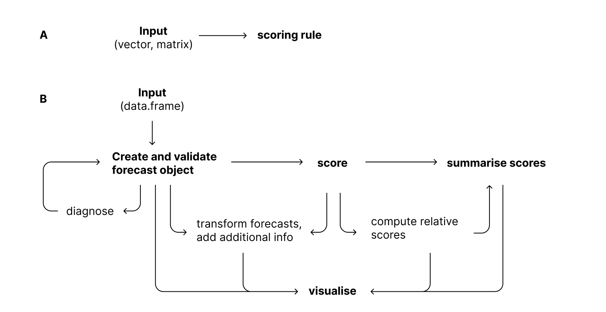
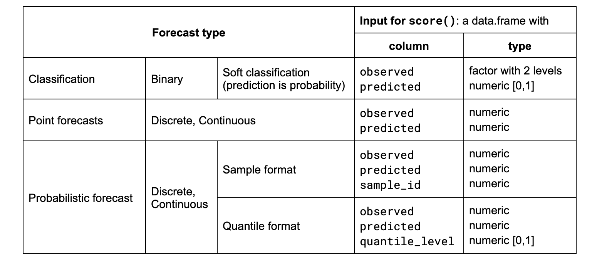
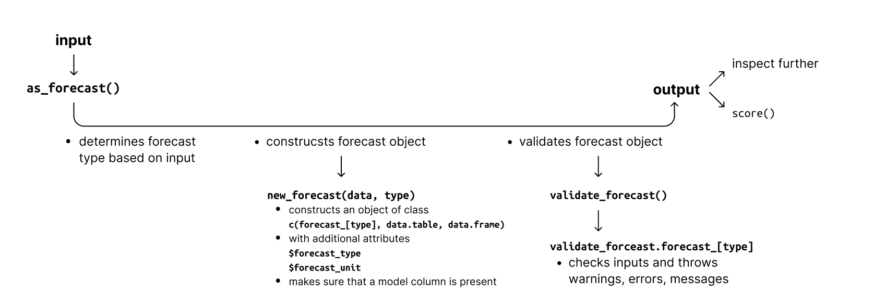
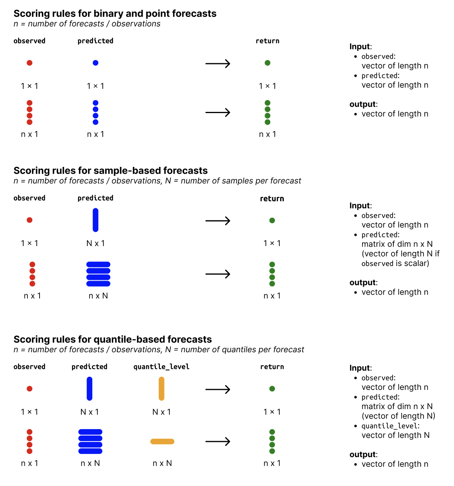

```{r, setup, include=FALSE}
options(prompt = 'R> ', continue = '+ ', width = 70)

library("scoringutils")
library("knitr")
library("dplyr")
library("magrittr")
library("kableExtra")
library("xtable")
library("formatR")
library("data.table")
library("patchwork")
library("ggplot2")

xtable2kable <- function(x) {
  out <- capture.output(print(x, table.placement = NULL))[-(1:2)]
  out <- paste(out, collapse = "\n")
  structure(out, format = "latex", class = "knitr_kable")
}

opts_chunk$set(
  cache = TRUE,
  warning = FALSE, 
  message = FALSE, 
  out.width = "100%"
)
```

```{r eval = FALSE, include=FALSE}
trackdown::update_file("inst/manuscript/manuscript.Rmd", gfile = "scoringutils-paper", hide_code = FALSE)
# trackdown::download_file("inst/manuscript/manuscript.Rmd", gfile = "scoringutils-paper")
```

# Introduction

Good forecasts are of great interest to decision makers in various fields like finance \citep{timmermannForecastingMethodsFinance2018, elliottForecastingEconomicsFinance2016}, weather predictions \citep{gneitingWeatherForecastingEnsemble2005, kukkonenReviewOperationalRegionalscale2012} or infectious disease modeling \citep{reichCollaborativeMultiyearMultimodel2019, funkShorttermForecastsInform2020, cramerEvaluationIndividualEnsemble2021, bracherNationalSubnationalShortterm2022, europeancovid-19forecasthubEuropeanCovid19Forecast2021}. 
<!-- Throughout the COVID-19 pandemic, forecasting has garnered widespread interest from policy makers and the general public, with several collaborative forecasting efforts ("Forecast Hubs") being established \citep{reichCollaborativeMultiyearMultimodel2019, cramerCOVID19ForecastHub2020, europeancovid-19forecasthubEuropeanCovid19Forecast2021, bracherNationalSubnationalShortterm2022}. Forecast evaluation is an integral part of assessing and improving the usefulness of forecasts.  -->
For decades, researchers, especially in the field of weather forecasting, have therefore developed and refined an arsenal of techniques to evaluate predictions (see for example \cite{goodRationalDecisions1952}, \cite{epsteinScoringSystemProbability1969, murphyNoteRankedProbability1971a, mathesonScoringRulesContinuous1976}, \cite{gneitingProbabilisticForecastsCalibration2007}, \cite{funkAssessingPerformanceRealtime2019}, \cite{gneitingStrictlyProperScoring2007}, \cite{bracherEvaluatingEpidemicForecasts2021}). 

Various \proglang{R} \citep{R} packages cover a wide variety of scoring rules, plots and other metrics that are useful in assessing the quality of a forecast. Existing packages offer functionality that is well suited to evaluate the quality of a single forecast or to compare the performance of several forecasters on a single target variable. However, they also come with important limitations and have limited uptake in some fields. 

<!-- \pkg{scoringutils} extends the existing landscape by providing a comprehensive framework that allows users to integrate a variety of tasks related to forecast evaluation, as well as functionality from other packages, into a single workflow.  -->

Some packages such as \pkg{tscount} \citep{tscount}, \pkg{topmodels} \citep{topmodels}, \pkg{GLMMadaptive} \citep{GLMMadaptive}, \pkg{cvGEE} \citep{cvGEE} or \pkg{fabletools} \citep{fabletools} expect that forecasts were generated in a certain way and require users to supply an object of a specific class in order to compute and scores. These packages provide excellent tools for users operating within the specific package framework, but are by their nature not generally applicable to many use cases practitioners might encounter. 

Packages such as \pkg{scoringRules} \citep{scoringRules}, \pkg{Metrics} \citep{Metrics}, \pkg{MLmetrics} \citep{MLmetrics}, \pkg{verification} \citep{verification}, \pkg{SpecsVerification} \citep{SpecsVerification}, \pkg{surveillance} \citep{surveillance}, \pkg{predtools} \citep{predtools}, or \pkg{probably} \citep{probably} provide an extensive collection of tools, scoring rules and visualisations for various use cases. However, most scoring functions operate on vectors and matrices. This can make it difficult to evaluate, for example, multiple forecasts across several dimensions, such as time, space, and different types of targets. 

\pkg{scoring} \citep{scoring} operates on a data.frame and uses a formula interface, making this task easier. However, \pkg{scoring} only exports a few scoring rules and does not allow users to supply their own. \pkg{yardstick} \citep{yardstick}, which builds on the \pkg{tidymodels} \citep{tidymodels} framework, is the most general and flexible widely used forecast evaluation package. It allows users to apply arbitrary scoring rules to a data.frame of forecasts, independently of how they were created. However, \pkg{yardstick} is primarily focused on point forecasts and classification tasks. It currently lacks general support for probabilistic forecasts (forecasts in the form of a full predictive distribution, represented e.g. by a set of quantiles or samples from the forecast distribution). Probabilistic forecasts are desirable, as they allow decision makers to take into account the uncertainty of a forecast \citep{gneitingProbabilisticForecastsCalibration2007}, and are widely used, e.g. in Meteorology or Epidemiology. 

\pkg{scoringutils} aims to fill this gap in the ecosystem by providing a general-purpose tool as well as a framework for the evaluation of (probabilistic) forecasts across multiple dimensions using a wide variety of user-provided scoring rules. Notably, \pkg{scoringutils} is the first package to offer extensive support for probabilistic forecasts in the form of predictive quantiles, a format that is currently used by several infectious disease Forecast Hubs \citep{reichCollaborativeMultiyearMultimodel2019, cramerCOVID19ForecastHub2020, europeancovid-19forecasthubEuropeanCovid19Forecast2021, bracherNationalSubnationalShortterm2021}.
The package provides broad functionality to check the data and diagnose issues, to visualise forecasts and missing data, to transform data before scoring \citep{bosseScoringEpidemiologicalForecasts2023}, to apply scoring rules to data, to handle missing forecasts, to aggregate scores and to visualise the results of the evaluation. \pkg{scoringutils} makes extensive use of \pkg{data.table} \citep{data.table} to ensure fast and memory-efficient computations. The core functionality is designed around S3 classes, allowing users to expand on the generics and methods implemented in the package. 
\pkg{scoringutils} provides extensive documentation and case studies, as well as sensible defaults for scoring forecasts. 

<!-- TODO: WE WANT TO PROVIDE HELPER FUNCTIONS.  -->

The remainder of this paper is structured as follows. 
- overview of the workflow
    - validating forecasts
    - scoring them

# Package overview

The following section gives an overview of the main functionality of \pkg{scoringutils}. Everything will be illustrated using the example data shipped with the package, which is based on a subset of case and death forecasts submitted every week between May and September 2021 to the European COVID-19 Forecast Hub \citep{europeancovid-19forecasthubEuropeanCovid19Forecast2021}. An overview of all existing functions can be seen on \url{https://epiforecasts.io/scoringutils}. 

<!-- Forecasts were originally submitted in a quantile-based format (see below), but were converted to different formats and are exported as `example_quantile`, `example_continuous`, `example_integer`, `example_point` and `example_binary`.  -->

## Basic workflows

\pkg{scoringutils} supports two basic workflows. Most users will interact with \pkg{scoringutils} through a framework based on a `data.frame`-like structure. Within this framework they can complete a variety of different tasks such as validating and diagnosing inputs, transforming inputs, scoring, aggregating scores, and visualisation (see Figure \ref{fig:workflow-scoringutils}A).
Users can, however, also apply scoring rules directly to a set of vectors or matrices (see Figure \ref{fig:workflow-scoringutils}B). 
<!-- Functions that compute a quantity of interest based on the forecasts and observed values are consistently called "scoring rules" in the following. The output of a scoring rule will be called "score".  -->

```{r workflow-scoringutils, echo = FALSE, fig.pos = "!h", out.width="100%", fig.cap= "Illustration of potential workflows for evaluating forecasts with scoringutils. A: Workflow for working with forecasts in a data.frame-based format. B: Using scoring rules directly with vectors/matrices as inputs.", fig.show="hold"}

```

## Input formats and types of forecasts

Forecasts differ in the exact prediction task and in how the forecaster chooses to represent their prediction. To distinguish different kinds of forecasts, we use the term "forecast type" (which is more a convenient classification than a formal definition). Currently, `scoringutils` distinguishes four different forecast types: "binary", "point", "quantile" and "sample" forecasts.

- "Binary" denotes a probability forecast for a binary (yes/no) outcome variable. This is sometimes also called "soft binary classification". 
- "Point" denotes a forecast for a continuous or discrete outcome variable that is represented by a single number.
- "Quantile" or "quantile-based" is used to denote a probabilistic forecast for a continuous or discrete outcome variable, with the forecast distribution represented by a set of predictive quantiles. While a single quantile would already satisfy the requirements for a quantile-based forecast, most scoring rules expect a set of quantiles which are symmetric around the median (thus forming the lower and upper bounds of central "prediction intervals") and will return `NA` if this is not the case. 
- "Sample" or "sample-based" is used to denote a probabilistic forecast for a continuous or discrete outcome variable, with the forecast represented by a finite set of samples drawn from the predictive distribution. A single sample technically suffices, but would lead to very imprecise results.

```{r input-score, echo = FALSE, fig.pos = "!h", out.width="100%", fig.cap= "Table with different input formats.", fig.show="hold"}

```

The input will usually be a data.frame (or similar) containing both the predictions and the observed values. At the minimum, the data.frame must have columns called `observed` and `predicted` and should usually have a column called `model` denoting the name of the model that generated the forecast. Additional requirements depend on the forecast type. Table \ref{fig:input-score} shows the expected input format for each forecast type. The package contains example data for each forecast type, which can serve as an orientation for the correct formats. The example data sets are exported as `example_quantile`, `example_continuous`, `example_integer`, `example_point` and `example_binary`. For illustrative purposes, the example data also contains some rows with only observations and no corresponding predictions. Input formats for the scoring rules that can be called directly follow the same convention, with inputs expected to be vectors or matrices.

### The unit of a single forecast {short-title="The unit of a single forecast" #sec:forecastunit}

Apart from the columns `observed`, `predicted`, `model`, and the extra columns required for each forecast type, the input will usually require contain additional columns. This is because probabilistic forecasts (apart from binary predictions) are composed of several values. A quantile-based forecast, for example, is composed of several quantiles, and a sample-based forecast of multiple samples. However, every row only holds a single sample/quantile. Several rows in the input data therefore jointly form a single forecast. Additional columns in the input provide the information necessary to group together rows that belong to the same forecast. The combination of values in those columns form the unit of a single forecast (or "forecast unit") and should uniquely identify a single forecast. For example, consider forecasts made by different models in various locations at different time points and for different targets. A single forecast could then be uniquely described by the values in the columns `model`, `location`, `date`, and `target`, and the forecast unit would be `forecast_unit = c("model", "location", "date", "target")`. 

Rows are automatically grouped together based on the values in all other columns present in the data (excluding required columns like `sample_id` or `quantile_level` and values computed by \pkg{scoringutils}). As the forecast unit is determined based on all existing columns, no column must be present that is unrelated to the forecast unit. As a very simplistic example, consider an additional row, "even", that is one if the row number is even and zero otherwise. The existence of this column would change results, as \pkg{scoringutils} assumes it was relevant to grouping the forecasts. 

## Forecast objects and input validation

Inputs can easily be processed and validated using the function `as_forecast()`: 

```{r, eval=TRUE, echo=TRUE}
forecast_quantile <- example_quantile |>
  as_forecast() 
```

The function \fct{as\_forecast} recognises the type of the forecast based on the available columns, transforms the input into a "forecast" object and validates it (see Figure XX for details). A forecast object is a `data.table` that has passed some input validations. It behaves like a `data.table`, but has dedicated methods e.g. for input validation, scoring and printing. The classes corresponding to the forecast types are `forecast_point`, `forecast_binary`, `forecast_quantile` and `forecast_sample`. 

\fct{as\_forecast} can automatically determine the forecast type and forecast unit based on the input data. However, it can also take additional arguments that help facilitate the process of creating a forecast object. For example, we could call 
```{r, eval=FALSE, echo=TRUE}
forecast_quantile <- example_quantile |>
  as_forecast(
    observed = "observed", 
    predicted = "predicted",
    model = "model",
    forecast_unit = c(
      "model", "location", "target_end_date", 
      "forecast_date", "horizon", "location"
    ),
    quantile_level = "quantile_level",
  ) 
```

The argument `forecast_unit` allows the user to manually set the unit of a single forecast. \fct{as\_forecast} will then simply drop all columns that are not either a) specified in the `forecast_unit` or b) are required columns (such as `observed`, `predicted`, `quantile_level`, or `sample_id`) or have otherwise been added by `scoringutils`.  
<!-- Question: should it drop / keep `model`? Is there any plausible case in which you'd call `as_forecast` after scoringutils has already computed any columns? -->
The other arguments can be used to specify the column names of the input data that correspond to the required columns. \fct{as\_forecast} will then rename these columns into the corresponding required columns. 

```{r flowchart-validation, echo = FALSE, fig.pos = "!h", out.width="100%", fig.cap= "Illustration of the process of creating a `forecast` object.", fig.show="hold"}

```

## Diagnostic helper functions

Various helper functions are available to diagnose and fix issues with the input data. One common issue are "duplicates" in the data. \pkg{scoringutils} strictly requires that there be only one forecast per forecast unit and only one predicted value per quantile_level or sample_id within a single forecast. Duplicates usually occur if the forecast unit is misspecified. For example, if we removed the column `target_type` from the example data, we'd now have two forecasts (one for cases and one for deaths of COVID-19) that appear to have the same forecast unit (since the information that distinguished between case and death forecasts is no longer there). The function \fct{get\_duplicate\_forecasts} returns duplicate rows for the user to inspect. To remedy the issue, the user needs to add additional columns that uniquely identify a single forecast.

```{r}
rbind(example_quantile, example_quantile[1001:1002]) |>
  get_duplicate_forecasts() 
```

Users can obtain information about the forecast type by calling \fct{get\_forecast\_type} on the data. They can obtain the forecast unit by calling \fct{get\_forecast\_unit} on the data. They can manually set the forecast unit using \fct{set\_forecast\_unit} which acts like the `forecast_unit` argument in \fct{as\_forecast} and drops unneeded columns, while retaining required columns and those added by \pkg{scoringutils}. These functions work on either an unvalidated data.frame or on an already validated object. 

Once a forecast object has successfully been created, diagnostic information will automatically be added to the output when printing a forecast object. This information includes the forecast type, the forecast unit, and additional information in case the object would fail validations. The print method runs \fct{get\_forecast\_type}, \fct{get\_forecast\_unit} and \fct{validate\_forecast}. \fct{validate\_forecast} can be used to validate an existing forecast object and can also be called directly, e.g. to re-validate forecast objects programmatically.

```{r}
print(forecast_quantile, 2)
```

<!-- MAYBE REWRITE THE FOLLIWNG: "drops unneeded columns, while retaining required columns and those added by \pkg{scoringutils}" to "while retaining so-called 'protected columns'." -->
<!-- Protected columns are for example those columns that define the forecast and observations, as well as the names of all scores computed throughout the evaluation process. Protected columns will be ignored e.g. by \fct{get\_forecast\_unit} and \fct{set\_forecast\_unit}. You can call \fct{get\_protected\_columns} either on the data to obtain the protected columns currently present or without any arguments to obtain all protected columns.  -->
DO SOMETHING ABOUT GET PROTECTED COLUMNS. 
```{r}
scoringutils:::get_protected_columns()
```

<!-- They come with a constructor, \fct{new\_forecast}, a generic validator, \fct{validate\_forecast} (which dispatches to a specialised validator method depending on the class of the input), and a convenient wrapper function \fct{as\_forecast}. \fct{as\_forecast} determines the forecast type of the input, constructs the class and validates the input. The process is illustrated in Figure \ref{fig:flowchart-validation}. 

## Diagnostic functions that provide additional information about the data
<!-- Maybe move this up -->

## Transforming forecasts

As suggested in \citep{bosseScoringEpidemiologicalForecasts2023}, users may want to transform forecasts before scoring them. Two commonly used scoring rules are the continuous ranked probability score (CRPS) and the weighted interval score (WIS). Both measure the absolute distance between the forecast and the observation. This may not be desirable, for example in the context of epidemiological forecasts, where infectious disease processes are usually modelled to occur on a multiplicative scale. Taking the logarithm of the forecasts and observations before scoring them makes it possible to evaluate forecasters based on how well they predicted the exponential growth rate.

The function \fct{transform\_forecasts} allows users to apply arbitrary transformations to forecasts and observations. Users can specify a function via the argument \code{fun} (as well as supply additional function parameters). The default function is \fct{log_shift}, which is simply a wrapper around \fct{log} with an additional argument that allows adding an offset (i.e. \code{log(x + offset)}) to deal with zeroes in the data. Users can specify to either append the transformed forecasts to the existing data by setting \code{append = TRUE} (the default behaviour, resulting in an additional column `scale`) or to replace the existing forecasts in place.

The example data contains negative values which need to be handled before applying the logarithm. Presumably, negative values for count data should be dropped altogether, but for illustrative purposes, we will call \fct{transform\_forecasts() twice to replace them with zeroes first before appending transformed counts. 

```{r}
example_quantile |> 
  transform_forecasts(fun = \(x) {pmax(x, 0)}, append = FALSE) |>
  transform_forecasts(fun = log_shift, offset = 1) |>
  print(2)
```


## Additional functionality related to forecast objects

\pkg{scoringutils} offers a variety of different functions that allows users to obtain and visualise additional information about their forecast. 

### Displaying the number of forecasts avaiable

Users can get an overview of how many forecasts there are using \fct{get\_forecast\_counts}. The function returns a data.table of foreast counts, which helps obtain an overview of missing forecasts. This can impact the evaluation, if missingness correlates with performance. Users can specify the level of summary through the `by` argument. For example, to see how many forecasts there are per `model`, `target_type` and `forecast_date`, we can run

```{r get-forecast-counts}
forecast_counts <- get_forecast_counts(
  quantile_forecast, by = c("model", "target_type", "forecast_date")
)
```

We can visualise the results by calling \fct{plot\_forecast\_counts} on the output (Figure \ref{fig:plot-forecast-counts}). 

```{r plot-forecast-counts, fig.pos = "!h", fig.width = 7, out.width="100%", fig.cap = "Forecast counts for the example data."}
library(ggplot2)
plot_forecast_counts(forecast_counts, x = "forecast_date") + 
  facet_wrap(~ target_type) + 
  labs (y = "Model", x = "Forecast date")
```

### Visualising the forecasts and observed values

The forecasts and observed values themselves can be visualised using the function \fct{plot\_predictions}. The function works on a validated object of class `forecast_*`.

<!-- and its \fct{make\_na} helper function. \fct{make\_na} represents a form of filtering, but instead of filtering entire rows, the relevant entries in the columns "prediction" or "true\_value" are made `NA`. This allows the user to filter observations and forecasts independently. To be able to facet the plot correctly, \fct{plot\_predictions} has an additional `by` argument in which the user needs to specify all columns relevant for facetting.  -->
<!-- To display, for example, short-term forecasts for COVID-19 cases and deaths made by the EuroCOVIDhub-ensemble model on June 28 2021 as well as 5 weeks of prior data, we can call the following. The resulting plot is shown in Figure \ref{fig:forecast-visualisation}.  -->

```{r forecast-visualisation, eval = FALSE, fig.pos = "!h", fig.width = 10, fig.height = 5, fig.cap = "Short-term forecasts for COVID-19 cases and deaths made by the EuroCOVIDhub-ensemble model on June 28 2021."}

# NEEDS TO BE UPDATED ONCE FUNCTION HAS BEEN REWORKED. 
example_quantile %>%
  make_na(what = "truth", 
          target_end_date > "2021-07-15",
          target_end_date <= "2021-05-22") %>%
  make_na(what = "forecast", 
          model != "EuroCOVIDhub-ensemble",
          forecast_date != "2021-06-28") %>%
  plot_predictions(x = "target_end_date", by = c("target_type", "location")) +
  aes(colour = model, fill = model) +
  facet_wrap(target_type ~ location, ncol = 4, scales = "free_y") +
  labs(x = "Target end date")
```

<!-- ### Helper functions -->

<!-- - `run_safely()` -->

<!-- ## Internal functions -->

<!-- ### Check functions -->
<!-- Functions to check inputs. Most of these are internal functions, but some are exposed to the user. The naming convention follows that of the \pkg{checkmate} package \citep{checkmate}.  -->

<!-- Functions that begin with `assert_` return `TRUE` if the condition is met, and throw an error otherwise.  -->

<!-- Functions that begin with `check_` return `TRUE` if the condition is met, and a string with an error message otherwise.  -->

<!-- Functions that begin with `test_` return `TRUE` if the condition is met, and `FALSE` otherwise.  -->

### Probabilistic calibration and PIT histograms

One important quality of good forecasts is calibration. The term describes a statistical consistency between the forecasts and the observations, i.e. an absence of systematic deviations between the two. It is possible to distinguish several forms of calibration which are discussed in detail by \cite{gneitingProbabilisticForecastsCalibration2007}. The form of calibration most commonly focused on is called probabilistic calibration. Probabilistic calibration means that the forecast distributions are consistent with the true data-generating distributions in the sense that on average, $\tau$\% of true observations will be below the corresponding $\tau$-\%-quantiles of the cumulative forecast distributions. 

A common way to visualise probabilistic calibration is the probability integral transform (PIT) histogram \citep{dawidPresentPositionPotential1984}. Observed values, $y$, are transformed using the CDF of the predictive distribution, $F$, to create a new variable $u$ with $u = F(y)$. $u$ is therefore simply the CDF of the predictive distribution evaluated at the observed value. If forecasts are probabilistically calibrated, then the transformed values will be uniformly distributed (for a proof see for example @angusProbabilityIntegralTransform1994). When plotting a histogram of PIT values (see Figure \ref{fig:pit-plots}), a systematic bias usually leads to a triangular shape, a U-shaped histogram corresponds to forecasts that are underdispersed (too sharp) and a hump shape appears when forecasts are overdispersed (too wide). There exist different variations of the PIT to deal with discrete instead of continuous data (see e.g. \cite{czadoPredictiveModelAssessment2009} and \cite{funkAssessingPerformanceRealtime2019}). The PIT version implemented in `scoringutils` for discrete variables follows \cite{funkAssessingPerformanceRealtime2019}. 

Users can plot the PIT histograms using the function \fct{plot\_pit}. The output of the following is shown in Figure \ref{fig:pit-plots}: 

```{r pit-plots, fig.pos = "!h", fig.cap="PIT histograms of all models stratified by forecast target. Histograms should ideally be uniform. A u-shape usually indicates overconfidence (forecasts are too narrow), a hump-shaped form indicates underconfidence (forecasts are too uncertain) and a triangle-shape indicates bias.", fig.width = 8, fig.height=4}
example_continuous |>
  pit(by = c("model", "target_type")) |>
  plot_pit() + 
  facet_grid(target_type ~ model)
```

It is, in theory, possible to formally test probabilistic calibration, for example by employing an Anderson-Darling test on the uniformity of PIT values. In practice, this can be difficult as forecasts, and therefore PIT values as well, are often correlated. Personal experience suggests that the Anderson-Darling test is often too quick to reject the null hypothesis of uniformity.
<!-- I once did a simulation study for this for my master thesis. Could include here -->
It is also important to note that uniformity of the PIT histogram (or a diagonal on quantile and interval coverage plots) indicates probabilistic calibration, but does not guarantee that forecasts are indeed calibrated in every relevant sense. \cite{gneitingProbabilisticForecastsCalibration2007, hamillInterpretationRankHistograms2001a} provide examples with different forecasters who are mis-calibrated, but have uniform PIT histograms. 

### Probabilistic calibration and coverage plots

For forecasts in a quantile-based format, there exists a second way to assess probabilistic calibration: we can easily compare the proportion of observations that fall below the $\tau$-quantiles of all forecasts ("empirical quantile coverage") to the nominal quantile coverage $\tau$. Similarly, we can compare the empirical coverage of the central prediction intervals formed by the predictive quantiles to the nominal interval coverage. For example, the central 50\% prediction intervals of all forecasts should contain around 50\% of the observed values, the 90\% central intervals should contain around 90\% of observations etc. In addition, we can define coverage deviation as the difference between nominal and empirical coverage.

Interval and quantile coverage can easily be computed by calling \fct{get_coverage}. The function takes data in a quantile format as input and computes interval coverage, quantile coverage, interval coverage deviation and quantile coverage deviation. Coverage values will be summarised according to the level specified in the `by` argument and one value per quantile level/interval range is returned. 

```{r eval=FALSE}
example_quantile |>
  get_coverage(by = "model") |>
  data.table:::print.data.table(2)
```

Results can then be visualised using the functions `plot_interval_coverage()` (see row 3 in Figure \ref{fig:calibration-plots}) and `plot_quantile_coverage()` (row 4 in Figure \ref{fig:calibration-plots}). Both show nominal against empirical coverage. Ideally, forecasters should lie on the diagonal line. If the line moves into the green shaded area, the forecaster is too conservative, i.e. the predictive distributions are too wide/overdispersed on average. The white area implies overconfidence/predictive distributions that are too narrow on average. 

```{r coverage-code, eval = FALSE, fig.width = 10, fig.pos = "!h", fig.show='hold', fig.cap = "Interval coverage and quantile coverage plots. Areas shaded in green indicate that the forecasts are too wide (i.e., underconfident), while areas in white indicate that the model is overconfident and generates too narrow predictions intervals."}
coverage <- get_coverage(example_quantile, by = c("model", "target_type")) 

plot_interval_coverage(coverage) + 
  facet_wrap(~ target_type)

plot_quantile_coverage(coverage) + 
  facet_wrap(~ target_type)
```

Note that users can also compute individual coverage values as scores using \fct{score}. This separate workflow treats coverage values more like a summary measure to be computed alongside other scores, rather than providing a way to visually assess calibration. 

<!-- It is in principle possible to convert sample-based forecasts to quantile-based forecasts using the function \fct{sample\_to\_quantile} to make use of `add_coverage()`. This should be done with caution, as the estimation of quantiles from predictive samples may be biased if the number of available samples is not sufficiently large.  -->

```{r calibration-plots, echo = FALSE,  fig.pos = "!h", out.extra = "", fig.cap= "A: Different forecasting distributions (black) against observations sampled from a standard normal distribution (grey histograms). B: PIT histograms based on the predictive distributions and the sampled observations shown in A. C: Empirical vs. nominal coverage of the central prediction intervals for simulated observations and predictions. Areas shaded in green indicate that the forecasts are too wide (i.e., underconfident), covering more true values than they actually should, while areas in white indicate that the model generates too narrow predictions and fails to cover the desired proportion of true values with its prediction intervals. D: Quantile coverage values, with green areas indicating too wide (i.e., conservative) forecasts. E: Scores for the standard normal predictive distribution and the observations drawn from different data-generating distributions.", cache = FALSE}
include_graphics("output/calibration-diagnostic-examples.png")
```

```{r coverage, echo = FALSE, fig.height = 6, fig.width = 10, fig.pos = "!h", fig.show='hold', fig.cap = "Interval coverage (A) and quantile coverage (B) plots. Areas shaded in green indicate that the forecasts are too wide (i.e., underconfident), while areas in white indicate that the model is overconfident and generates too narrow predictions intervals."}
cov_scores <- score(example_quantile) |>
  summarise_scores(by = c("model", "target_type", "range", "quantile"))

p1 <- plot_interval_coverage(cov_scores) + 
  facet_wrap(~ target_type) + 
  theme(panel.spacing = unit(2, "lines"))

p2 <- plot_quantile_coverage(cov_scores) + 
  facet_wrap(~ target_type) + 
  theme(panel.spacing = unit(2, "lines"))

p1 / p2 +
  plot_annotation(tag_levels = "A") + 
  plot_layout(guides = "collect") &
  theme(legend.position = "bottom") 

```


# Scoring forecasts
<!-- \pkg{scoringutils} offers two ways of scoring forecasts: Users can either call different scoring rules directly on vectors and matrices or use the function `score()` on a data.frame (or similar) to apply multiple scoring rules at once.  -->

## score()

The function \fct{score} is the workhorse of the package and applies a set of scoring rules to predicted and observed values. It is a generic function that dispatches to different methods depending on the class of the input. The input data can either be a forecast object, in which case \fct{score} dispatches to a dedicated method with appropriate defaults depending on the forecast type. Or it can be a data.frame (or similar), in which case \fct{score.default} turns the input data into a forecast object and calls \fct{score} again. 

```{r}
score(example_point) |>
  print(2)
```

The second input to \fct{score} is a list of functions (the scoring rules) to apply to the data. There exists a default list of scoring rules for each forecast type which is automatically applied when the appropriate \fct{score} method is called. The default scoring rules can be accessed by calling the functions \fct{rules\_point}, \fct{rules\_binary}, \fct{rules\_sample} and \fct{rules\_quantile}. These functions take additional arguments `exclude` and `select` which can be used to customise which scoring rules are included. Alternatively, users can call the function \fct{select\_rules} on a list of scoring rules, which achieves the same purposes and allows users to compose custom lists of scoring rules. 

```{r eval=FALSE}
rules <- rules_quantile() |>
  select_rules(select = c("wis", "overprediction"))

score(forecast_quantile, rules = rules)
```

All scoring rules passed to \fct{score} need to adhere to the same input formats (it is therefore not possible to score different forecast types together, but instead they have to be scored separately). However, it is not necessary that all function arguments have the same name. Within \fct{score}, inputs like the observed and predicted values, quantile levels etc. are passed to the individual scoring rules by position, rather than by name. While the columns of the input data passed to \fct{score} need to be called `observed` and `predicted`, the aruments of the actual scoring rules can have any name, as long as the input formats are compatible with the given forecast type. The default scoring rules for point forecasts, for example, comprise functions from the \pkg{Metrics} package, which use the names `actual` and `predicted` for their arguments instead of `observed` and `predicted`.

Additional arguments can be passed down to the scoring rules via the `...` arguments in \fct{score}. The output of \fct{score}() is an object of class `scores`, which is essentially a data.table with an additional attribute `score_names` (containing a vector with the names of the scoring rules used). 
<!-- The process is illustrated in Figure \ref{fig:flowchart-score}.  -->
<!-- Maybe say something about extending `score()` for others. Could also be a section -->

```{r flowchart-score, echo = FALSE, eval = FALSE, fig.pos = "!h", out.width="100%", fig.cap= "Flowchart for calling `score()`", fig.show="hold"}
include_graphics("output/flowchart-score.png")
```

## Scoring rules

Scoring rules are the functions that compute scores. They can either be called directly on a set of vectors and matrices, or applied to a data set of observed and predicted values using \fct{score}. 

Scoring rules are named `name of the metric + _ + forecast type`. If only a single forecast type is possible, then `_ + forecast type` is omitted. The return value is a vector with scores (only in the case of \fct{wis} is there an optional argument that causes the function to return a list of vectors). The first argument of the scoring rule exported by \pkg{scoringutils} is always `observed`, and the second one is `predicted`. Scoring rules for quantile-based arguments require an additional vector, `quantile_level` that denotes the quantile levels of the predictive quantiles. 

Scoring rules differ in the relationship between input and output. Some scoring rules have a one-to-one relationship between predicted values and scores, returning one value per value in `predicted`. This is the case for all scoring rules for binary and point forecasts. Other scoring rules have a many-to-one relationship, returning one value per multiple values in `predicted`. This is the case for all scoring rules for sample- and quantile-based forecasts. For sample- and quantile-based forecasts, `predicted` is therefore a matrix, with values in each row jointly forming a single forecast.

Input formats and return values are shown in more detail in Figure \ref{fig:input-scoring-rules}. The package vignettes provide extensive documentation for the scoring rules exported by \pkg{scoringutils} and offer guidance on which scoring rule to use and how to interpret the scores.

```{r input-scoring-rules, echo = FALSE, fig.pos = "!h", out.width="100%", fig.cap= "Overview of the inputs and outputs of the scoring rules (scoring functions that produce a score and can be called directly on a set of vectors / matrices)", fig.show="hold"}

```

<!-- Maybe something about the wrapper functions that we want to have -->

## Adding pairwise comparisons

## Pairwise comparisons {#pairwisetheory}

Raw scores for different forecasting models are usually not directly comparable in the case of missing forecasts. This is because forecasting targets usually differ in their characteristics (e.g., the scale of the forecast target, how difficult targets are to forecast etc.). One way to mitigate this are relative skill scores based on pairwise comparisons \citep{cramerEvaluationIndividualEnsemble2021}. 

Models enter a 'pairwise tournament', where all possible pairs of models are compared based on the overlapping set of available forecasts common to both models (omitting comparisons where there is no overlapping set of forecasts). For every pair, the ratio of the mean scores of both models is computed. The relative skill score of a model is then the geometric mean of all mean score ratios which involve that model. This gives us an indicator of performance relative to all other models, with the orientation depending on the score used: if lower values are better for a particular scoring rule, then the same is true for the relative skill score computed based on that score. 

Two models can of course only be fairly compared if they have overlapping forecasts. One possible way of ensuring this is the case is to only compare models that have forecasts for at least 50\% of the available targets. Furthermore, pairwise comparisons between models for a given score are only possible if all values have the same sign, i.e. all score values need to be either positive or negative. The process of pairwise comparisons is illustrated in Figure \ref{fig:pairwise-comparison}. 

```{r pairwise-comparison, echo=FALSE, fig.pos = "!h", fig.cap = "Illustration of the computation of relative skill scores through pairwise comparisons of three different forecast models, M1-M3.."}
include_graphics("output/pairwise-comparisons.png")
```

To compute relative skill scores, users can call \fct{add\_pairwise\_comparison} on the output of \fct{score}. This function computes relative skill values with respect to a score specified in the argument XX`relative_skill_metric`XX and adds them as an additional column to the input data. Optionally, users can specify a baseline model to additionally compute relative skill scores scaled with respect to that baseline. Scaled relative skill scores are obtained by simply dividing the relative skill score for every individual model (computed excluding the baseline) by the relative skill score of the baseline model. Pairwise comparisons are computed according to the grouping specified in the argument \code{by}: internally, the \code{data.table} with all scores gets split into different \code{data.table}s according to the values specified in \code{by} (excluding the column 'model'). Relative scores are then computed for every individual group separately. In the example below we specify \code{by = c("model", "target_type")}, which means that there is one relative skill score per model, calculated completely separately for the different forecasting targets. 

```{r pairwise-comparison-code, eval = FALSE}
score(example_quantile[horizon == 2]) |>
  add_pairwise_comparison(by = c("model", "target_type"), 
                          baseline = "EuroCOVIDhub-baseline")
```


Pairwise comparisons should usually be made based on unsummarised scores (the function \fct{pairwise\_comparison} internally summarises over samples and quantiles automatically, but nothing else), as summarising can change the set of overlapping forecasts between two models and distort relative skill scores. When using \fct{pairwise\_comparison}, the function \fct{summarise\_scores} should therefore usually not be called beforehand. One potential exception to this is when one is interested in the p-values obtained from pairwise comparisons. As forecasts are usually highly correlated (which the calculation of p-values does not account for), it may be sensible to summarise over a few categories (provided there are no missing values within the categories summarised over) to reduce correlation and obtain more conservative p-values. 


Users can obtain relative skill scores via pairwise comparisons in two different ways. The first one is by calling the function \fct{pairiwse\_comparison}. It takes a \code{data.table} (or similar) of scores as input, and returns a \code{data.table} with the results of the pairwise tournament. It displays the mean scores ratio for every pair of models, a p-value for whether scores for one model are significantly different from scores for another model, and the relative skill score for every model. Users can also specify a baseline model, in which case a scaled relative skill score is computed by dividing the relative skill score of every model by the relative skill score of the baseline model. 

The output of \fct{pairwise\_comparison} can then be visualised using the function \fct{plot\_pairwise\_comparison}. An example is shown in Figure \ref{fig:pairwise-plot}. 

```{r pairwise-plot, echo=TRUE, fig.width = 8, fig.cap="Ratios of mean weighted interval scores based on overlapping forecast sets. When interpreting the plot one should look at the model on the y-axis, and the model on the x-axis is the one it is compared against. If a tile is blue, then the model on the y-axis performed better (assuming that scores are negatively oriented, i.e. that lower scores are better). If it is red, the model on the x-axis performed better in direct comparison. In the example above, the EuroCOVIDhub-ensemble performs best (it only has values smaller than one), while the EuroCOVIDhub-baseline performs worst (and only has values larger than one). For cases, the UMass-MechBayes model is excluded as there are no case forecasts available and therefore the set of overlapping forecasts is empty."}
score(example_quantile) |>
  pairwise_comparison(by = c("model", "target_type"), 
                      baseline = "EuroCOVIDhub-baseline") |>
  plot_pairwise_comparison() + 
  facet_wrap(~ target_type)
```

<!-- WE MIGHT WANT TO RETHINK THE FOLLOWING PART A BIT: A) MAYBE WE SHOULD SEPARATE COMPUTING P-VALUES FROM THE PAIRWISE COMPARISONS AND B) WE NEED TO THINK A BIT MORE ABOUT HOW WE WANT TO HYPOTHESIS TESTING MORE GENERALLY.  -->

It is in principle possible to compute p-values to determine whether two models perform significantly differently as part of the pairwise comparisons. \pkg{scoringutils} allows to compute these using either the Wilcoxon rank sum test (also known as Mann-Whitney-U test) \citep{mannTestWhetherOne1947} or a permutation test. In practice, this is complicated by the fact that both tests assume independent observations. In reality, however, forecasts by a model may be correlated across time or another dimension (e.g., if a forecaster has a bad day, they might perform badly across different targets for a given forecast date). P-values may therefore be too liberal in suggesting significant differences where there aren't any. One way to mitigate this is to aggregate observations over a category where one suspects correlation (for example averaging across all forecasts made on a given date) before making pairwise comparisons. A test that is performed on aggregate scores will likely be more conservative. 

Pairwise comparisons should usually be made based on unsummarised scores (the function \fct{pairwise\_comparison} internally summarises over samples and quantiles automatically, but nothing else), as summarising can change the set of overlapping forecasts between two models and distort relative skill scores. When using \fct{pairwise\_comparison}, the function \fct{summarise\_scores} should therefore usually not be called beforehand. One potential exception to this is when one is interested in the p-values obtained from pairwise comparisons. As forecasts are usually highly correlated (which the calculation of p-values does not account for), it may be sensible to summarise over a few categories (provided there are no missing values within the categories summarised over) to reduce correlation and obtain more conservative p-values. 


## Additional things to do with the output of scores

### correlations

### pairwise comparisons

# Summarising results

Usually, one will not be interested in the scores for each forecast, but rather in summarised scores. \pkg{scoringutils} provides methods for the generic function \fct{aggregate} that allow users to aggregate scores across dimensions using an arbitrary function (for most users most of the time this will be the default mean). 

There are two different, but essentially equivalent ways of specifying the summary level. Users can either specify the columns that should be retained (using the argument `by`), or they can specify the columns that should be aggregated over (using the argument \code{across}). 

```{r, eval = FALSE}
# NEED TO UPDATE AFTER RENAMING TO AGGREGATE
example_quantile[horizon == 2] |>
  score(metrics = list("wis" = wis)) |>
  summarise_scores(by = c("model", "target_type"))
```

Summarised scores can then be visualised using a \fct{plot} method for class `score`. To display scores it is often useful to round the output, for example to two significant digits, which can be achieved with another call to \fct{aggregate}. The output of the following is shown in Figure \ref{fig:score-table}:
 
```{r score-table, fig.width = 12, fig.cap="Coloured table to visualise the computed scores. Red colours indicate that a value is higher than ideal, blue indicates it is lower than ideal and the opacity indicates the strength of the deviation from the ideal."}
# NEED TO UPDATE AFTER RENAMING TO AGGREGATE
example_quantile[horizon == 2] |>
  score() |>
  summarise_scores(by = c("model", "target_type")) |>
  summarise_scores(fun = signif, digits = 2) |>
  plot_score_table(y = "model", by = "target_type") + 
  facet_wrap(~ target_type)
```

While \fct{aggregate} accepts arbitrary summary functions, care has to be taken when using something else than \fct{mean}. Many scoring rules for probabilistic forecasts are so-called 'strictly proper scoring rules' \citep{gneitingStrictlyProperScoring2007}. Strictly proper scoring rules are constructed such that they cannot always incentivise the forecaster to report her honest belief about the future and cannot be cheated. Let's assume that a forecaster's true belief about the future corresponds to a predictive distribution $F$. Then, if $F$ was the true data-generating process, a scoring rule would be proper if it ensures that no other forecast distribution $G$ would yield a better expected score. If the scoring rule ensures that under $F$ no other possible predictive distribution can achieve the same expected score as $F$, then it is called strictly proper. From the forecaster's perspective, any deviation from her true belief $F$ leads to a worsening of expected scores. 
When using summary functions other than the mean, however, scores may lose their propriety (the property of incentivising honest reporting) and become cheatable. For example, the median of several individual scores (individually based on a strictly proper scoring rule) is usually not proper. A forecaster judged by the median of several scores may be incentivised to misrepresent their true belief in a way that is not true for the mean score.

The user must exercise additional caution and should usually avoid aggregating scores across categories which differ much in the magnitude of the quantity to forecast, as (depending on the scoring rule used) forecast errors usually increase with the order of magnitude of the forecast target. In the given example, looking at one score per model (i.e., specifying \code{summarise_by = c("model")}) is problematic, as overall aggregate scores would be dominated by case forecasts, while performance on deaths would have little influence. Similarly, aggregating over different forecast horizons is often ill-advised as the mean will be dominated by further ahead forecast horizons. In the previous function calls, we therefore decided to only analyse forecasts with a forecast horizon of two weeks. 

## Additional visualisations of scores

### Heatmaps

To detect systematic patterns it may be useful to visualise a single score across several dimensions. The function \fct{plot\_heatmap} can be used to create a heatmap that achieves this. The following produces a heatmap of bias values across different locations and forecast targets (output shown in Figure \ref{fig:score-heatmap}). 

```{r score-heatmap, fig.pos = "!h", fig.width = 8, fig.cap = "Heatmap of bias values for different models across different locations and forecast targets. Bias values are bound between -1 (underprediction) and 1 (overprediction) and should be 0 ideally. Red tiles indicate an upwards bias (overprediction), while blue tiles indicate a downwards bias (under-predicction)"}
score(example_continuous) |>
  summarise_scores(by = c("model", "location", "target_type")) |>
  plot_heatmap(x = "location", metric = "bias") + 
    facet_wrap(~ target_type) 
```

### Weighted interval score decomposition

For quantile-based forecasts, the weighted interval score \citep[WIS, ][]{bracherEvaluatingEpidemicForecasts2021} is commonly used and is a strictly proper scoring rule. The WIS treats the predictive quantiles as a set of symmetric prediction intervals and measures the distance between the observation and the forecast interval. It can be decomposed into a dispersion (uncertainty) component and penalties for over- and underprediction. For a single interval, the interval score is computed as
  $$IS_\alpha(F,y) = \underbrace{(u-l)}_\text{dispersion} + \underbrace{\frac{2}{\alpha} \cdot (l-y) \cdot \mathbf{1}(y \leq l)}_{\text{overprediction}} + \underbrace{\frac{2}{\alpha} \cdot (y-u) \cdot \mathbf{1}(y \geq u)}_{\text{underprediction}}, $$
  where $\mathbf{1}()$ is the indicator function, $y$ is the observed value, and $l$ and $u$ are the $\frac{\alpha}{2}$ and $1 - \frac{\alpha}{2}$ quantiles of the predictive distribution $F$, i.e. the lower and upper bound of a single prediction interval. For a set of $K$ prediction intervals and the median $m$, the score is computed as a weighted sum,
  $$WIS = \frac{1}{K + 0.5} \cdot \left(w_0 \cdot |y - m| + \sum_{k = 1}^{K} w_k \cdot IS_{\alpha}(F, y)\right),$$
where $w_k$ is a weight for every interval. Usually, $w_k = \frac{\alpha_k}{2}$ and $w_0 = 0.5$. It is helpful to visualise the decomposition of the weighted interval score into its components: dispersion, overprediction and underprediction. This can be achieved using the function \fct{plot\_wis}, as shown in Figure \ref{fig:wis-components}. 

```{r wis-components-code, eval = FALSE, fig.pos = "!h", fig.width = 8, fig.cap = "Decomposition of the weighted interval score (WIS) into dispersion, overprediction and underprediction. The WIS components measure over- and underprediction in absolute, rather than relative terms."}
score(example_quantile) |>
  summarise_scores(by = c("model", "target_type")) |>
  plot_wis(relative_contributions = FALSE) + 
  facet_wrap(~ target_type, 
             scales = "free_x") 
```

```{r wis-components, echo = FALSE, fig.pos = "!h", fig.width = 9.5, fig.show = "hold", fig.cap = "Decomposition of the weighted interval score (WIS) into dispersion, overprediction and underprediction. A: absolute contributions, B: contributions normalised to 1."}
p1 <- score(example_quantile) |>
  summarise_scores(by = c("model", "target_type")) |>
  plot_wis(relative_contributions = FALSE) + 
  facet_wrap(~ target_type, 
             scales = "free_x") + 
  theme(panel.spacing = unit(1.5, "lines"))

p2 <- score(example_quantile) |>
  summarise_scores(by = c("model", "target_type")) |>
  plot_wis(relative_contributions = TRUE) + 
  facet_wrap(~ target_type, 
             scales = "free_x") + 
  theme(axis.title.y = element_blank(), 
        axis.text.y = element_blank()) + 
  theme(panel.spacing = unit(1.5, "lines")) + 
  labs(x = "Normalised WIS contributions")

p1 + p2 +
  plot_annotation(tag_levels = "A") + 
  plot_layout(guides = "collect") &
  theme(legend.position = "bottom") 
  
```

## Correlations

Users can examine correlations between scores using the function \fct{correlation} and plot the result using \fct{plot\_correlation}. The plot resulting from the following code is shown in Figure \ref{fig:correlation-plot}. 

```{r correlation-plot, fig.pos = "!h", fig.width=8, fig.height=4, fig.cap = "Correlation between different scores"}
correlations <- example_quantile |>
  score() |>
  summarise_scores() |>
  correlation(digits = 2)

correlations |>
  plot_correlation()
```


## Bias

<!-- should this part be included? We're not discussing other metrics -->
Another specific and very common form of miscalibration is bias, i.e. systematically over- or underpredicting the observed values. \pkg{scoringutils} exports a bias metric \fct{bias_quantile} and \fct{bias_sample}. The implementation follows \cite{funkAssessingPerformanceRealtime2019} and captures how much probability mass of the forecast was above or below the true value (mapped to values between -1 and 1, with 0 being ideal). Values represent a general tendency to over- or under-predict in relative terms. A value of -1 implies that the entire probability mass of the predictive distribution was below the observed value (and analogously above it for a value of 1). 

For forecasts in a quantile format, bias is also reflected in the over- and underprediction components of the weighted interval score. These measure over- and underprediction on an absolute scale (analogous to the absolute error of a point forecast), rather than a relative scale. It is important to note that it is not a priori clear what the decomposition 'should' look like - a forecast can be well calibrated and still have different amounts of over- and underprediction. High overprediction or underprediction values can therefore not immediately be interpreted as systematic bias. 

# Conclusion

\pkg{scoringutils} aims to provide a framework that makes it easy for practitioners to evaluate and compare forecasts across multiple dimensions. It offers a flexible and extensible set of general-purpose tools to validate, diagnose, visualise, transform and score forecasts. It allows users to supply their own scoring rules and work with forecasts (in particular probabilistic forecasts) in a variety of different formats. The package is designed to help users bridge the gap between existing packages in the forecast evaluation ecosystem by making it easy to use functionality from different packages in a single workflow. In particular, the package aims to be accessible to more inexperienced users, providing sensible defaults and a simple interface, as well as extensive documentation and examples.

Further extensions to the package are planned and we welcome feedback and suggestions for improvement. As of now, \pkg{scoringutils} currently does not handle all possible kinds of prediction formats supported by other packages. For example, it does not support multiclass predictions (like \pkg{yardstick} does), or scoring forecasts that are specified as a closed-form distribution (as is possible with \pkg{scoringRules}). We plan to support for these in the near future. We also plan to add support for scoring multivariate forecasts that specify a joint distribution across targets.

Another area of future development is the integration of \pkg{scoringutils} with other packages in the forecast evaluation ecosystem. We aim to add more helper functions that allow users to easily convert between different formats and use functionality from other packages. We also aim to provide interfaces to common modelling packages such as \pkg{odin} in order to allow for a closer integration of modelling and evaluation.

# Acknowledgments

<!-- % The results in this paper were obtained using -->
<!-- % \proglang{R}~\Sexpr{paste(R.Version()[6:7], collapse = ".")} with the -->
<!-- % \pkg{MASS}~\Sexpr{packageVersion("MASS")} package. \proglang{R} itself -->
<!-- % and all packages used are available from the Comprehensive -->
<!-- % \proglang{R} Archive Network (CRAN) at -->
<!-- % \url{https://CRAN.R-project.org/}. -->

Funding statements

NIB received funding from the Health Protection Research Unit (grant code NIHR200908). HG MISSING. AC acknowledges funding by the NIHR, the Sergei Brin foundation, USAID, and the Academy of Medical Sciences. EvL acknowledges funding by the National Institute for Health Research (NIHR) Health Protection Research Unit (HPRU) in Modelling and Health Economics (grant number NIHR200908) and the European Union's Horizon 2020 research and innovation programme - project EpiPose (101003688). SF's work was supported by the Wellcome Trust (grant: 210758/Z/18/Z), and the NIHR (NIHR200908). SA's work was funded by the Wellcome Trust (grant: 210758/Z/18/Z). This study is partially funded by the National Institute for Health Research (NIHR) Health Protection Research Unit in Modelling and Health Economics, a partnership between UK Health Security Agency and Imperial College London in collaboration with LSHTM (grant code NIHR200908); and acknowledges funding from the MRC Centre for Global Infectious Disease Analysis (reference MR/R015600/1), jointly funded by the UK Medical Research Council (MRC) and the UK Foreign, Commonwealth & Development Office (FCDO), under the MRC/FCDO Concordat agreement and is also part of the EDCTP2 programme supported by the European Union. Disclaimer: “The views expressed are those of the author(s) and not necessarily those of the NIHR, UKHSA or the Department of Health and Social Care. 
We thank Community Jameel for Institute and research funding
<!-- % All acknowledgments (note the AE spelling) should be collected in this -->
<!-- % unnumbered section before the references. It may contain the usual information -->
<!-- % about funding and feedback from colleagues/reviewers/etc. Furthermore, -->
<!-- % information such as relative contributions of the authors may be added here -->
<!-- % (if any). -->

<!-- %% -- Bibliography ------------------------------------------------------------- -->
<!-- %% - References need to be provided in a .bib BibTeX database. -->
<!-- %% - All references should be made with \cite, \citet, \citep, \citealp etc. -->
<!-- %%   (and never hard-coded). See the FAQ for details. -->
<!-- %% - JSS-specific markup (\proglang, \pkg, \code) should be used in the .bib. -->
<!-- %% - Titles in the .bib should be in title case. -->
<!-- %% - DOIs should be included where available. -->

<!-- %% -- Appendix (if any) -------------------------------------------------------- -->
<!-- %% - With proper section titles and _not_ just "Appendix". -->


<!-- ## Code formatting -->

<!-- In general, don't use Markdown, but use the more precise LaTeX commands instead: -->

<!-- * \proglang{Java} -->
<!-- * \pkg{plyr} -->

<!-- One exception is inline code, which can be written inside a pair of backticks (i.e., using the Markdown syntax). -->

<!-- If you want to use LaTeX commands in headers, you need to provide a `short-title` attribute. You can also provide a custom identifier if necessary. See the header of Section \ref{r-code} for example. -->

<!-- # \proglang{R} code {short-title="R code" #r-code} -->

<!-- Can be inserted in regular R markdown blocks. -->

<!-- ```{r} -->
<!-- x <- 1:10 -->
<!-- x -->
<!-- ``` -->

<!-- ## Features specific to \pkg{rticles} {short-title="Features specific to rticles"} -->

<!-- * Adding short titles to section headers is a feature specific to \pkg{rticles} (implemented via a Pandoc Lua filter). This feature is currently not supported by Pandoc and we will update this template if [it is officially supported in the future](https://github.com/jgm/pandoc/issues/4409). -->
<!-- * Using the `\AND` syntax in the `author` field to add authors on a new line. This is a specific to the `rticles::jss_article` format. -->
