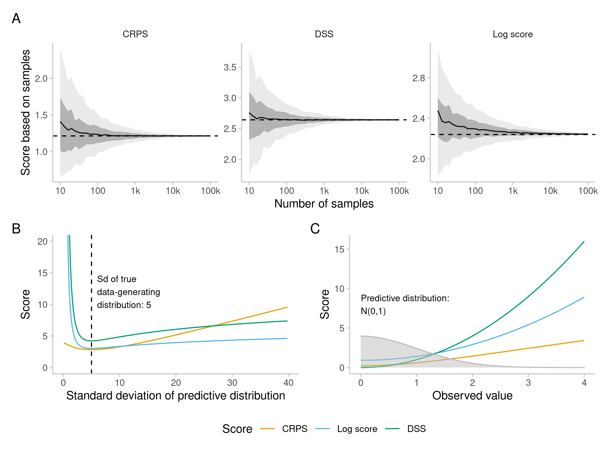

```{r setup, include=FALSE}
knitr::opts_chunk$set(echo = TRUE,
                      fig.width = 7,
                      collapse = TRUE,
                      comment = "#>")
library(scoringutils)
library(magrittr)
library(data.table)
library(ggplot2)
library(knitr)
```

scoringutils has the following forecast types: 
- ...

# Point forecasts


# Binary forecasts

### Proper scoring rules for binary outcomes (BS and log score)

Binary forecasts can be scored using the Brier score (BS) or the log score. The Brier score \citep{brierVERIFICATIONFORECASTSEXPRESSED1950} corresponds to the squared difference between the given probability and the outcome (either 0 or 1) and equals the ranked probability score for the case of only two possible outcomes \citep{epsteinScoringSystemProbability1969, murphyNoteRankedProbability1971a}. The log score corresponds to the log of the probability assigned to the observed outcome. Just as with continuous forecasts, the log score penalises overconfidence much more harshly than underconfidence. The Brier score, on the other hand, penalises over- and underconfidence similarly \citep{macheteContrastingProbabilisticScoring2012} and is more forgiving of outlier predictions. 

# Sample-based forecasts

### Proper scoring rules for sample-based forecasts (CRPS, log score and DSS)

For forecasts in a sample format, the \pkg{scoringutils} package implements the following proper scoring rules by providing wrappers to the corresponding functions in the \pkg{scoringRules} package: the (continuous) ranked probability score (CRPS) \citep{epsteinScoringSystemProbability1969, murphyNoteRankedProbability1971a, mathesonScoringRulesContinuous1976, gneitingStrictlyProperScoring2007}, the logarithmic score (log score) \citep{goodRationalDecisions1952}, and the Dawid-Sebastiani-score (DSS) \citep{dawidCoherentDispersionCriteria1999} (formal definitions are given in Table \ref{tab:score-table-detailed}). Compared to the implementations in the \pkg{scoringRules} these are exposed to the user through a slightly adapted interface. Other, closed form variants of the CRPS, log score and DSS are available in the \pkg{scoringRules} package. 

When scoring forecasts in a sample-based format, the choice is usually between the log score and the CRPS. The DSS is much less commonly used. It is easier to compute, but apart from that does not have immediate advantages over the other options. DSS, CRPS and log score differ in several important aspects: ease of estimation and speed of convergence, treatment of over- and underconfidence, sensitivity to distance \cite{winklerScoringRulesEvaluation1996}, sensitivity to outlier predictions, and sensitivity to the order of magnitude of the forecast quantity. 

#### Estimation details and the number of samples required for accurate scoring

The CRPS, DSS and log score are in principle all applicable to continuous as well as discrete forecasts. However, they differ in how easily and accurately scores can be computed based on predictive samples. This is an issue for the log score in particular, which equals the negative log density of the predictive distribution evaluated at the observed value and therefore requires a density estimation. The kernel density estimation used in \pkg{scoringutils} (through the function \fct{log\_sample} from the \pkg{scoringRules} package) may be particularly inappropriate for discrete values (see also Table \ref{tab:score-table-detailed}). The log score is therefore not computed for discrete predictions in \pkg{scoringutils}. For a small number of samples, estimated scores may deviate considerably from the exact scores computed based on closed-form predictive functions. This is especially pronounced for the log score, as illustrated in Figure \ref{fig:score-convergence} (adapted from \citep{jordanEvaluatingProbabilisticForecasts2019}). 

```{r score-convergence, echo = FALSE, fig.cap="Top: Estimation of scores from predictive samples (adapted from \\citep{jordanEvaluatingProbabilisticForecasts2019}). Scores were computed based on samples of differing size (from 10 to 100,000). This was repeated 500 times for each sample size. The black line is the mean score across the 500 repetitions, shaded areas represent 50\\% and 90\\% intervals, and the dashed line represents the true calculated score.  Bottom left: Change in score when the uncertainty of the predictive distribution is changed. The true distribution is N(0,5) with the true standard deviation marked with a dashed line, while the standard deviation of the predictive distribution is varied along the x-axis. Log score and DSS clearly punish overconfidence much more severely than underconfidence. Bottom right: Score achieved for a standard normal predictive distribution (illustrated in grey) and different true observed values. Log score and DSS punish instances more harshly where the observed value is far away from the predictive distribution.", fig.show="hold"}

```

#### Overconfidence, underconfidence and outliers

Proper scoring rules differ in how they penalise over- or underconfident forecasts. The log score and the DSS penalise overconfidence much more severely than underconfidence, while the CRPS does not distinguish between over- and underconfidence and penalises both rather leniently \citep{macheteContrastingProbabilisticScoring2012} (see Figure \ref{fig:score-convergence}B, left panel). Similarly, the CRPS is relatively lenient with regards to outlier predictions compared to the log score and the DSS (see Figure \ref{fig:score-convergence}B, right panel). The CRPS, which can be thought of as a generalisation of the absolute error to a predictive distribution, scales linearly with the distance between forecast distribution and true value. The log score, on the other hand, as the negative logarithm of the predictive density evaluated at the observed value, can quickly tend to infinity if the probability assigned to the observed outcome is close to zero. Whether or not harsh penalisation of overconfidence and bad predictions is desirable or not depends of course on the setting. If, for example, one wanted to forecast hospital bed capacity, it may be prudent to score forecasts using a log score as one might prefer to be too cautious rather than too confident. 

#### Sensitivity to distance - local vs\. global scores {#localglobal}

The CRPS and the DSS are so-called global scoring rules, which means that the score is sensitive to the distance of the entire predictive distribution from the observed value. The log score, on the other hand, is local and the resulting score depends only on the probability density assigned to the actual outcome, ignoring the rest of the predictive distribution (see Figure \ref{fig:score-locality}). 
Sensitivity to distance (taking the entire predictive distribution into account) may be a desirable property in most settings that involve decision making. A prediction which assigns high probability to results far away from the observed value is arguably less useful than a forecast which assigns a lot of probability mass to values closer to the observed outcome (the probability assigned to the actual outcome being equal for both forecasts). The log score is only implicitly sensitive to distance in expectation if we assume that values close to the observed value are actually more likely to occur. The fact that the log score only depends on the outcome that actually realised, however, may make it more appropriate for inferential purposes (see \citep{winklerScoringRulesEvaluation1996}) and it is commonly used in Bayesian statistics \citep{gelmanUnderstandingPredictiveInformation2014}. 

```{r score-locality, echo = FALSE, fig.cap="Probabilities assigned by two hypothetical forecasters, A and B, to the possible number of goals in a football match. The true number later observed, 2, is marked with a dashed line. Both forecasters assign a probability of 0.35 to the observed outcome, 2. Forecaster A's prediction is centred around the observed value, while Forecaster B assigns significant probability to outcomes far away from the observed value. Judged by a local score like the Log Score, both forecasters receive the same score. A global score like the CRPS and the DSS penalises forecaster B more severely."}


```

#### Sensitivity to the order of magnitude of the forecast quantity

Average scores usually scale with the order of magnitude of the quantity we try to forecast (as the variance of the data-generating distribution usually increases with the mean). Figure \ref{fig:score-scale} illustrates the effect of an increase in scale of the forecast target on average scores. This relation makes it harder to compare forecasts for very different targets, or assess average performance if the quantity of interest varies substantially over time. Average scores tend to be dominated by forecasts for targets with high absolute numbers. This is especially the case for the CRPS (as a generalisation of the absolute error), for which average scores tend to increase strongly with the order of magnitude of the quantity to forecast (see Figure \ref{fig:score-scale}. The log score and the DSS tend to be more robust against this effect and on average increase more slowly with an increase in the variance of the forecast target.

```{r score-scale, echo = FALSE, fig.cap="Scores depend on the variability of the data and therefore implicitly on the order of magnitude of the observed value. A: Mean and standard deviation of scores from a simulation of perfect forecasts with predictive distribution $F$ equal to the true data-generating distribution $G$. The standard deviation of the two distributions was held constant at $\\sigma$, and for different mean values $\\mu$ 100 pairs of forecasts and observations were simulated. Every simulated forecast consisted of 1000 draws from the data-generating distribution $G$ and 5000 draws from the (same) predictive distribution $F$. For all three scoring rules, mean and sd of the calculated scores stay constant regardless of the mean $\\mu$ of $F$ and $G$. B: Same setup, but now the mean of $F$ and $G$ was held constant at $\\mu = 1$ and the standard deviation $\\sigma$ was varied. Average scores increase for all three scoring rules, but most strongly for the CRPS. Standard deviations of the estimated scores stay roughly constant for the DSS and log score, but also increase for the CRPS. C: Scores for forecasts of COVID-19 cases and deaths from the European Forecast Hub ensemble based on the example data provided in the package."}


```


# Quantile-based forecasts

### Proper scoring rule for quantile-based forecasts (WIS) {#wis}
For forecasts in an interval or quantile format, \pkg{scoringutils} offers the weighted interval score (WIS) \citep{bracherEvaluatingEpidemicForecasts2021}. The WIS has very similar properties to the CRPS and can be thought of as a quantile-based approximation. For an increasing number of equally-spaced prediction intervals the WIS converges to the CRPS. One additional benefit of the WIS is that it can easily be decomposed into three additive components: an uncertainty penalty (called dispersion or sharpness penalty) for the width of a prediction interval and penalties for over- and underprediction (if a value falls outside of a prediction interval). 

